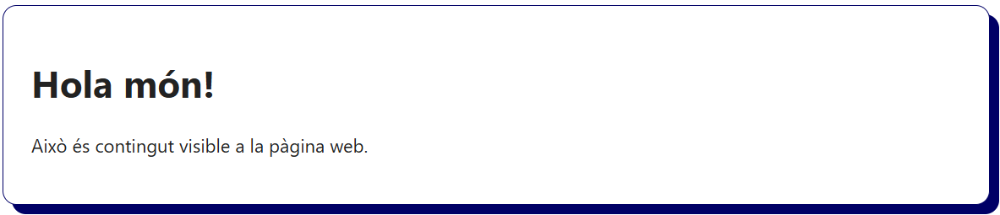
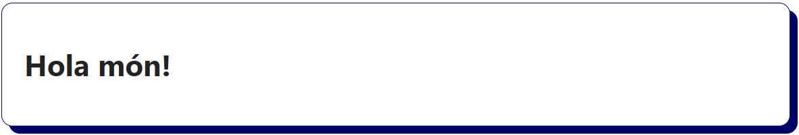

# El llenguatge HTML i estructura HTML5

## Què és un llenguatge de marques?

Un **llenguatge de marques** (markup language) és un sistema basat en **etiquetes** que s'utilitza per **estructurar, organitzar i descriure** el contingut d'un document. Les etiquetes s'escriuen seguint un conjunt de normes i no defineixen la forma en què es veu el contingut (l'aspecte visual), sinó **la seva estructura i significat**.

Exemples de llenguatges de marques:
- HTML (per desenvolupar pàgines web)
- XML (per intercanvi de dades)
- Markdown (per realitzar documentació)

**Característiques llenguatge de marques**

- Estan formats per **etiquetes** d'obertura i tancament.
- Són **jeràrquics**, és a dir, les etiquetes poden estar **dins d'altres etiquetes**.
- Són **lleugers** i **llegibles fàcilment per persones**.
- Fan servir la següent **sintaxi**:
  ```html
  <etiqueta> Contingut de text. </etiqueta>
  ```

## Què és HTML?

L’**HTML (HyperText Markup Language)** és el llenguatge principal que s'utilitza per crear documents de pàgines web. Permet per **definir l'estructura, les seccions i els elements** que han d'apareixer a una pàgina, com poden ser els **títols, els paràgrafs, els enllaços, les imatges, les taules, els formularis**, etc.

> HTML descriu el contingut, **no el disseny visual**.

## Estructura bàsica d’un document HTML5

Tot document HTML ha de seguir una estructura mínima perquè el navegador pugui interpretar-lo correctament:

```html
<!DOCTYPE html>
<html lang="ca">
  <head>
    <meta charset="UTF-8" />
    <title>La meva primera pàgina web</title>
  </head>
  <body>
    <h1>Hola món!</h1>
    <p>Això és contingut visible a la pàgina web.</p>
  </body>
</html>
```



Explicació de les etiquetes HTML principals:

```html 
<!DOCTYPE html> Declara el tipus de document. Indica al navegador que es tracta d’un document HTML5.
```
```html
<html lang="ca"> Element arrel de tot el document. L’atribut lang indica l’idioma principal del contingut.
```
```html
<head> Conté metadades: informació sobre la pàgina, com el títol, la codificació (charset), enllaços a documents d'estil CSS i documents d'scripts JavaScript, etc.
```
```html
<meta charset="UTF-8"> Especifica la codificació de caràcters. UTF-8 és la codificació recomanada i permet representar qualsevol caràcter del català, castellà, anglès, etc.
```
```html
<title> Defineix el nom que apareixerà a la pestanya del navegador (títol del web).
```
```html
<body> Diposa del contingut visible de la pàgina: textos, imatges, enllaços, vídeos, taules, etc.
```

## Plantilla HTML5 per iniciar projectes web

```html
<!DOCTYPE html>
<html lang="ca">
<head>
    <meta charset="UTF-8" />
    <meta name="viewport" content="width=device-width, initial-scale=1" />
    <title>La meva plantilla web</title>
    <meta name="description" content="La meva plantilla web" />
    <link rel="icon" href="./img/favicon.ico" />
</head>
<body>
    <h1>Hola món!</h1>
</body>
</html>
```



Explicació de les etiquetes HTML recomanades per la pantilla inicial d'un projecte:

```html
<meta name="viewport" content="width=device-width, initial-scale=1"> Fa que la pàgina sigui adaptable a diferents dispositius (web responsive). Controla l’amplada i l’escala inicial de visualització.
```
```html
<meta name="description" content="Descripció de la pàgina web"> Proporciona als motors de cerca un resum del contingut de la pàgina. Permet millorar el posicionament als resultats de cerca (SEO).
```
```html
<link rel="icon" href="./img/favicon.ico"> Defineix la icona (favicon) que es mostra a la pestanya del navegador. S’acostuma a fer servir un fitxer amb extensió `.ico` o `.png`.
```