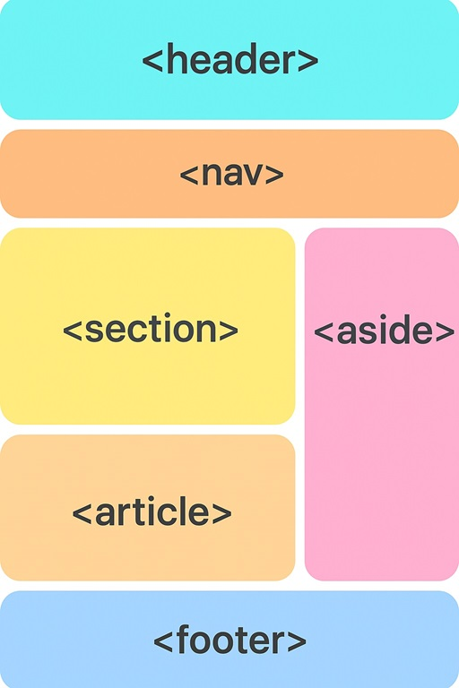
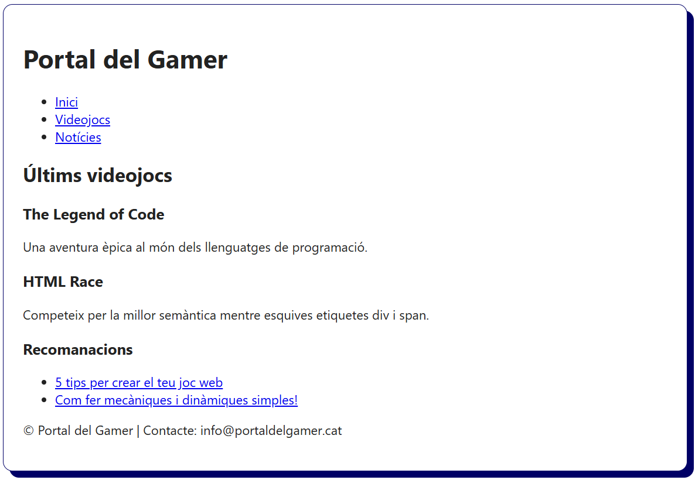

# HTML5: Estructura semàntica

## Què és HTML5?

**HTML5** és la cinquena versió del llenguatge HTML publicada l'any 2014. Aquesta versió incorpora millores significatives respecte a versions anteriors:

- Nous **elements semàntics** per descriure millor l’estructura del document.
- Suport nadiu per **àudio, vídeo i gràfics** sense necessitat de "codi incrustat".
- Integració amb **JavaScript i APIs** modernes de geolocalització, emmagatzematge local, etc.

Amb HTML5 es van introduir **etiquetes semàntiques** que defineixen la funció del contingut dins de la pàgina. Aquestes etiquetes milloren:

- La **comprensió del codi** per part de desenvolupadors.
- La **indexació** per part dels cercadors o rastrejadors web.
- L’**accessibilitat** pels usuaris que utilitzen lectors de la pantalla.

## Què són les etiquetes semàntiques?

Una **etiqueta semàntica** és aquella que, per si mateixa, **descriu el significat la informació** que conté. A diferència d’una etiqueta genèrica com `<div>` o `<span>` , les etiquetes semàntiques com `<header>`, `<main>` o `<footer>` defineixen una funció clara de la secció de la pàgina web.

### Quan s'utilitzen les etiquetes genèriques `<div>` i `<span>`?

Encara que no aportin significat semàntic, les etiquetes **genèriques** com `<div>` i `<span>` són **molt útils i necessàries**.

| Etiqueta  | Tipus            | Descripció                                                                                         |
|-----------|------------------|----------------------------------------------------------------------------------------------------|
| `<div>`   | Bloc (Block)     | Contenidor que permet agrupar diversos elements per aplicar estils CSS o una funcionalitat amb JS. |
| `<span>`  | En línia (Inline)| Contenidor que permet agrupar text o elements en línia per donar-los estil o funcionalitat.        |

> S'han d'utilitzar quan **cap altra etiqueta semàntica** sigui adequada per al contingut o el contxet.

> A la pràctica, es combinen sovint **etiquetes semàntiques** amb **`<div>` i `<span>`** per tenir un codi estructurat i fàcil de mantenir.

## Etiquetes principals d’estructura semàntica

| Etiqueta    | Descripció                                                                               |
| ----------- | ---------------------------------------------------------------------------------------- |
| `<header>`  | Capçalera de la pàgina o d’una secció. Inclou un logotip, un títol, un menú, etc.        |
| `<nav>`     | Menú de navegació amb enllaços. Acostuma a posar-se dins del `<header>`.                 |
| `<main>`    | Contingut principal de la pàgina. Només pot haver una etiqueta `<main>` per pàgina.      |
| `<section>` | Secció d'un pàgina que agrupa per una temàtica concreta el contingut.                    |
| `<article>` | Bloc independent i reutilitzable: acostuma a ser una notícia, una entrada de blog, etc.  |
| `<aside>`   | Contingut complementari o secundari: acostumen a ser anuncis, enllaços relacionats, etc. |
| `<footer>`  | Peu de pàgina o d’una secció amb dades de contacte, copyright, enllaços interns, xarxes socials etc.|

### Com a recordatori

- Pots tenir **diverses seccions o articles**, però només **un `<main>`** per pàgina.
- Els elements `<section>` i `<article>` **poden contenir altres etiquetes semàntiques**, com `<header>`, `<footer>` o `<nav>`.
- Les etiquetes semàntiques **ajuden a l’accessibilitat i al posicionament SEO** ja que donen sentit al contingut i això ho valoren els motors de cerca.

## Exemple estructura semàntica HTML5



```html
<!DOCTYPE html>
<html lang="ca">
  <head>
    <meta charset="UTF-8" />
    <title>Portal de Videojocs</title>
    <meta name="viewport" content="width=device-width, initial-scale=1" />
    <meta name="description" content="El teu portal de videojocs" />
    <link rel="icon" href="./img/favicon.ico" />
  </head>
  <body>
    <header>
      <h1>Portal del Gamer</h1>
      <nav>
        <ul>
          <li><a href="#">Inici</a></li>
          <li><a href="#">Videojocs</a></li>
          <li><a href="#">Notícies</a></li>
        </ul>
      </nav>
    </header>
    <main>
      <section>
        <h2>Últims videojocs</h2>
        <article>
          <h3>The Legend of Code</h3>
          <p>Una aventura èpica al món dels llenguatges de programació.</p>
        </article>
        <article>
          <h3>HTML Race</h3>
          <p>Competeix per la millor semàntica mentre esquives etiquetes div i span.</p>
        </article>
      </section>
      <aside>
        <h3>Recomanacions</h3>
        <ul>
          <li><a href="#">5 tips per crear el teu joc web</a></li>
          <li><a href="#">Com fer mecàniques i dinàmiques simples!</a></li>
        </ul>
      </aside>
    </main>
    <footer>
      <p>&copy; Portal del Gamer | Contacte: info@portaldelgamer.cat</p>
    </footer>
  </body>
</html>
```


