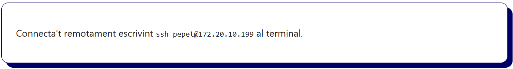
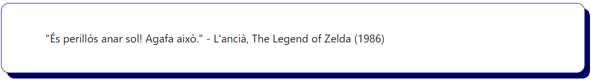

# Bloc 02. Contingut de text: Elements bàsics

En aquest bloc treballarem les etiquetes HTML més comunes per representar **text**, **llistes**, **enllaços** i **taules**. Són les eines bàsiques per mostrar informació estructurada dins d’una pàgina web.

## Etiquetes de text

Les etiquetes de text ens permeten definir el contingut textual dins del document HTML, donant-li una jerarquia i una estructura clara.

| Etiqueta      | Funció                                                                     |
| ------------- | -------------------------------------------------------------------------- |
| `<h1>`-`<h6>` | Títols de nivell 1 a 6. Jerarquia de contingut segons la seva importància. |
| `<p>`         | Paràgraf. Bloc de text genèric (es pot escriure qualsevol contingut).      |
| `<strong>`    | Text important (amb significat semàntic i es veu en negreta).              |
| `<em>`        | Text amb èmfasi (indica un canvi d'entonació  i es veu en cursiva).        |
| `<code>`      | Fragment de codi font o comandes de sistema (tipografia "monospace").      |
| `<pre>`       | Text preformatat (manté els espais i els salts de línia del text).         |
| `<blockquote>`| S'utilitza per citar una font externa.                                     |
| `<br>`        | Substituida amb CSS: Salt de línia.                                        |
| `<hr>`        | Substituida amb CSS: Línia horitzontal que separa seccions.                |

## Títols `<h1> – <h6>`
```html
<h1>Títol de Nivell 1</h1>
<h2>Títol de Nivell 2</h2>
<h3>Títol de Nivell 3</h3>
<h4>Títol de Nivell 4</h4>
<h5>Títol de Nivell 5</h5>
<h6>Títol de Nivell 6</h6>
```


## Paràgraf `<p>`
```html
<p>Això és un paràgraf de text. Conté informació general i es mostra en bloc (en una línia independent).</p>
```


## Text en Negreta `<strong>`
```html
<p>Aquest text és <strong>molt important</strong> dins del context.</p>
```


## Text amb Èmfasi `<em>`
```html
<p>Volem <em>ressaltar aquesta idea</em> amb èmfasi.</p>
```


## Codi `<code>`
```html
<p>Connecta't remotament escrivint <code>ssh pepet@172.20.10.199</code> al terminal.</p>
```



## Preformatat `<pre>`
```html
<pre>
const jugador = {
  nom: "Pepet",
  punts: 999,
  nivell: 5,
  vides: 3
};
</pre>
```


## Cita `<blockquote>`
```html
<blockquote>
  "És perillós anar sol! Agafa això." - L'ancià, The Legend of Zelda (1986)
</blockquote>
```



## Salt de Línia `<br>`
```html
<p>Línia 1<br>Línia 2</p>
```


## Línia Horitzontal `<hr>`
```html
<p>Secció 1</p>
<hr>
<p>Secció 2</p>
```

