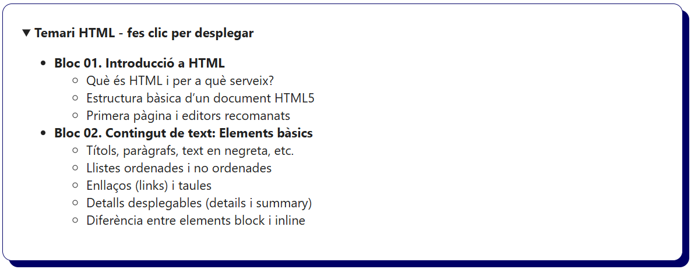
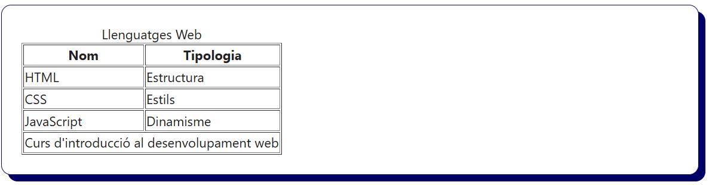
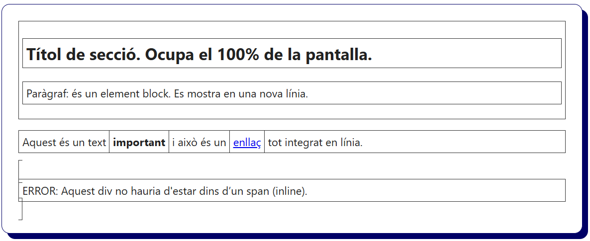

# Bloc 03. Contingut de text: Llistes, Enllaços i Taules

En aquest bloc treballarem les etiquetes HTML més comunes per representar **llistes**, **enllaços** i **taules**. Complementen a les etiquetes bàsiques per mostrar informació estructurada dins d’una pàgina web.

---

## Etiquetes de llistes

Les llistes permeten agrupar informació de forma ordenada o desordenada.

### Llistes no ordenades (`<ul>`)
Són llistes on l’ordre no és rellevant. Els elements es representen amb punts (etiqueta molt utilitzada per crear `menús de navegació`).

```html
<ul>
  <li>HTML</li>
  <li>CSS</li>
  <li>JavaScript</li>
</ul>
```


### Llistes ordenades (`<ol>`)
Són llistes numerades, on l’ordre dels elements té importància.

```html
<ol>
  <li>Obrir l'editor</li>
  <li>Escriure el codi</li>
  <li>Desar l'arxiu</li>
  <li>Tanca l'editor</li>
</ol>
```


### Element desplegable (`<details>` i `<summary>`)

Les etiquetes "Detalls" i "Resum" permeten mostrar o amagar contingut.  
Permet desplegar contingut addicional **evitant així saturar la pàgina amb informació**.

```html
<details>
  <summary><strong>Temari HTML - fes clic per desplegar</strong></summary>
  <ul>
    <li><strong>Bloc 01. Introducció a HTML</strong>
      <ul>
        <li>Què és HTML i per a què serveix?</li>
        <li>Estructura bàsica d’un document HTML5</li>
        <li>Primera pàgina i editors recomanats</li>
      </ul>
    </li>
    <li><strong>Bloc 02. Contingut de text: Elements bàsics</strong>
      <ul>
        <li>Títols, paràgrafs, text en negreta, etc.</li>
        <li>Llistes ordenades i no ordenades</li>
        <li>Enllaços (links) i taules</li>
        <li>Detalls desplegables (details i summary)</li>
        <li>Diferència entre elements block i inline</li>
      </ul>
    </li>
  </ul>
</details>
```



## Etiquetes d'enllaç (hipervincles)
Els enllaços són l’essència del web, ja que permeten navegar entre pàgines o llocs web.

### Etiqueta (`<a>`)

```html
<a href="https://www.lamevaweb.cat">Visita el lloc web</a>
<a href="#videojocs">Ves a la secció Videojocs</a>
<a href="https://latevaweb.cat" target="_blank">Obre una nova pestanya</a>
<a href="./README.md" download>Descarrega el fitxer README.md</a>
```


- `href`: indica la destinació de l’enllaç.
- Els enllaços poden ser a pàgines externes (https://...) o internes (./fitxer.html).
- L’atribut `target="_blank"` permet obrir l’enllaç en una pestanya nova del navegador.

## Etiquetes de taules

Les taules s’utilitzen per mostrar dades estructurades en **files i columnes**.

| Etiqueta     | Funció                                                                                      |
|--------------|---------------------------------------------------------------------------------------------|
| `<table>`    | Defineix la taula. És l’element principal que engloba tot el contingut de la taula.         |
| `<caption>`  | Títol de la taula que s'ha de situar a continuació de l'etiqueta `<table>`.                 |
| `<thead>`    | Secció de capçaleres de la taula. Conté una o diverses files `<tr>` amb cel·les `<th>`.     |
| `<tbody>`    | Secció principal amb dades de la taula. Està composat de files `<tr>` i cel·les `<td>`.     |
| `<tfoot>`    | Opcional. Peu de taula. Pot contenir (sumatoris) totals, notes o informació resumida.       |
| `<tr>`       | Defineix una **fila** (Table Row). Pot estar dins de `<thead>`, `<tbody>` o `<tfoot>`.      |
| `<th>`       | Cel·la de **capçalera** (Table Heading) dins d’una fila. Text en **negreta** i **centrat**. |
| `<td>`       | Cel·la de **dades** (Table Data) dins d’una fila. Pot contenir informació genèrica.         |


```html
<table>
  <caption>Llenguatges Web</caption>
  <thead>
    <tr>
      <th>Nom</th>
      <th>Tipologia</th>
    </tr>
  </thead>
  <tbody>
    <tr>
      <td>HTML</td>
      <td>Estructura</td>
    </tr>
    <tr>
      <td>CSS</td>
      <td>Estils</td>
    </tr>
    <tr>
      <td>JavaScript</td>
      <td>Dinamisme</td>
    </tr>
  </tbody>
  <tfoot>
    <tr>
      <td colspan="2">Curs d'introducció al desenvolupament web</td>
    </tr>
  </tfoot>
</table>
```



## Etiquetes per tipologia: **En Bloc i En Línia**

### Element en bloc (**block**)  
- Ocupa **tota l’amplada disponible** del seu contenidor pare (l'amplada completa, el 100%).  
- L'element es disposa en **una nova línia**, fa un salt de línia sobre l'element anterior i posterior.  
- S’utilitza per crear **continguts estructurals** dins la pàgina i **poden contenir** elements de tipus **inline i block**.  
- Exemples:  
  - `<div>`, `<p>`, `<h1> – <h6>`, `<ul>`, `<ol>`, `<li>`, `<table>`
  - `<header>`, `<main>`, `<footer>`, `<section>`, `<article>`

### Element en línia (**inline**)  
- Ocupa **només l’espai establert** segons la longitud del seu contingut (amplada limitada al contingut).  
- L'element es disposa en **la mateixa línia**, al costat d'altres elements inline.  
- S’utilitza per **aplicar estils** a un apartat de text concret i **NO poden contenir** elements de tipus **block**.  
- Exemples:  
  - `<span>`, `<a>`, `<strong>`, `<em>`, `<code>`

> ### 📝 Nota: Elements inline a CSS
> - No permeten modificar propietats del contenidor com l'amplada, l'alçada, els marges, etc.  

```html
<!-- Elements de tipus block -->
<section>
  <h2>Títol de secció. Ocupa el 100% de la pantalla.</h2>
  <p>Paràgraf: és un element block. Es mostra en una nova línia.</p>
</section>

<!-- Elements inline dins un paràgraf (block) -->
<p>Aquest és un text <strong>important</strong> i això és un <a href="#">enllaç</a> tot integrat en línia.</p>

<!-- Incorrecte: Un element block dins d'un inline -->
<span>
  <div>Aquest div no hauria d'estar dins d’un span (inline).</div>
</span>
```

