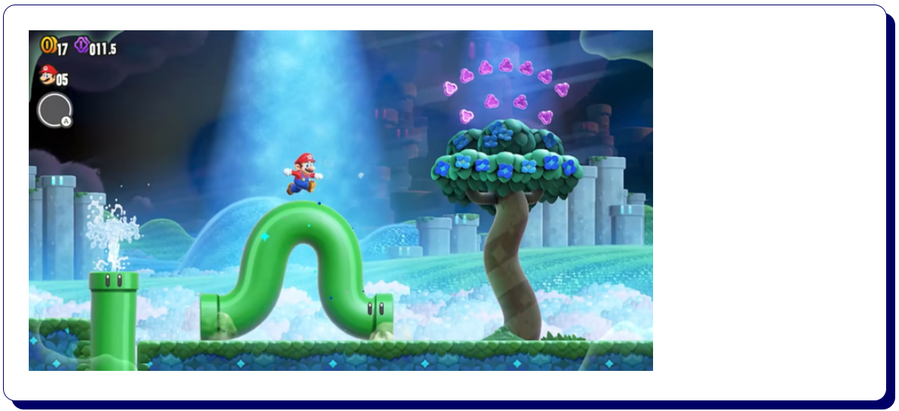
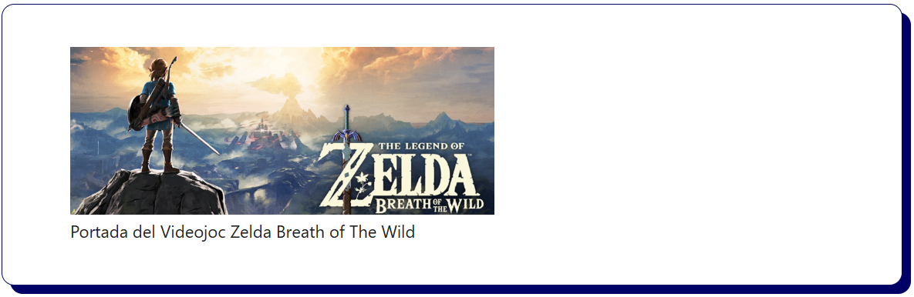
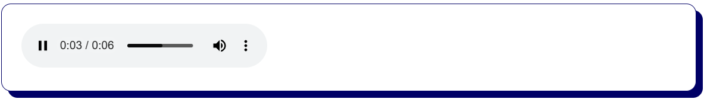
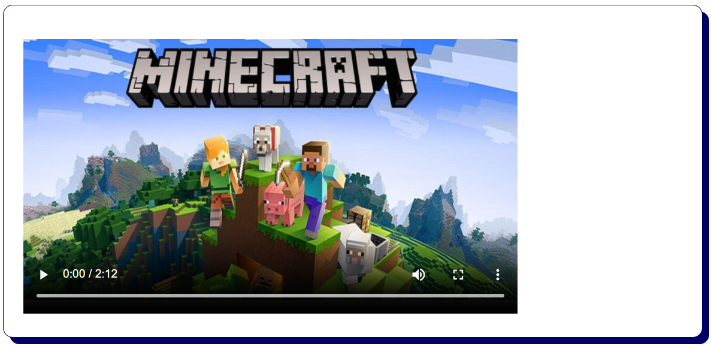
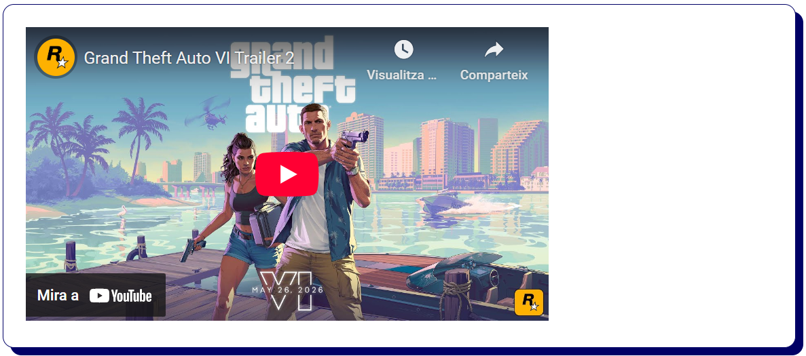

# Bloc 04. Elements Multimèdia

En aquest bloc treballarem les etiquetes HTML més comunes per representar **contingut multimèdia** (imatges, àudio i vídeo) i **formularis web** per recollir informació dels usuaris. Aquestes funcionalitats són essencials per crear pàgines web interactives i atractives.

## Etiquetes Multimèdia

| Etiqueta       | Funció                                                                                |
| -------------- | ------------------------------------------------------------------------------------- |
| ``        | Permet inserir una **imatge** dins de la pàgina web.                                  |
| `<figure>`     | Agrupar contingut multimèdia (imatges, vídeos, etc) amb context semàntic.             |
| `<figcaption>` | Permet establir un **títol o descripció** a un element `<figure>`.                    |
| `<audio>`      | Incrustar **fitxers d’àudio** per reproduir amb controls (play, pausa, volum, etc.)   |
| `<video>`      | Incrustar **fitxers de vídeo** per reproduir amb controls (play, pausa, volum, etc.)  |
| `<source>`     | Indica la ruta d’un fitxer d’àudio o vídeo i oferir diferents formats de reproducció. |
| `<iframe>`     | Incrustar **contingut extern** dins la pàgina (YouTube, Google Maps, Spotify, etc).   |

### Imatge (``)

```html

```

`src`: Ruta relativa o URL de la imatge.

`alt`: Text alternatiu per l'accessibilitat.

`width` i `height`: Ajustar l'amplada i l'alçada. S'ha d'utilitzar **CSS** per controlar l'estil visual.


### Figura i Descripció (`<figure>` i `<figcaption>`)

```html
<figure>
  
  <figcaption>Portada del Videojoc Zelda Breath of The Wild</figcaption>
</figure>
```

`<figure>`: Agrupa contingut multimèdia amb una descripció. Normalment un element per cada figura.

`<figcaption>`: Proporciona una llegenda o títol per al contingut dins de `<figure>`.

> ### 📝 Nota: Quan utilitzar `<figure>`?
>
> - Si la descripció és **essencial** per entendre el contingut de la imatge.
> - Si la imatge només acompanya al text o la descripció és molt llarga, millor utilitzar `` sense `<figure>`.


### Àudio (`<audio>`)

```html
<audio controls>
  <source src="./audio/mario-level-complete.mp3" type="audio/mpeg" />
  <source src="./audio/mario-level-complete.ogg" type="audio/ogg" />
</audio>
```

`src`: Ruta o URL de l'arxiu d'àudio.

`controls`: Atribut que mostra els controls de reproducció (play, pausa, volum, etc.).

`<source>`: Etiqueta que permet especificar múltiples formats d'àudio per disposar de compatibilitat entre navegadors.

`type`: Atribut que indica el tipus de fitxer d'àudio (MPEG, OGG, etc.).

`Altres atributs`:

- `muted`: La reproducció es realitzarà en silenci.
- `autoplay`: La reproducció s'iniciarà automàticament.
- `loop`: La reproducció es tornarà a iniciar quan finalitzi (reproducció en bucle).
- `preload`: Indica al navegador si ha de descarregar `auto` o no descarregar `none` el fitxer d'àudio.



### Vídeo (`<video>`)

```html
<video controls poster="./img/poster-minecraft-video.png" width="600" height="350">
  Minecraft Videojoc
  <source src="./video/minecraft-trailer.mp4" type="video/mp4" />
  <source src="./video/minecraft-trailer.ogv" type="video/ogg" />
</video>
```

> ### 📝 Nota: L'etiqueta `<video>` comparteix els mateixos atributs que `<audio>`

`poster`: Ruta o URL de la imatge que es mostrarà abans de reproduir el vídeo.

`width` i `height`: Ajustar l'amplada i l'alçada. S'ha d'utilitzar **CSS** per controlar l'estil visual.



### Vídeo (`<iframe>`)

```html
<iframe
  width="560"
  height="315"
  src="https://www.youtube.com/embed/VQRLujxTm3c?si=i_ubHZKF_H3rftOT"
  title="YouTube Video Trailer Oficial GTA 6"
  frameborder="0"
  allow="accelerometer; autoplay; clipboard-write; encrypted-media; gyroscope; picture-in-picture; web-share"
  referrerpolicy="strict-origin-when-cross-origin"
  allowfullscreen
></iframe>
```

`src`: URL del contingut es vol incrustar (un vídeo de YouTube o un mapa de Google Maps).

`width` i `height`: Amplada i alçada de l’iframe (en píxels).

`title`: Text descriptiu per a l'accessibilitat.

`frameborder`: Controla el contorn de l’iframe (amb `0` s'indica que no tindrà border).

`allow`: Permet habilitar funcions especials com l'autoplay o la pantalla completa.

`allowfullscreen`: Permet que l’iframe es pugui veure en pantalla completa.


