# Bloc 05. Formularis Web

En aquest bloc treballarem les etiquetes HTML més comunes per representar **formularis web** que permeten recollir informació dels usuaris. Aquesta eina és essencials per crear pàgines web interactives i amb una operativa real.

Un formulari permet als usuaris enviar dades a un servidor per realitzar accions com: registrar-se en una web, iniciar sessió, fer una comanda, deixar un comentari, penjar una publicació amb una foto, etc.

Els formularis HTML estan formats per elements de diferents tipologies que permeten obtenir informació de tipus divers.

## Etiquetes de Formularis HTML

| Etiqueta         | Funció                                                                                        |
| ---------------- | --------------------------------------------------------------------------------------------- |
| `<form>`         | Defineix un formulari. És l’element principal que engloba tot el contingut del formulari.     |
| `<input>`        | Etiqueta genèrica per introduir dades. Pot ser de tipus (text, password, email, number, etc). |
| `<textarea>`     | Àrea de text per escriure textos llargs (diverses línies de text).                            |
| `<select>`       | Llista desplegable que permet seleccionar una opció d’un conjunt d'opcions possible.          |
| `<option>`       | Opcions que es poden sel·leccionar dins d’una etiqueta `<select>`.                            |
| `<button>`       | Botó per enviar o executar accions dins del formulari (ha de de tipus `submit`).              |
| `<fieldset>`     | Agrupa elements relacionats dins d’un formulari, amb un marc (border) visible.                |
| `<legend>`       | Títol descriptiu del formulari associat a una etiqueta `<fieldset>`.                          |
| `<label>`        | Etiqueta descriptiva per associar un text a un camp de formulari (millora accessibilitat).    |
| `<datalist>`     | Proporciona una llista d’opcions suggerides per una etiqueta `<input>`.                       |

## Atributs comuns dels formularis:

- `action`: URL on s’enviaran les dades del formulari pel seu processament (validació i emmagatzematge).  
- `method`: Mètode d’enviament, pot ser (`GET` o `POST`).
  - `GET`: La informació es transmet a través de la URL en text clar. S'utilitza per consultar dades i no s'introdueix informació sensible.
  - `POST`: La informació és transmet per un canal intern del navegador i no és visible per l'usuari. És el mètode més comú per enviar informació.   
- `id`: Permet identificar fàcilment el formulari i els seus camps.  

```html
<form action="./processar_dades.php" method="POST" id='login_usuari'>
  <label for="nom">Usuari:</label>
  <input type="text" id="nom" name="nomUsuari">
  <button type="submit">Enviar</button>
</form>
```

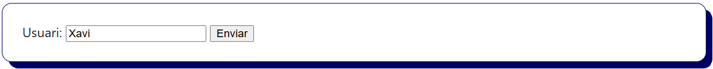

## Atributs de l'etiqueta `<input>`

L'etiqueta `<input>` permet acollir **diferents tipus de dades** gràcies a l’atribut `type`.

| Atribut `type`   | Descripció                                                                                       |
|------------------|------------------------------------------------------------------------------------------------- |
| `text`           | Permet introduir una cadena de text d'una sola línia i és pot limitar la seva longitud.          |
| `password`       | Permet introduir contrasenyes (els caràcters s'oculten i és mostren com punts o asteriscos).     |
| `email`          | Permet introduir una adreça de correu electrònic i verifica si és vàlida (nom@domini.cat)        |
| `tel`            | Permet introduir números de telèfon (sense una format específic ni una validació).               |
| `url`            | Permet introduir URLs i verifica si són vàlides (ha de ser un enllaç web correcte).              |
| `date`           | Permet seleccionar una data (obre un quadra amb un calendari) i el format és (yyyy-mm-dd).       |
| `datetime-local` | Permet seleccionar una data i una hora amb el format (yyyy-mm-ddThh:mm).                         |
| `number`         | Permet introduir números enters o amb decimals i és poden limitar els valors a introduir.        |
| `range`          | Selector numèric composat d'una barra lliscant (permet triar entre un valor mínim i un màxim).   |
| `color`          | Selector de color a través del codi RGB en hexadecimal (obre un quadre amb una paleta de colors).|
| `checkbox`       | Casella quadrada que es pot marcar o desmarcar. Permet seleccionar una o múltiples opcions.      |
| `radio`          | Casella rodona que es pot marcar o desmarcar. Només permet seleccionar una única opció.          |
| `file`           | Permet a l’usuari pujar (enviar) un o diversos fitxers (imatges, pdf, etc.).                     |
| `hidden`         | Camp ocult que no es mostra a l’usuari però s’envia amb el formulari (dades de validació).       |
| `submit`         | Botó que permet enviar el formulari a la pàgina de l'`action` del servidor web.                  |
| `reset`          | Botó per reiniciar (buidar) tots els camps del formulari al valor que tinguin per decte.         |
| `button`         | Botó genèric que s'utilitza per executar codi JavaScript (una validació prèvia a l'enviament).   |


### Cadena de text (`<input type="text">`)

```html
<input type="text" id="usuari" name="usuari" size="30" maxlength="20" placeholder="Escriu el teu nom" required>
```

`size`: Longitud (amplada) del requadre de text. S'ha d'indicar el número de caràcters.

`maxlength`: Número de caràcters màxim que l'usuari pot introduir al camp de text perquè aquest sigui vàlid.

`minlength`: Número de caràcters mínim que l'usuari pot introduir al camp de text perquè aquest sigui vàlid.

`placeholder`: Text guia que es mostra dins del camp (indica a l'usuari la informació que ha d'introduir).

`required`: Fa que el camp sigui obligatori. El formulari no es podrà enviar si no s'emplena aquest camp.

`name`: Nom de la variable que rebrà el servidor a l'enviar el formulari. Permet identificar un camp del formulari de manera única.

`value`: És el contingut del camp i el que s'enviarà al servidor. Per defecte es pot afegir informació sinó quedarà buit.

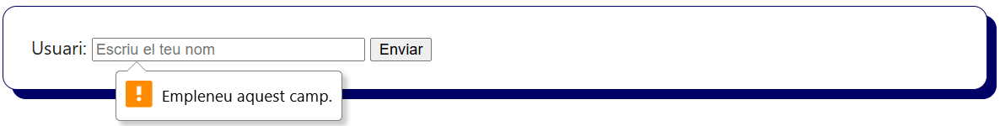

### Contrasenyes (`<input type="password">`)

```html
<input type="password" id="contrasenya" name="contrasenya" minlength="8" required>
```

`Atributs genèrics`: El tipus "password" disposa dels mateixos atributs que "text".

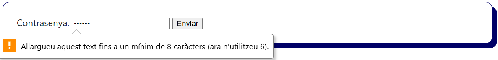

### Correu electrònic (`<input type="email">`)

```html
<input type="email" id="email" name="correu" placeholder="exemple@domini.cat">
```

`Atributs genèrics`: El tipus "email" disposa dels mateixos atributs que "text".

> 📝 Nota: El navegador només verifica el format del correu, el desenvolupador s'ha d'encarregar de verificar al servidor si és un correu vàlid i existeix realment.

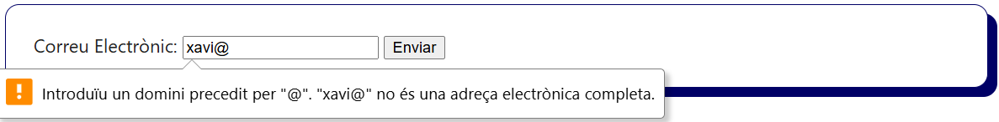

### Telèfon (`<input type="tel">`)

```html
<input type="tel" id="telefon" name="telefon" pattern="[6-7]{1}[0-9]{8}" placeholder="600332211">
```
`Atributs genèrics`: El tipus "password" disposa dels mateixos atributs que "text".

`pattern`: Conjunt de regles (expressió regular) que permeten validar una entrada de text, en aquest cas, un telèfon mòbil a Espanya.

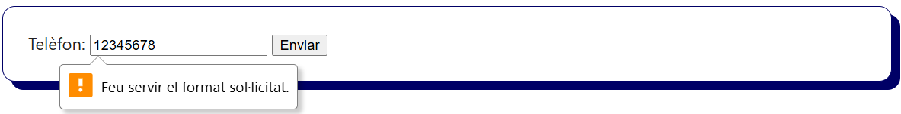

### Enllaç Web (`<input type="url">`)

```html
<input type="url" id="web" name="web" placeholder="https://domini.cat">
```

`Atributs genèrics`: El tipus "password" disposa dels mateixos atributs que "text".

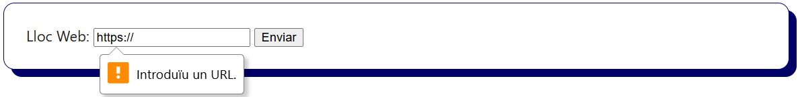

### Data (`<input type="date">`)

```html
<input type="date" id="data" name="data" min="1900-01-01" max="2030-12-31">
```

`Atributs genèrics`: El tipus "date" disposa de l'atribut `required`.

`min`: Indica la data mínima permesa.

`max`: Indica la data màxima permesa.

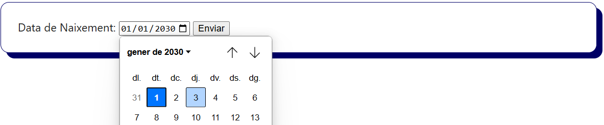

### Data i Hora (`<input type="datetime-local">`)

```html
<input type="datetime-local" id="dataHora" name="dataHora">
```

`Atributs genèrics`: El tipus "datetime-local" disposa de l'atribut `required`.

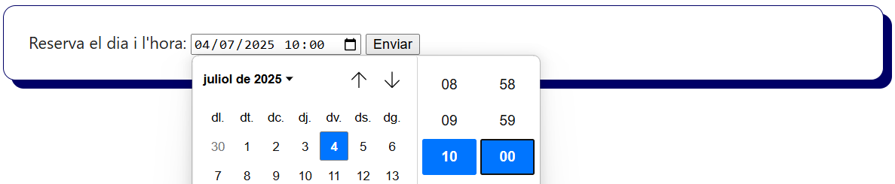

### Número (`<input type="number">`)

```html
<input type="number" id="edat" name="edat" min="0" max="125" step="1">
```

`Atributs genèrics`: El tipus "number" disposa dels atributs `required` i `placeholder`.

`min`: Indica el número mínim permès.

`max`: Indica el número màxim permès.

`step`: Indica el valor numèric d'increment que es realitzarà. Pot ser enter o decimal (amb punt).


### Rang (`<input type="range">`)

```html
<input type="range" id="quantitatMax" name="quantitatMax" min="0" max="100" step="5">
```

`Atributs genèrics`: El tipus "range" disposa dels atributs `required`.

`Atributs numèrics`: El tipus "range" disposa dels atributs `min`, `max` i `step`.

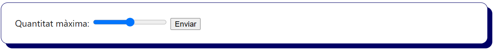

### Color (`<input type="color">`)

```html
<input type="color" id="color" name="color" value="#000066">
```

`Atributs genèrics`: El tipus "color" disposa dels atributs `required`.

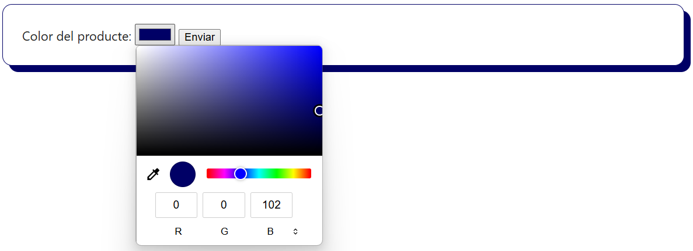

### Selecció Múltiple (`<input type="checkbox">`)

```html
<label><input type="checkbox" name="opcioHTML" checked> HTML</label>
<label><input type="checkbox" name="opcioCSS"> CSS</label>
```

`Atributs genèrics`: El tipus "checkbox" disposa l'atribut `required`.

`checked`: Marca per defecte l'opció que disposa d'aquest atribut.

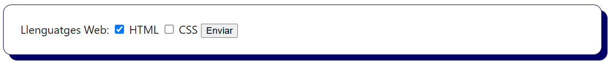

### Selecció Única (`<input type="radio">`)

```html
<label><input type="radio" name="llenguatge"> PHP</label>
<label><input type="radio" name="llenguatge" checked> JavaScript</label>
```

`Atributs genèrics`: El tipus "radio" disposa l'atribut `required`.

`checked`: Marca per defecte l'opció que disposa d'aquest atribut.

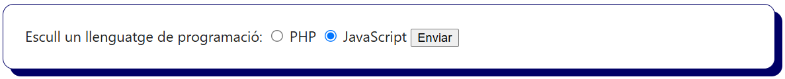

### Fitxer (`<input type="file">`)

```html
<input type="file" id="fitxer" name="fitxer" accept="image/png,image/jpeg">
```

`Atributs genèrics`: El tipus "radio" disposa l'atribut `required`.

`accept`: Indica els fitxers que admet pujar al servidor (per tipologia i extensió) `/image/*` accepta tot tipus d'imatges.

`multiple`: Permet la pujada al servidor de múltiples fitxers.

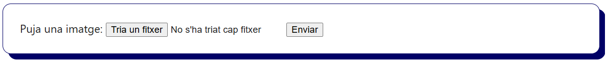

### Ocult (`<input type="hidden">`)

```html
<!-- No Visible: Token de seguretat generat pel servidor -->
<input type="hidden" name="tokenCSRF" value="a12f34c56d78ef90abc1234567890def">
<!-- Visible: Camp d'usuari i contrasenya  -->
<input type="text" id="usuari" name="usuari" required>
<input type="password" id="contrasenya" name="contrasenya" required>
```

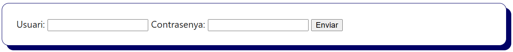

### Botó Genèric (`<input type="button">`)
### Enviar Formulari (`<input type="submit">`)

```html
<input type="button" value="Executa JavaScript" onclick="alert('Hola Món!')">
<input type="submit" value="Enviar Formulari">
```

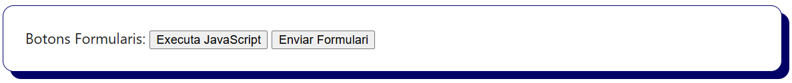

## 📝 Area de Text `<textarea>`

```html
<textarea id="comentari" name="comentari" rows="3" cols="40" placeholder="Escriu el teu comentari..."></textarea>
```

`name`: Nom de la variable que rebrà el servidor a l'enviar el formulari. Permet identificar un camp del formulari de manera única.

`rows`: Número de files visibles (alçada de l’àrea de text).

`cols`: Número de columnes visibles (amplada de l’àrea de text).

`placeholder`: Text guia que es mostra dins del camp (indica a l'usuari la informació que ha d'introduir).

`required`: Fa que el camp sigui obligatori. El formulari no es podrà enviar si no s'emplena aquest camp.

`maxlength`: Número de caràcters màxim que l'usuari pot introduir al camp de text perquè aquest sigui vàlid.

`minlength`: Número de caràcters mínim que l'usuari pot introduir al camp de text perquè aquest sigui vàlid.

`readonly`: Fa que el text de l'àrea de text es pugui llegir però no modificar.


## Selector d'opcions desplegable: `<select>` i `<option>`

```html
<select id="cicle" name="cicle" required>
  <option value="">-- Selecciona --</option>
  <option value="asix">ASIX</option>
  <option value="dam">DAM</option>
  <option value="dam">DAW</option>
  <option value="ciber">CIBER</option>
</select>
```
`name`: Ha de definir-se a l'etiqueta `<select>`.
`value`: Les dades de l'opció seleccionada s'enviaran al servidor.
`selected`:	Marca per defecte una opció que disposi d'aquest atribut. 

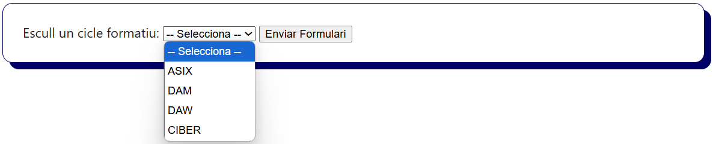


> 📝 Nota: El procés de validació de formularis i `satinitzat de dades` és molt important per garantir que la informació introduïda és correcta i segura. El procediment correcte és realitzar una validació amb `HTML5` i `JavaScript` al client i posteriorment al servidor amb llenguatges com `PHP` o `Python`.

---

## Exemple de Formulari HTML

```html
<form action="./processa_alta_videojoc.php" method="POST">
  <fieldset>
    <legend>Formulari Steam - Nou Videojoc</legend>

    <label for="titol">Títol del videojoc:</label>
    <input type="text" id="titol" name="titol" placeholder="Ex: Hollow Knight" required maxlength="50">
    <br><br>

    <label for="descripcio">Descripció:</label><br>
    <textarea id="descripcio" name="descripcio" rows="4" cols="50" placeholder="Escriu una petita sinopsi..." required></textarea>
    <br><br>

    <label for="plataforma">Plataforma:</label>
    <select id="plataforma" name="plataforma" required>
      <option value="">-- Selecciona una opció --</option>
      <option value="pc">PC</option>
      <option value="switch">Nintendo Switch</option>
      <option value="ps5">PlayStation 5</option>
      <option value="xbox">Xbox</option>
    </select>
    <br><br>

    <label for="genere">Gènere:</label>
    <input list="generes" id="genere" name="genere" placeholder="Acció, RPG, Plataformes..." required>
    <datalist id="generes">
      <option value="Acció">
      <option value="RPG">
      <option value="Plataformes">
      <option value="Simulació">
      <option value="Puzzle">
    </datalist>
    <br><br>

    <label for="preu">Preu (€):</label>
    <input type="number" id="preu" name="preu" step="0.01" min="0" max="100" required>
    <br><br>

    <label for="data-llancament">Data de llançament:</label>
    <input type="date" id="dataLlancament" name="dataLlancament" required>
    <br><br>

    <label for="valoracio">Còpies Gratuïtes (0-100):</label>
    <input type="range" id="valoracio" name="valoracio" min="0" max="100" step="1">
    <br><br>

    <label for="color-portada">Color principal de la portada:</label>
    <input type="color" id="colorPortada" name="colorPortada">
    <br><br>

    <label>Idiomes disponibles:</label>
    <input type="checkbox" id="catala" name="catala" value="catala">
    <label for="catala">Català</label>
    <input type="checkbox" id="castella" name="castella" value="castella">
    <label for="castella">Castellà</label>
    <input type="checkbox" id="angles" name="angles" value="angles">
    <label for="angles">Anglès</label>
    <br><br>

    <label>Mode de joc:</label>
    <input type="radio" id="singlePlayer" name="mode" value="1" required>
    <label for="singlePlayer">Un jugador</label>
    <input type="radio" id="multiPlayer" name="mode" value="2">
    <label for="multiPlayer">Multijugador</label>
    <br><br>

    <label for="email">Correu de contacte del desenvolupador:</label>
    <input type="email" id="email" name="email" placeholder="correu@domini.cat">
    <br><br>

    <label for="web">Web oficial del joc:</label>
    <input type="url" id="web" name="web" placeholder="https://domini.cat">
    <br><br>

    <label for="imatge">Pujar imatge del joc:</label>
    <input type="file" id="imatge" name="imatge" accept="image/*">
    

    <input type="hidden" name="id_desenvolupador" value="2991">

  </fieldset>

  <br>
  <button type="submit">Enviar formulari</button>
  <button type="reset">Reiniciar</button>
</form>
```

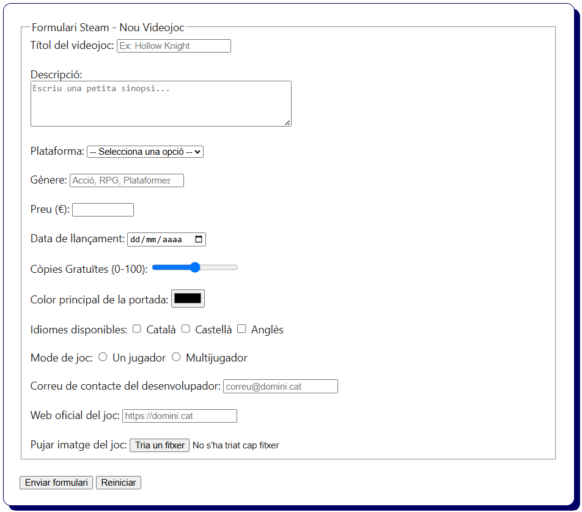