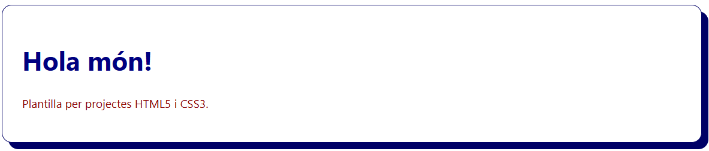

# Sintaxi CSS

Com ja sabem, CSS (Cascading Style Sheets) és un llenguatge que permet aplicar estils visuals als elements HTML. El navegador interpreta cada estil a partir de **regles CSS** que defineixen com han de mostrar-se els elements d'una pàgina web.

## Sintaxi regles CSS

Una regla CSS està formada per:

- **`Selector`**: Indica a quin element o conjunt d'elements HTML s’aplicaran els estils especificats.
- **`Propietat`**: Indica quina característica de l'element HTML es vol modificar (el color de fons, la mida, etc).
- **`Valor`**: Defineix com ha de ser la propietat (el valor del color de fons, el valor de la mida, etc).

```css
selector {
  propietat: valor;
}
```

- **`{ }`**: L'àmbit (bloc de declaracions), entre claus `{}`, delimita i conté una o més declaracions de propietats i valors.
- **`:`**: Els dos punts `:`, s'encarreguen de separar la propietat del valor.
- **`;`**: El punt i coma `;`, indica el final de cada declaració (per legibilitat, normalment es mostra una declaració per línia).

## Exemple document CSS

```css
/* Document CSS d'exemple */
h1 {
  color: navy;
}

p {
  color: darkred;
  font-size: 14px;
}
```

> 📝 Nota: Els documents amb codi CSS han de tenir una extensió `.css` perquè siguin identificats i interpretats correctament pel navegador. 

## Enllaçar documents HTML i CSS

Per treballar de manera ordenada en el desenvolupament d'una pàgina web, es recomana separar el contingut (codi HTML) i els estils visuals (codi CSS) en diferents fitxers.

Per associar (enllaçar) un document d'estils `.css` amb un document de contingut `.html` s'utilitza l'etiqueta `<link>` que s'ha de disposar dins de l'etiqueta `<head>` del fitxer HTML.

```html
<head>
  <link rel="stylesheet" href="./css/index.css">
</head>
```

> 📝 Nota: És molt important crear una carpeta anomenada `css` per allotjar tots els fitxers d'estils.

## Plantilla HTML5 i CSS3 per iniciar projectes web

```html
<!DOCTYPE html>
<html lang="ca">
  <head>
    <meta charset="UTF-8" />
    <meta name="viewport" content="width=device-width, initial-scale=1" />
    <title>Plantilla Web HTML5 i CSS3</title>
    <meta name="description" content="La meva plantilla web per projectes HTML5 i CSS3" />
    <link rel="icon" href="./img/favicon.ico" />
    <link rel="stylesheet" href="./css/index.css" />
  </head>
  <body>
    <h1>Hola món!</h1>
    <p>Plantilla per projectes HTML5 i CSS3.</p>
  </body>
</html>
```

