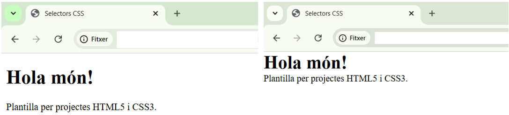
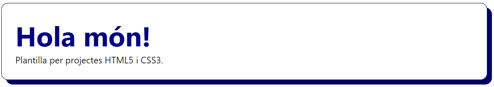
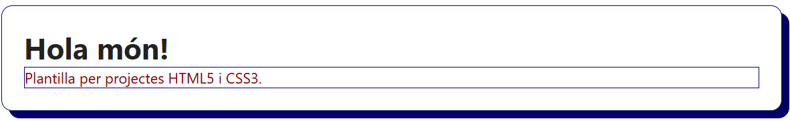
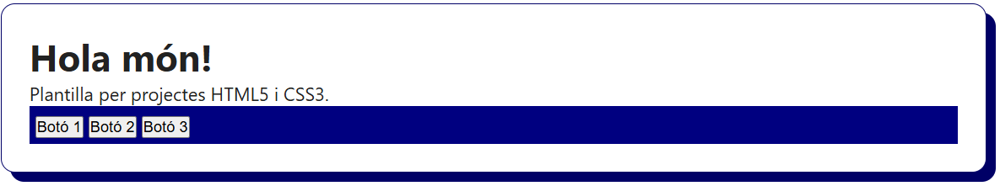
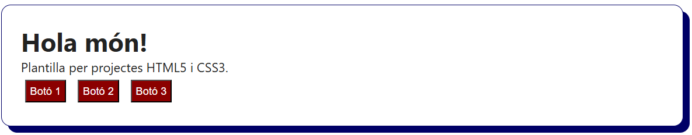
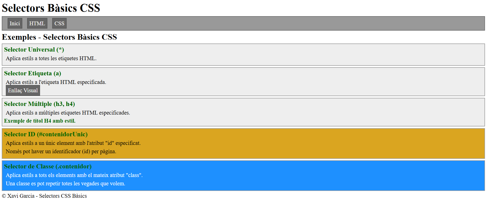

# Selectors bàsics en CSS

Els **selectors** permeten "seleccionar" un o diversos elements HTML i aplicar-hi uns estils CSS concrets.

## Tipus de selectors bàsics

| Selector               | Exemple       | Descripció                                                                            |
| ---------------------- | --------------| ------------------------------------------------------------------------------------- |
| **Universal**          | `*`           | Selecciona i aplica els estils especificats a TOTS els elements de la pàgina.         |
| **Etiqueta**           | `h1`          | Selecciona i aplica els estils a tots els elements amb l'etiqueta HTML especificada.  |
| **Múltiple**           | `h1, p, li`   | Selecciona i aplica els mateixos estils a un grup d'etiquetes HTML especifidades.     |
| **Identificador**      | `#logo`       | Selecciona i aplica els estils a un únic element HTML amb l'atribut `id` indicat.     |
| **Classe**             | `.jugador`    | Selecciona i aplica els estils a tots els elements amb l'atribut `class` indicat.     |

## Selector Universal (`*`)

```css
* {
  margin: 0;
  padding: 0;
}
```

> Elimina els marges de tots els elements de la pàgina web que per defecte apliquen els navegadors.

> 📝 Nota: Per tots els projectes web es recomana "reiniciar" els margin i padding per defecte.



## Selector Etiqueta (`h1`)

```css
h1 {
  font-size: 48px;
  color: navy;
}
```

> Per a tots els títols (`<h1>`) de la pàgina web modifica la seva mida de lletra a 48px i el seu color a navy.



## Selector Múltiple (`h2, p, li`)

```css
h2, p, li {
  border: solid 1px navy;
  color: darkred;
}
```

> Per a tots els (`<h2> <p> i <li>`) de la pàgina web, modifica la seva vora i color de lletra.



## Selector Identificador (`#nom`) id

```css
#menu {
  background-color: navy;
  color: white;
  padding: 5px;
}
```

> Per a l'etiqueta que conté l'atribut únic `id=menu` modifica el fons a color navy, el color de lletra blanc i el marge interior (padding) a 5px.



## Selector Classe (`.nom`) class

```css
.boto {
  margin: 5px;
  padding: 5px;
  background-color: darkred;
  color: navy;
}
```

> Per a totes les etiquetes amb l'atribut `class=boto` modifica el marge i el padding a 5px, el color de fons a darkred i el color de lletra a blanc.



## Exemples dels Selectors Bàsics CSS



```html
<!DOCTYPE html>
<html lang="ca">
  <head>
    <meta charset="UTF-8" />
    <meta name="viewport" content="width=device-width, initial-scale=1" />
    <title>Selectors Bàsics CSS</title>
    <meta name="description" content="Exemples d'ús dels diferents selectors bàsics de CSS." />
    <link rel="icon" href="./img/favicon.ico" />
    <link rel="stylesheet" href="./css/index.css" />
  </head>
  <body>
    <header>
      <h1>Selectors Bàsics CSS</h1>
      <nav>
        <ul id="menu">
          <li><a href="#">Inici</a></li>
          <li><a href="#">HTML</a></li>
          <li><a href="#">CSS</a></li>
        </ul>
      </nav>
    </header>
    <main>
      <section>
        <h2>Exemples - Selectors Bàsics CSS</h2>

        <div>
          <h3>Selector Universal (*)</h3>
          <p>Aplica estils a totes les etiquetes HTML.</p>
        </div>

        <div>
          <h3>Selector Etiqueta (a)</h3>
          <p>Aplica estils a l'etiqueta HTML especificada.</p>
          <a href="https://github.com/xavig-icv/">Enllaç Visual</a>
        </div>

        <div>
          <h3>Selector Múltiple (h3, h4)</h3>
          <p>Aplica estils a múltiples etiquetes HTML especificades.</p>
          <h4>Exemple de títol H4 amb estil.</h4>
        </div>

        <div id="contenidorUnic">
          <h3>Selector ID (#contenidorUnic)</h3>
          <p>Aplica estils a un únic element amb l'atribut "id" especificat.</p>
          <p>Només pot haver un identificador (id) per pàgina.</p>
        </div>

        <div class="contenidor">
          <h3>Selector de Classe (.contenidor)</h3>
          <p>Aplica estils a tots els elements amb el mateix atribut "class".</p>
          <p>Una classe es pot repetir totes les vegades que volem.</p>
        </div>
      </section>
    </main>
    <footer>
      <p>&copy; Xavi Garcia - Selectors CSS Bàsics</p>
    </footer>
  </body>
</html>
```

```css
/* Selectors bàsics CSS */

/* Selector Universal: Aplica estils a tots els elements HTML */
* {
  margin: 0;        /* Elimina marges per defecte */
  padding: 0;       /* Elimina separacions internes per defecte */
}

/* Selector Etiqueta: Aplica estils a l'element HTML indicat <div>, <li> i <a> */
div {
    border: solid 2px #999;
    background-color: #eee;
    padding: 5px;           /* Espai intern entre el text i la vora */
    margin: 5px;            /* Espai extern entre els enllaços */

}

li {
  display: inline-block;
}

a {
  background: #666;
  border: solid 2px #555;
  text-decoration: none;  /* Elimina el subratllat dels enllaços */
  color: white;           /* Defineix el color del text */
  margin: 5px;
  padding: 5px;
}

/* Selector Múltiple: Aplica el mateix estil als elements indicats */
h1, h2, p {
    margin: 5px;
}

h3, h4 {
  color: darkgreen;
}

/* Selector ID (#) – Aplica estils a una única etiqueta amb el "id" especificat */
/* Només pot haver un ID amb per pàgina, no es pot repetir el nom. */
#menu {
    background-color: #999;
    border: solid 2px #666;
    padding: 10px;
    margin: 5px;
}

#contenidorUnic {
  background: goldenrod;
}

/* Selector Classe (.) - Aplica estils a totes les etiquetes amb el mateix "class"  */
/* Les etiquetes CLASS es poden repetir a diferents elements de la pàgina. */
.contenidor {
  background: dodgerblue;
  color: white;
}
```
