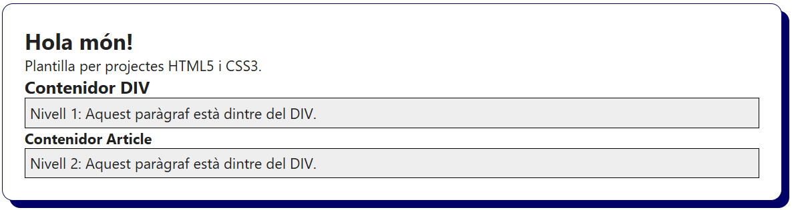
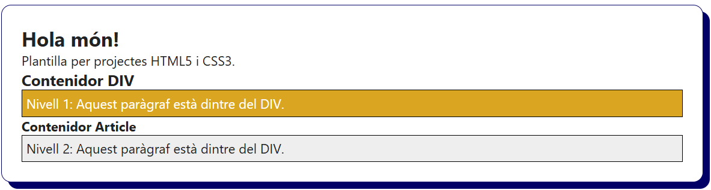
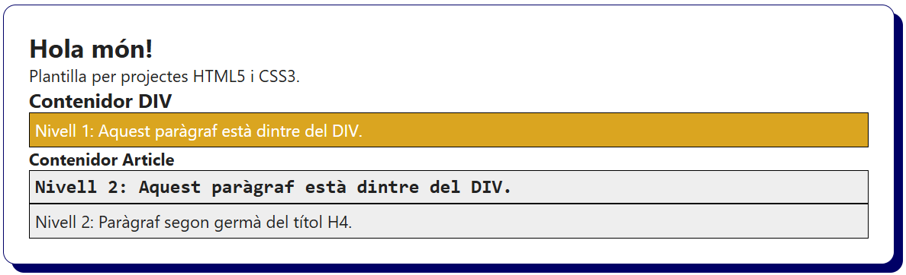
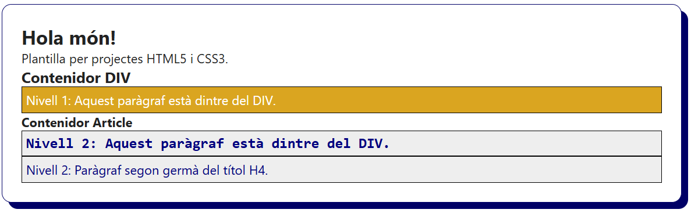
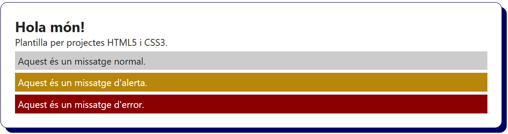
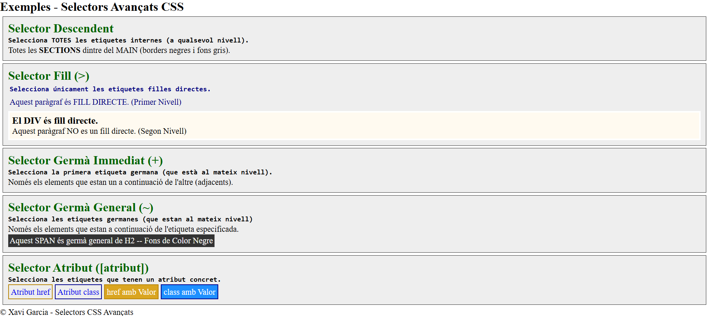

# Selectors avançats en CSS

Els **selectors avançats** permeten seleccionar elements HTML en funció de la seva posició dins de la pàgina, de la relació amb altres elements HTML o segons els atributs que contenen.

Aquests selectors es fan servir principalment per aplicar estils sense haver de fer ús excessiu de `class` i `id` als elements HTML. Aquest fet permet disposar d'un codi més net i fàcil de mantenir.

## Tipus de selectors avançats

| Selector               | Exemple          | Descripció                                                                                        |
|------------------------|------------------|---------------------------------------------------------------------------------------------------|
| **Descendent**         | `div p`          | Selecciona totes les etiquetes `p` que estiguin dins de `div` (a qualsevol nivell).               |
| **Fill directe**       | `ul > li`        | Selecciona només els fills directes (els `li` dins de `ul`, només el primer nivell).              |
| **Germans immediats**  | `h2 + p`         | Selecciona només la primera etiqueta germana `p` que estigui després d'un `h2` (al mateix nivell).|
| **Germans generals**   | `h2 ~ p`         | Selecciona a totes les etiquetes germanes `p`que estan a continuació d'un `h2` (al mateix nivell).|
| **Atribut**            | `a[href]`        | Selecciona tots els elements amb un atribut específic (els `a` amb un atribut `href`).            |

## Selector Descendent (`div p`)

```css
div p {
  border: solid 1px black;
  background-color: #eee;
  padding: 5px;
}
```

```html
<div>
  <h3>Contenidor DIV</h3>
  <p>Nivell 1: Aquest paràgraf està dintre del DIV.</p>
  <article>
    <h4>Contenidor Article</h4>
    <p>Nivell 2: Aquest paràgraf està dintre del DIV.</p>
  </article>
</div>
```

> Selecciona tots els paràgraf `<p>` de dintre de qualsevol element `<div>` a qualsevol nivell de profunditat.



## Selector Fill Directe (`div > p`)

> Nota: Mantenim l'HTML i CSS anterior i afegim la següent regla CSS.

```css
div > p {
  color: white;
  border: solid 1px black;
  background-color: goldenrod;
  padding: 5px;
}
```

> Selecciona tots els paràgraf `<p>` de dintre de qualsevol element `<div>` a una profunditat de nivell 1 (fills directes).



# Selector Germà Immediat (`h4 + p`)

> Nota: Mantenim l'HTML i CSS anterior i afegim la següent regla CSS.

```css
h4 + p {
  font-family: monospace;
  font-size: 18px;
  font-weight: bold;
}
```

```html
<p>Nivell 2: Paràgraf segon germà del títol H4.</p>
```

> Selecciona el paràgraf `<p>` que sigui el primer germà de `<h4>`, al mateix nivell.



# Selector Germà General (`h4 ~ p`)

> Nota: Mantenim l'HTML i CSS anterior i afegim la següent regla CSS.

```css
h4 ~ p {
  color: navy;
}
```

> Selecciona tots els paràgrafs `<p>` que siguin germans posteriors de `<h4>`, al mateix nivell.



# Selector Atribut (`[atribut]`)

> Nota: Mantenim l'HTML i CSS anterior i afegim les següents regles CSS.

```css
/* Atribut que comença per la paraula missatge */
div[class^="missatge"] {
  margin-top: 5px;
  padding: 5px;
  background-color: #ccc;
}

/* Atribut que conté la paraula alerta */
div[class~="alerta"] {
  background:darkgoldenrod;
  color: white;
}

/* Atribut que conté la paraula error */
div[class~="error"] {
  background: darkred;
  color: white;
}
```

```html
<div class="missatge">Aquest és un missatge normal.</div>
<div class="missatge alerta">Aquest és un missatge d'alerta.</div>
<div class="missatge error">Aquest és un missatge d'error.</div>
```

> Nota: Selecciona tots els `<div>` amb l'atribut que comença per `class=missatge` i també els `<div>` amb els atributs que contenen `class=alerta` i `class=error` i els hi aplica estils diferents.



Exemples dels Selectors Avançats CSS



```html
<!DOCTYPE html>
<html lang="ca">
  <head>
    <meta charset="UTF-8" />
    <meta name="viewport" content="width=device-width, initial-scale=1" />
    <title>Selectors Avançats CSS</title>
    <meta name="description" content="Exemples d'ús dels diferents selectors avançats de CSS." />
    <link rel="icon" href="./img/favicon.ico" />
    <link rel="stylesheet" href="./css/index.css" />
  </head>
  <body>
    <header>
      <h1>Selectors Avançats CSS</h1>
      <section>
        <p>Selecciona elements per aplicar-hi estils segons:</p>
        <ul>
          <li>La seva posició al document HTML.</li>
          <li>La relació que disposa amb altres elements.</li>
          <li>Els atributs que hi estan declarats.</li>
        </ul>
      </section>
    </header>
    <main>
      <h2>Exemples - Selectors Avançats CSS</h2>
      <section>
        <h2>Selector Descendent</h2>
        <p>Selecciona TOTES les etiquetes internes (a qualsevol nivell).</p>
        <p>Totes les <strong>SECTIONS</strong> dintre del MAIN (borders negres i fons gris).</p>      
      </section>
      <section id="fillDirecte">
        <h2>Selector Fill (&gt;)</h2>
        <p>Selecciona únicament les etiquetes filles directes.</p>
        <p>Aquest paràgraf és FILL DIRECTE. (Primer Nivell)</p>
        <div>
            <h3>El DIV és fill directe.</h3>
            <p>Aquest paràgraf NO es un fill directe. (Segon Nivell)</p>
        </div>
      </section>
      <section id="germaImmediat">
        <h2>Selector Germà Immediat (+)</h2>
        <p>Selecciona la primera etiqueta germana (que està al mateix nivell).</p>
        <p>Només els elements que estan un a continuació de l'altre (adjacents).</p>
      </section>
      <section id="germaGeneral">
        <h2>Selector Germà General (~)</h2>
        <p>Selecciona les etiquetes germanes (que estan al mateix nivell)</p>
        <p>Només els elements que estan a continuació de l'etiqueta especificada.</p>
        <span>Aquest SPAN és germà general de H2 -- Fons de Color Negre</span>
      </section>
      <section id="atributs">
          <h2>Selector Atribut ([atribut])</h2>
          <p>Selecciona les etiquetes que tenen un atribut concret.</p>
          <a href="#">Atribut href</a>
          <a href="#" class="jugador">Atribut class</a>
          <a href="https://github.com/xavig-icv/">href amb Valor</a>
          <a href="#" class="jugadorEspecial">class amb Valor</a>
      </section>
    </main>
    <footer>
      <p>&copy; Xavi Garcia - Selectors CSS Avançats</p>
    </footer>
  </body>
</html>
```

```css
* {
  margin: 0;
  padding: 0;
}

/* Selectors Avançats */

/* Selector DESCENDENT */
header section {
  border: solid 1px #999;
  background-color: bisque;
  margin: 5px;
  padding: 20px;
}

main section {
  border: solid 1px #333;
  background-color: #eee;
  padding: 10px;
  margin: 5px;
}

section h2 {
  color: darkgreen;
}


/* Selector FILL Directe (>) - Selecciona les etiquetes filles directes. */
#fillDirecte > p {
    color: navy;
    padding: 3px;
}

#fillDirecte > div {
  border: solid 3px #fff;
  background-color: floralwhite;
  margin-top: 5px;
  padding: 5px;
}

/* Selector GERMÀ Immediat (+) - Selecciona la primera etiqueta germana. */
h2 + p {
    font-family: monospace;
    font-size: 14px;
    font-weight: bolder;
    line-height: 1.4;
}

/* Selector GERMÀ General (~) - Selecciona les etiquetes germanes posteriors. */
#germaGeneral h2 ~ span {
    color: white;
    background-color: #333;
    padding: 3px;
    line-height: 1.6;
}

/* Selector ATRIBUT [nom_atribut] - Seleccions les etiquetes amb atributs els especificats. */
a {
  text-decoration: none;
  padding: 4px;
  line-height: 1.8;
}
#atributs a[href] {
    border: solid 2px darkgoldenrod;
}

#atributs a[class] {
    border: solid 2px darkblue;
}

#atributs a[href="https://github.com/xavig-icv/"] {
    background: goldenrod;
    color: white;
}

#atributs a[class="jugadorEspecial"] {
    background: dodgerblue;
    color: #fff;
}
```
