# Bloc 01. Propietats de Text

Les següents propietats permeten modificar la tipografia, la mida, el color i altres aspectes dels textos per fer-los més llegibles, atractius i que concordin amb el disseny de la resta de la pàgina web.

## Propietats del text

| Nom                    | Propietat            | Descripció                                                                                           |
|------------------------|----------------------|------------------------------------------------------------------------------------------------------|
| Color del text         | `color`              | Canvia el color del text aplicant un format (nom, hexadecimal, rgb, rgba, hsl, hsla).                |
| Mida del text          | `font-size`          | Defineix la mida de la lletra utilitzant una unitat de mesura (px, em, rem, %, etc).                 |
| Tipus de lletra        | `font-family`        | Canvia la tipografia de lletra (la font principal a utilitzar), es poden indicar fonts alternatives. |
| Gruix de la lletra     | `font-weight`        | Modifica el gruix del text amb valors de text (normal, bold, bolder) o numèrics (de 100 a 900).      |
| Estil de la lletra     | `font-style`         | Posa el text en cursiva (italic) o normal. Només afecta a l'estil visual, no substitueix a `<em>`.   |
| Alineació del text     | `text-align`         | Alinea el text horitzontalment a esquerra, dreta, centre o justificat (left, right, center, justify).|
| Decoració del text     | `text-decoration`    | Afegeix o elimina efectes visuals com el subratllat (underline, none, dashed, dotted, etc).          |
| Ombra del text         | `text-shadow`        | Permet afegir ombres de colors al text per afavorir la lectura o només com estil visual.             |
| Transformació del text | `text-transform`     | Converteix el text a majúscules, minúscules, etc. (uppercase, lowercase, capitalize, etc).           |
| Interliniat            | `line-height`        | Modifica l'espai (marge) vertical entre línies d’un paràgraf. Pren valors (1.2, 1.4, 1.6, 1.8, etc). |
| Espai entre caràcters  | `letter-spacing`     | Modifica l'espai (horitzontal) entre caràcters. Millora la llegibilitat en algunes fonts.            |
| Espai entre paraules   | `word-spacing`       | Defineix la quantiat de separació entre paraules. Apropa o allunya les paraules segons s'indiqui.    |

## Color del text (`color`)

```css
/* Nom del color: Poc precís però amb més de 100 colors disponibles */
.color-nom {
  color: darkred;
}

/* Hexadecimal: Cada 2 valors representa el color red, green o blue. El #000000 (negre) i el #ffffff (blanc) */
.color-hex {
  color: #2ecc71; /* verd suau */
}

/* Format RGB: Red, Green i Blue amb valors entre (0,0,0) negre i (255,255,255) blanc. */
.color-rgb {
  color: rgb(52, 152, 219); /* blau clar */
}

/* Format RGBA: Red, Green, Blue i Alpha. El mateix que RGB però amb un valor de transparència entre 0 i 1.*/
.color-rgba {
  color: rgba(155, 89, 182, 0.3); /* lila amb transparència */
}

/* Format HSL: Hue, Saturation i Lightness. H (entre 0 i 360), S (entre 0 i 100%), L (entre 0 i 100%)*/
.color-hsl {
  color: hsl(39, 100%, 50%); /* taronja intens */
}

/* Format HSLA: El mateix que HSL però amb un valor de transparència entre 0 i 1.*/
.color-hsla {
  color: hsla(0, 100%, 40%, 0.4); /* vermell translúcid */
}
```

```html
<h2>Propietat: color del text (color)</h2>
<p class="color-nom">Dóna color amb el format de nom.</p>
<p class="color-hex">Dóna color amb el format hexadecimal.</p>
<p class="color-rgb">Dóna color amb el format rgb.</p>
<p class="color-rgba">Dóna color amb el format rgba.</p>
<p class="color-hsl">Dóna color amb el format hsl.</p>
<p class="color-hsla">Dóna color amb el format hsla.</p>
```

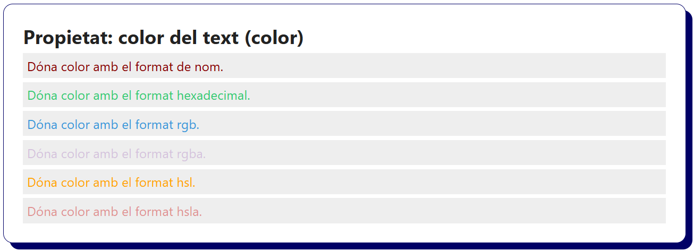

## Mida del text (`font-size`)

```css
/* Píxels (px): Unitat absoluta (valor fix) com els centímetres (1cm = 38px aprox.) */
.font-px {
  font-size: 18px; /* Mida en píxels (px) de cada lletra, per defecte acostuma a ser 16px. */
}

/* EM (em): Unitat relativa a la mida de lletra de l’element pare (un nivell superior). */
.font-em {
  font-size: 1.5em; /* Si el text del pare és de 16px, la mida serà de 16 x 1.5 = 24px */
}

/* RootEM (rem): Relatiu a la mida de lletra de l'element arrel HTML (acostuma a ser 16px). */
.font-rem {
  font-size: 2rem; /* 2 × 16px = 32px, és el format més recomanat per disseny web */
}

/* Viewport Width (vw): Relatiu a l’amplada de la finestra del navegador. */
/* S'utilitza per textos molt grans en landing pages i efectes visuals.*/
.font-vw {
  font-size: 3.5vw; /* 3.5vw = 3.5% de la mida de la pantalla. Valor diferent segons la mida de la pantalla. */
}
```

```html
<h2>Propietat: mida del text (font_size)</h2>
<p class="font-px">Text amb mida en PX (unitat absoluta).</p>
<p class="font-em">Text amb mida en EM (relativa al pare).</p>
<p class="font-rem">Text amb mida en REM (relativa a l'arrel HTML).</p>
<p class="font-vw">Text amb mida en VW (relativa a l'amplada de la finestra).</p>
```

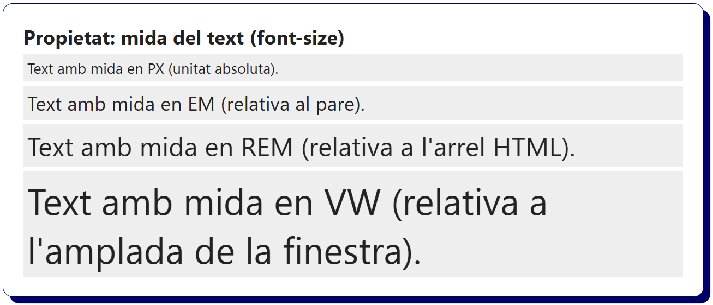

## Tipus de lletra (`font-family`)

```css
/* Fonts genèriques del sistema: Compatibles amb tots els navegadors */
.font-system {
  font-family: system-ui, sans-serif;
}

.font-serif {
  font-family: serif; /* Lletra amb serifa (com Times New Roman) */
}

.font-sans {
  font-family: sans-serif; /* Lletra sense serifa (com Arial o Helvetica) */
}

.font-monospace {
  font-family: monospace; /* Tots els caràcters mesuren el mateix (com Courier New) */
}

/* Fonts concretes i una font genèrica en cas de que la primera no estigui disponible. */
.font-georgia {
  font-family: Georgia, serif;
}

.font-arial {
  font-family: Arial, sans-serif;
}

.font-cursive {
  font-family: "Comic Sans MS", cursive;
}
```

```html
<h2>Propietat: tipus de lletra (font-family)</h2>
<p class="font-system">Text amb la font del sistema.</p>
<p class="font-serif">Text amb una font serif.</p>
<p class="font-sans">Text amb una font sans-serif.</p>
<p class="font-monospace">Text amb una font monospace.</p>
<p class="font-georgia">Text amb la font Georgia (serif).</p>
<p class="font-arial">Text amb la font Arial (sans-serif).</p>
<p class="font-cursive">Text amb la font Comic Sans MS.</p>
```

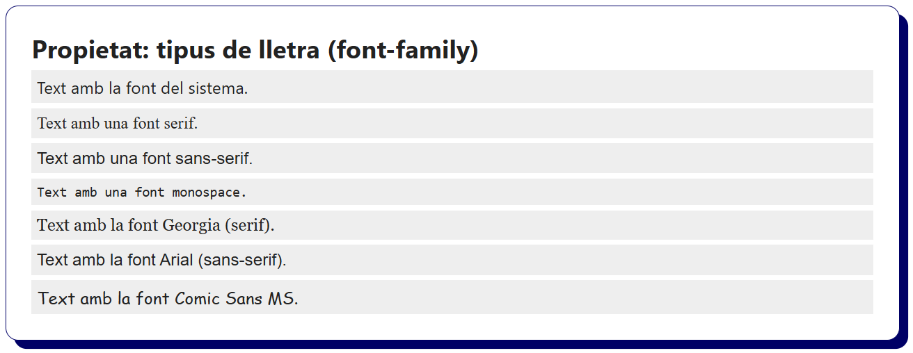

## Gruix de la lletra (`font-weight`)

```css
html {
    font-family: system-ui, sans-serif;
}

/* Lletra amb un gruix normal (per defecte), pot ser "normal" o 400. */
.weight-normal {
  font-weight: normal;
}

/* Lletra poc gruixuda amb valors per sota de 400. */
.weight-thin {
  font-weight: 100;
}

/* Lletra amb un gruix per sobre de la mitjana de 400. */
.weight-medium {
  font-weight: 500;
}

/* Lletra amb un gruix de negreta, pot ser "bold" o 700. */
.weight-bold {
  font-weight: bold;
}

/* Lletra molt gruixuda, a partir de 700 fins a 900. */
.weight-heavy {
  font-weight: 900;
}
```

```html
<h2>Propietat: gruix de la lletra (font-weight)</h2>
<p class="weight-normal">Text amb un gruix normal (400 o "normal").</p>
<p class="weight-thin">Text amb molt poc gruix (100).</p>
<p class="weight-medium">Text amb un gruix mig (500).</p>
<p class="weight-bold">Text amb un gruix de negreta (700 o "bold").</p>
<p class="weight-heavy">Text amb el gruix màxim (900).</p>
```

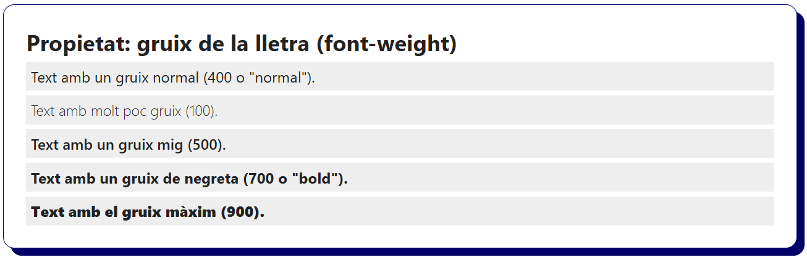

## Estil de lletra (`font-style`)

```css
/* Estil normal (sense inclinació) */
.style-normal {
  font-style: normal;
}

/* Estil italic (cursiva) */
.style-italic {
  font-style: italic;
}

/* Estil oblique (més inclinació que la cursiva) */
.style-oblique {
  font-style: oblique;
}
```

```html
<h2>Propietat: estil de lletra (font-style)</h2>
<p class="style-normal">Text amb estil normal (sense inclinació).</p>
<p class="style-italic">Text amb estil italic (cursiva).</p>
<p class="style-oblique">Text amb estil oblique (cursiva més inclinada).</p>
```

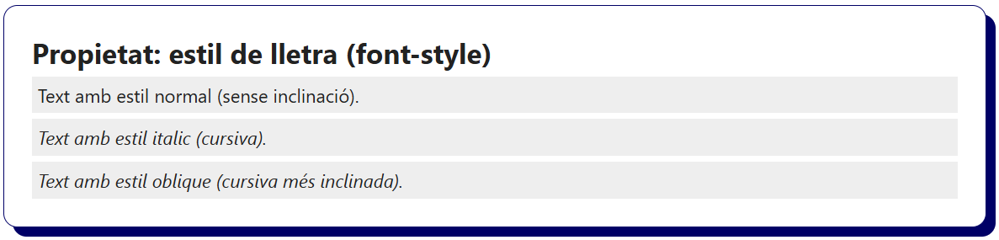

## Alineació del text (`text-align`)

```css
/* Alineació del text a l'esquerra (valor per defecte) */
.align-left {
  text-align: left;
}

/* Alineació del text al centre */
.align-center {
  text-align: center;
}

/* Alineació del text a la dreta */
.align-right {
  text-align: right;
}

/* Justificat: Ajusta el text de cada línia als marges del contenidor (no s'aconsella en web) */
.align-justify {
  text-align: justify;
}
```

```html
<h2>Propietat: alineació del text (text-align)</h2>
<p class="align-left">Text alineat a l'esquerra (valor per defecte).</p>
<p class="align-center">Text alineat al centre. S'utilitza per títols, missatges d'usuari (notificacions).</p>
<p class="align-right">Text alineat a la dreta. S'utilitza amb un layout concret que pot ser més estètic.</p>
<p class="align-justify">
Text justificat. El navegador, de forma automàtica, com un processador de text, ajusta cada línia perquè comencin i acabin  exactament als marges del contenidor. És útil per millorar l'estètica en textos llargs, però pot generar espais blancs de diferents mides. No s'aconsella utilitzar en el desenvolupament web, és preferible alinear el text a l'esquerra o al centre.
</p>
```

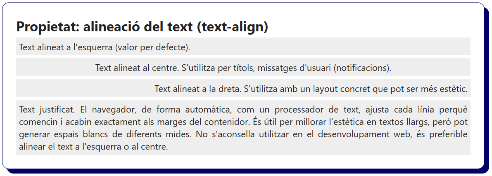

## Decoració del text (`text-decoration`)

```css
/* Sense cap decoració (valor per defecte) */
/* Permet treure el subratllat als anchor <a> */
.decoration-none {
  text-decoration: none;
}

/* Text subratllat */
.decoration-underline {
  text-decoration: underline;
}

/* Text ratllat (una línia al mig) */
.decoration-line-through {
  text-decoration: line-through;
}

/* Línia a sobre del text */
.decoration-overline {
  text-decoration: overline;
}

/* Mètode abreujat: Subratllat ondulat de color blau */
.underline-wavy-blue {
  text-decoration: underline wavy dodgerblue;
}

/* Mètode abreujat: Subratllat de punts vermell */
.underline-dotted-red {
  text-decoration: underline dotted darkred;
}

/* Mètode abreujat: Línia doble al mig amb color verd */
.line-through-double-green {
  text-decoration: line-through double seagreen;
}

/* Mètode abreujat: Línia a sobre amb estil dashed i color lila */
.overline-dashed-purple {
  text-decoration: overline dashed darkorchid;
}
```

```html
<h2>Propietat: decoració del text (text-decoration)</h2>
<p class="decoration-none">Text sense decoració (none). Permet treure el subratllat als enllaços.</p>
<p class="decoration-underline">Text amb subratllat (underline).</p>
<p class="decoration-line-through">Text amb una línia al mig (line-through).</p>
<p class="decoration-overline">Text amb línia a sobre (overline).</p>
<p class="underline-wavy-blue">Mètode abreujat: Subratllat ondulat i blau. (underline i wavy)</p>
<p class="underline-dotted-red">Mètode abreujat: Subratllat de punts i vermell. (underline i dotted)</p>
<p class="line-through-double-green">Mètode abreujat: Ratllat doble i verd. (line-through i double)</p>
<p class="overline-dashed-purple">Mètode abreujat: Línia superior lila i discontínua. (overline i dashed)</p>
```

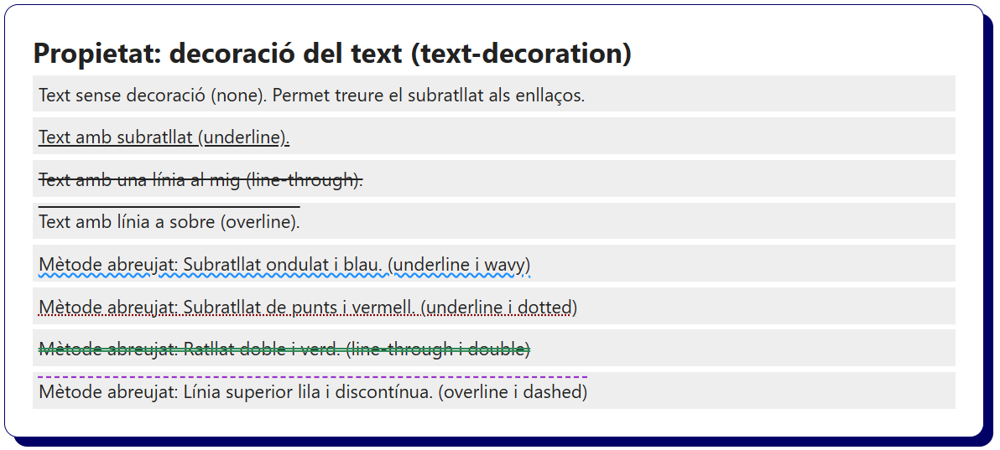

## Ombra del text (`text-shadow`)

```css
/* L'ombra és simple i visible (molt marcada per veure l'exemple d'ombra dels caràcters). */
.shadow-visible {
  text-shadow: 2px 2px 1px #aaa;
}

/* L'ombra està força difuminada i és pretèn marcar amb un color fosc */
.shadow-strong {
  text-shadow: 0px 0px 5px black;
}

/* L'ombra és difuminada i de color vermell */
.shadow-colored {
  text-shadow: 1px 1px 4px darkred;
}

/* L'ombra negra sobre text blanc (efecte visual). */
.shadow-white {
  color: white;
   text-shadow: 0px 0px 4px black;
}

/* Diverses ombres en un mateix text (efecte visual). */
.shadow-multiple {
  text-shadow:
    0px 1px 0px #aaa,
    0px 2px 0px #bbb,
    0px 3px 0px #ccc;
}
```

```html
<h2>Propietat: ombra del text (text-shadow)</h2>
<p>Text d'exemple normal (sense ombra).</p>
<p class="shadow-light">El text disposa d'una ombra. (2px 2px 1px gris).</p>
<p class="shadow-strong">El text disposa d'una ombra més intensa. (0px 0px 5px negre).</p>
<p class="shadow-colored">El text disposa d'una ombra vermella. (1px 1px 4px vermell).</p>
<p class="shadow-white">El text de color blanc disposa d'una ombra negra. (efecte visual).</p>
<p class="shadow-multiple">El text disposa de diverses ombres superposades. (efecte visual).</p>
```

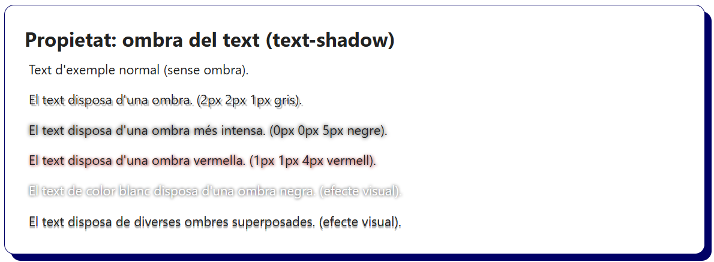

## Transformació del text (`text-transform`)

```css
/* Tot el text en majúscules */
.transform-uppercase {
  text-transform: uppercase;
}

/* Tot el text en minúscules */
.transform-lowercase {
  text-transform: lowercase;
}

/* La primera lletra de cada paraula en majúscula */
.transform-capitalize {
  text-transform: capitalize;
}

/* Sense transformació (valor per defecte) */
.transform-none {
  text-transform: none;
}
```

```html
<h2>Propietat: transformació del text (text-transform)</h2>
<p class="transform-uppercase">El text es mostrarà TOT EN MAJÚSCULES. (uppercase)</p>
<p class="transform-lowercase">El text es mostrarà tot en MINÚSCULES. (lowercase)</p>
<p class="transform-capitalize">El text mostrarà cada lletra d'inici de Paraula En Majúscula. (capitalize)</p>
<p class="transform-none">El text es MOSTRA sense cap Transformació. (none)</p>
```

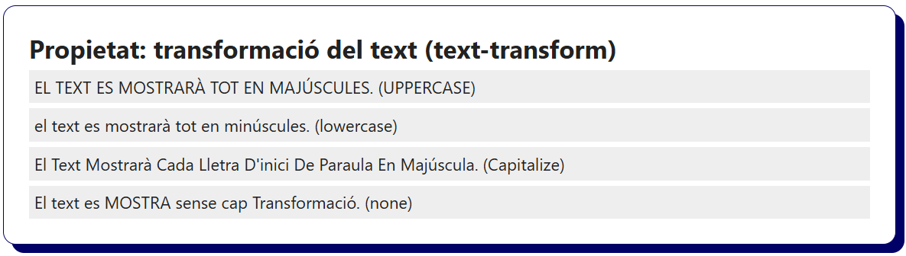

## Interliniat (`line-height`)

```css
/* Interlineat mínim sense solapament (línies molt juntes) */
.line-1 {
  line-height: 1;
}

/* Interliniat amb l'alçada normal (el valor per defecte és 1.2) */
.line-normal {
  line-height: normal;
}

/* Interlineat agradable per la lectura (és el valor recomanat) */
.line-1-6 {
  line-height: 1.6;
}

/* Interlineat amb les línies molt separades */
.line-2 {
  line-height: 2;
}
```

```html
<h2>Propietat: interlineat (line-height)</h2>
<p class="line-1">
  El text disposa d'un interlineat molt petit (1).<br>
  No s'aconsella aquesta distància entre línies de text.
</p>
<p class="line-normal">
  El text disposa de l'interlineat per defecte (normal ó 1.2).<br>
  És agradable a la vista i s'utilitza en textos curts.
</p>
<p class="line-1-6">
  El text disposa d'un interlineat adequat per la lectura (1.6).<br>
  S'utilitza a la majoria de pàgines web i sobretot en textos llargs.
</p>
<p class="line-2">
  El text disposa d'un interlineat amb molt d'espai. (2)<br>
  Pot ser útil per destacar algun paràgraf en concret del text.
</p>
```

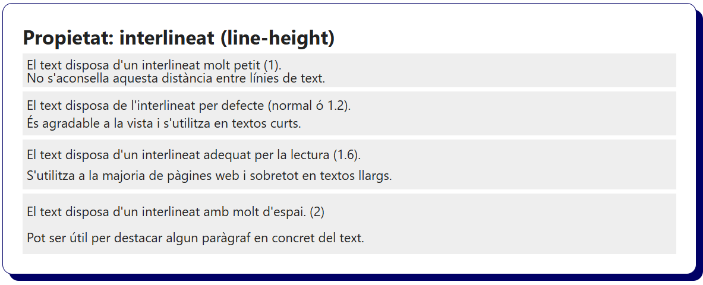

## Espai entre caràcters (`letter-spacing`)

```css
/* Espai per defecte entre caràcters (0px ó normal) */
.spacing-normal {
  letter-spacing: normal;
}

/* Caràcters més junts (Espais reduïts, botons, etc.) */
.spacing--1 {
  letter-spacing: -1px;
}

/* Caràcters amb separació (Per donar èmfasi o destacar una part del text) */
.spacing-1 {
  letter-spacing: 1px;
}

/* Caràcters molt separats (Per títols, portades, animacions, etc.) */
.spacing-3 {
  letter-spacing: 3px;
}
```

```html
<h2>Propietat: espai entre caràcters (letter-spacing)</h2>
<p class="spacing-normal">Text amb l'espai per defecte entre caràcters. (normal ó 0px)</p>
<p class="spacing--1">Text amb els caràcters més junts. S'utilitza en alguns botons o amb poc espai. (-1px)</p>
<p class="spacing-1">Text amb més espai entre caràcters. S'utilitza per visibilitat o decoració. (1px)</p>
<p class="spacing-3">TEXT VISTÓS AMB CARÀCTERS MOLT SEPARATS. (3px)</p>
```

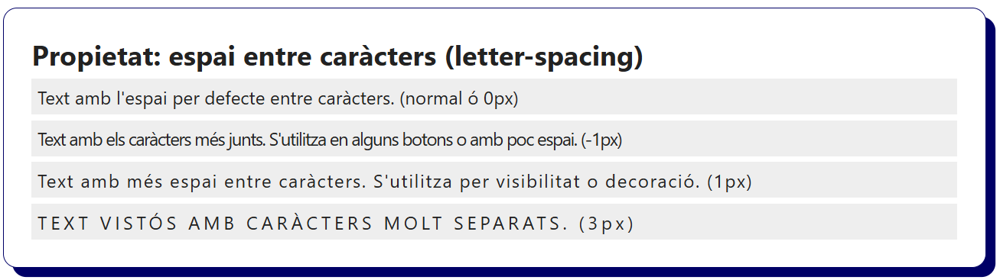

## Espai entre paraules (`word-spacing`)

```css
/* Espai per defecte entre paraules (normal ó 0px) */
.word-normal {
  word-spacing: normal;
}

/* Paraules molt juntes, sense espais (no s'aconsella aquest ús, només en casos molt concrets). */
.word--4 {
  word-spacing: -4px;
}

/* Paraules amb un espai considerable entre elles. (Títols o paràgraf a destacar). */
.word-8 {
  word-spacing: 8px;
}

/* Paraules molt separades. (Bàsicament només s'utilitza en títols com eslògans). */
.word-16 {
  word-spacing: 16px;
}
```

```html
<h2>Propietat: espai entre paraules (word-spacing)</h2>
<p class="word-normal">El text disposa d'un espai entre paraules per defecte. (normal ó 0px)</p>
<p class="word--4">El text no disposa d'espai entre paraules. (-4px)</p>
<p class="word-8">El text disposa del doble d'espai entre paraules del normal. (8px)</p>
<p class="word-16">El text disposa d'un espai de paraules molt grant. (16px)</p>
```

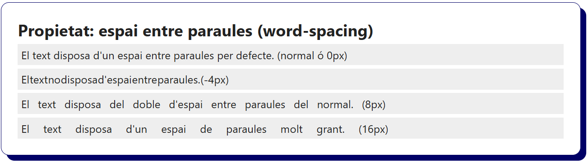