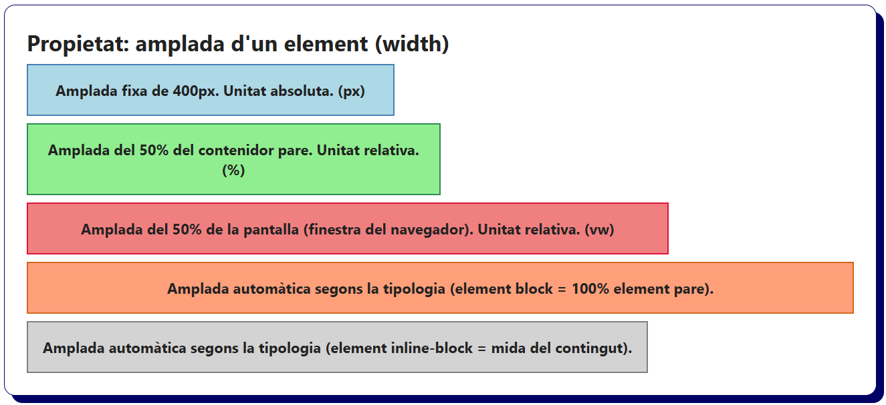
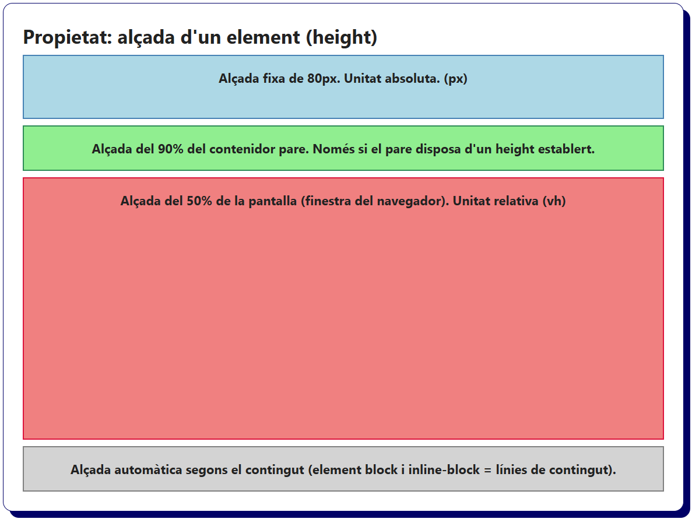
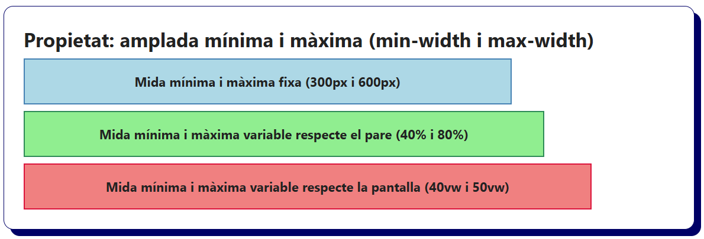
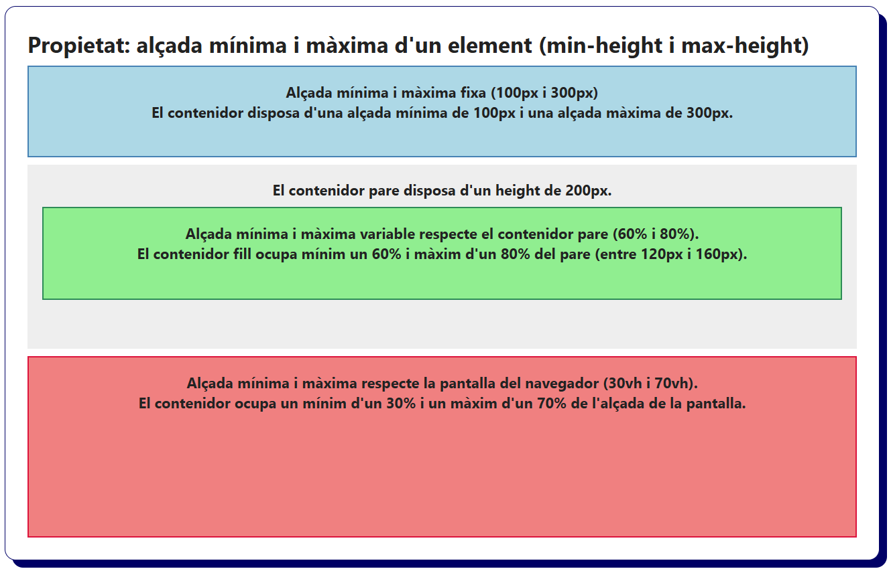

# Bloc 02. Propietats de Dimensions

Les següents propietats permeten establir i limitar l’alçada i l’amplada dels elements HTML (fent ús de valors absoluts o relatius). Això permet controlar l'espai que ocupa cada element dins del disseny (layout) de la pàgina web.

| **Nom**        | **Propietat** | **Descripció**                                                                                      |
| -------------- | ------------- | --------------------------------------------------------------------------------------------------- |
| Amplada        | `width`       | Estableix l’amplada exacta d’un element utilitzant una unitat de mesura (px, %, vw, etc).           |
| Alçada         | `height`      | Estableix l'alçada exacta d’un element utilitzant una unitat de mesura (px, %, vh, etc).            |
| Amplada mínima | `min-width`   | Indica l’amplada mínima que pot tenir un element. (estableix un mínim d'amplada en webs responsive).|
| Amplada màxima | `max-width`   | Limita l’amplada màxima d'un element (estableix un màxim d'amplada en webs responsive).             |
| Alçada mínima  | `min-height`  | Indica l'alçada mínima que pot tenir un element. (estableix un mínim d'alçada en webs responsive).  |
| Alçada màxima  | `max-height`  | Limita l'alçada màxima d'un element (estableix un màxim d'alçada en webs responsive).               |


## Amplada d'un element (`width`)

```css
/* Element amb amplada fixa (unitat absoluta) */
.width-px {
  width: 400px;
  background-color: lightblue;
  border: solid 2px steelblue;
}

/* Element amb una amplada del 50% del contenidor pare */
.width-percent {
  width: 50%;
  background-color: lightgreen;
  border: solid 2px seagreen;
}

/* Element amb una amplda del 50% de l'amplada de la pantalla (navegador) */
.width-vw {
  width: 50vw;
  background-color: lightcoral;
  border: solid 2px crimson;
}

/* Element block (div), l’amplada és el 100% del contenidor pare */
.width-auto-block {
  width: auto;
  background-color: lightsalmon;
  border: solid 2px chocolate
}

/* Element inline-block (div transformat), l’amplada s’adapta al seu contingut */
.width-auto-inline-block {
  display: inline-block;
  width: auto;
  background-color: lightgray;
  border: solid 2px gray;
}
```

```html
<h2>Propietat: amplada d'un element (width)</h2>
<div class="width-px">Amplada fixa de 400px. Unitat absoluta. (px)</div>
<div class="width-percent">Amplada del 50% del contenidor pare. Unitat relativa. (%)</div>
<div class="width-vw">Amplada del 50% de la pantalla (finestra del navegador). Unitat relativa. (vw)</div>
<div class="width-auto-block">Amplada automàtica segons la tipologia (element block = 100% element pare).</div>
<div class="width-auto-inline-block">Amplada automàtica segons la tipologia (element inline-block = mida del contingut).</div>
```




## Alçada d'un element (`height`)

```css
/* Element amb una alçada fixa (unitat absoluta) */
.height-px {
  height: 80px;
  background-color: lightblue;
  border: solid 2px steelblue;
}

/* Element amb una alçada del 90% del contenidor pare */
.height-percent {
  height: 90%;
  background-color: lightgreen;
  border: solid 2px seagreen;
}

/* Element amb una alçada del 50% de la pantalla (navegador) */
.height-vh {
  height: 50vh;
  background-color: lightcoral;
  border: solid 2px crimson;
}

/* Elements block i inline-block, l’alçada s’adapta al contingut automàticament */
.height-auto-block {
  height: auto;
  background-color: lightgray;
  border: solid 2px gray;
}
```

```html
<h2>Propietat: alçada d’un element (height)</h2>
<div class="height-px">Alçada fixa de 80px. Unitat absoluta. (px)</div>
<div class="height-percent">Alçada del 90% del contenidor pare. Només si el pare disposa d'un height establert.</div>
<div class="height-vh">Alçada del 50% de la pantalla (finestra del navegador). Unitat relativa (vh)</div>
<div class="height-auto-block">Alçada automàtica segons el contingut (element block i inline-block = línies de contingut).</div>
```



## Amplada mínima i màxima d'un element (`min-width` i `max-width`)

```css
/* Amplada mínima i màxima fixa (px). Elements que no poden ser més petits o més grans per què siguin llegibles. */
.minmax-width-px {
  min-width: 300px;
  max-width: 600px;
  background-color: lightblue;
  border: solid 2px steelblue;
}

/* Amplada mínima i màxima variable (%). Es calcula respecte al contenidor pare. */
.minmax-width-percent {
  min-width: 40%;
  max-width: 80%;
  background-color: lightgreen;
  border: solid 2px seagreen;
}

/* Amplada mínima i màxima variable (vw). Es calcula respecte a l'amplada de la pantalla (navegador). */
.minmax-width-vw {
  min-width: 40vw;
  max-width: 50vw;
  background-color: lightcoral;
  border: solid 2px crimson;
}
```

```html
<h2>Propietat: amplada mínima i màxima (min-width i max-width)</h2>
<div class="minmax-width-px">Mida mínima i màxima fixa (300px i 600px)</div>
<div class="minmax-width-percent">Mida mínima i màxima variable respecte el pare (40% i 80%)</div>
<div class="minmax-width-vw">Mida mínima i màxima variable respecte la pantalla (40vw i 50vw)</div>
```



## Alçada mínima i màxima d'un element (`min-height` i `max-height`)

```css
/* Alçada mínima i màxima fixa (px). Elements que no poden ser més petits o més grans per què siguin llegibles. */
.minmax-height-px {
  min-height: 100px;
  max-height: 300px;
  background-color: lightblue;
  border: solid 2px steelblue;
}

/* Alçada mínima i màxima variable (%). Es calcula respecte al contenidor pare. Layouts amb elements d'alçada variable. */
.minmax-height-percent-pare {
  height: 200px; /* El contenidor pare ha de tenir una alçada (height) perquè el percentatge (%) en el fill funcioni. */
  background-color: #eee;
  padding: 1rem;
}

.minmax-height-percent {
  min-height: 60%;
  max-height: 80%;
  background-color: lightgreen;
  border: solid 2px seagreen;
}

/* Alçada mínima i màxima variable (vh). Es calcula respecte a l'alçada de la pantalla (navegador). Landing pages. */
.minmax-height-vh {
  min-height: 30vh;
  max-height: 70vh;
  background-color: lightcoral;
  border: solid 2px crimson;
}
```

```html
<h2>Propietat: alçada mínima i màxima d'un element (min-height i max-height)</h2>
<div class="minmax-height-px">
  <p>Alçada mínima i màxima fixa (100px i 300px)</p>
  <p>El contenidor disposa d'una alçada mínima de 100px i una alçada màxima de 300px.</p>
</div>
<div class="minmax-height-percent-pare">
  <p>El contenidor pare disposa d'un height de 200px.</p>
  <div class="minmax-height-percent">
    <p>Alçada mínima i màxima variable respecte el contenidor pare (60% i 80%).</p>
    <p>El contenidor fill ocupa mínim un 60% i màxim d'un 80% del pare (entre 120px i 160px).</p>
  </div>
</div>
<div class="minmax-height-vh">
  <p>Alçada mínima i màxima respecte la pantalla del navegador (30vh i 70vh).</p>
  <p>El contenidor ocupa un mínim d'un 30% i un màxim d'un 70% de l'alçada de la pantalla.</p>
</div>
```

