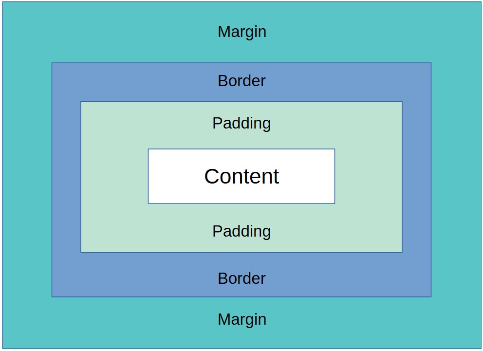
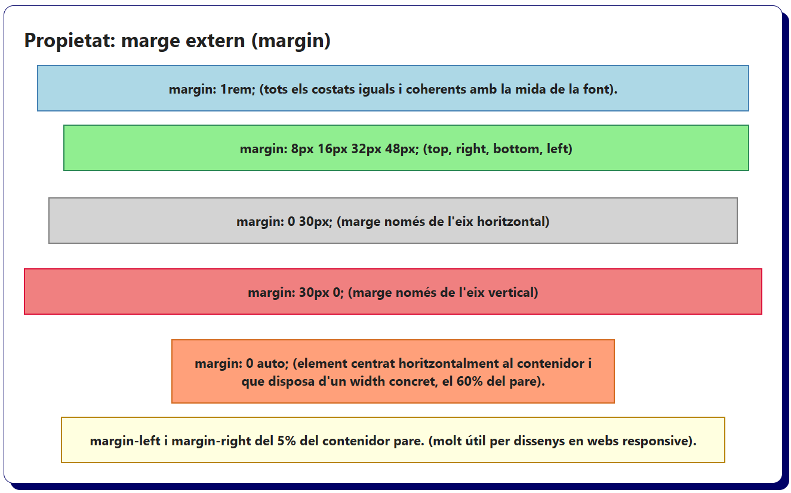
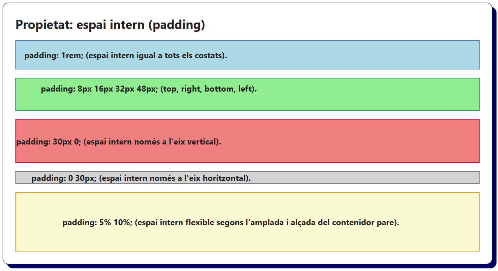
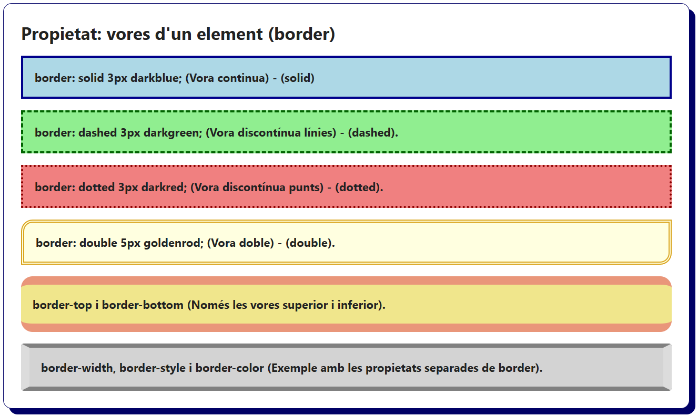
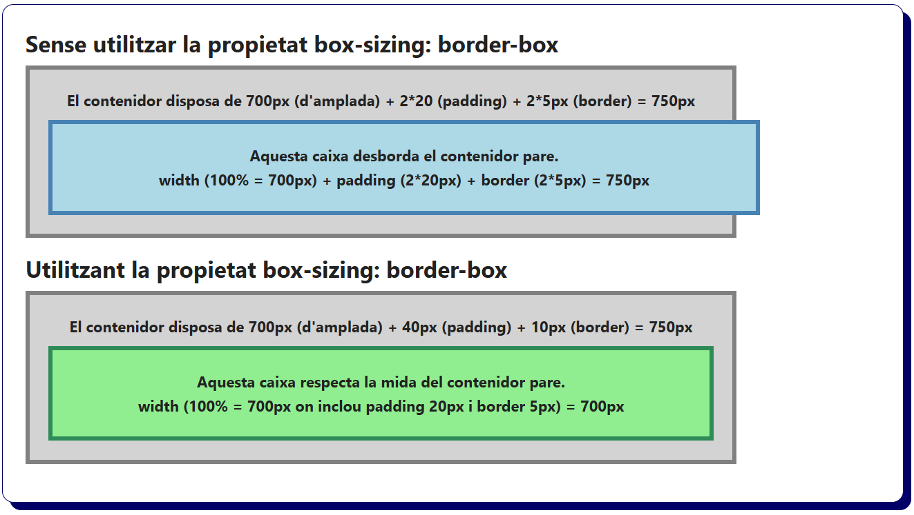

# Bloc 03. Propietats de Marges i Vores

Les següents propietats permeten separar, delimitar i distribuir els elements dins una pàgina web. Per tant, s'encarreguen d'establir la distància entre elements (margin) ó marge extern, l’espai intern d’un element (padding) ó marge intern i les vores que envolten un element (border).

| **Nom**            | **Propietat**  | **Descripció**                                                                                                           |
| ------------------ | -------------- | -------------------------------------------------------------------------------------------------------------------------|
| Màrge extern       | `margin`       | Estableix la separació entre un element i la resta que l'envolten utilitzant una unitat de mesura (px, em, rem, %, etc). |
| Espai intern       | `padding`      | Estableix la separació (l'espai) entre el contingut d'un element i les seves vores utilitzant (px, em, rem, %, etc).     |
| Vores              | `border`       | Estableix una vora al voltant d'un element. Es pot configurar l'amplada, l'estil i color de les vores.                   |
| Mida de caixa      | `box-sizing`   | Estableix si el padding i el border s'inclouen dins els valor establers pel width i height d'un element.                 |
| Estil de la vora   | `border-style` | Estableix el tipus de línia de la vora (solid, dashed, dotted, double, none, etc).                                       |
| Gruix de la vora   | `border-width` | Estableix el gruix de la vora. Es pot aplicar un valor únic o diferent per cada costat (px, em, rem, %, etc).            |
| Color de la vora   | `border-color` | Estableix el color de la vora (nom de color, hexadecimal, RGB, RGBA, HSL, HSLA, etc).                                    |
| Arrodonir la vora  | `border-radius`| Arrodoneix les cantonades de la vora. Cada cantonada pot tenir un valor independent (px, em, rem, %, etc).               |

## El Model de Caixa (Box Model)

Tots els elements HTML d'una pàgina web són interpretats pel navegador com a "caixes". Aquestes caixes tenen una estructura de capes i és súper important entendre el seu funcionament per poder disposar elements a la pàgina web correctmanet.

- `Contingut` (**Content**): Fa referència a tot el que hi ha inclós dins el contenidor (el text, les imatges, etc.).
- `Marge intern` (**Padding**): El marge intern fa referència a la separació (espai) entre el contingut i la vora de la caixa.
- `Vora` (**Border**): La vora és la "línia" que divideix un element d'un altre (línia divisòria de la caixa).
- `Marge extern` (**Margin**): El marge extern fa referència a l'espai entre la vora de la caixa i les vores d'altres elements de la web.   



## Marges entre elements (`margin`)

```css
/* Element amb el mateix marge tots els costats (superior, dreta, inferior i esquerra). */
.margin-all {
  margin: 1rem;
  background-color: lightblue;
  border: solid 2px steelblue;
}

/* Element amb marge especificat a cada costat (top, right, bottom, left) - Agulles del rellotge */
.margin-shorthand {
  margin: 8px 16px 32px 48px;
  background-color: lightgreen;
  border: solid 2px seagreen;
}

/* Element amb el marge establert només a l'eix vertical (superior i inferior). */
.margin-top-bottom {
  margin: 30px 0;
  background-color: lightcoral;
  border: solid 2px crimson;
}

/* Element amb el marge establert només a l'eix horitzontal (esquerra i dreta). */
.margin-left-right {
  margin: 0 30px;
  background-color: lightgray;
  border: solid 2px gray;
}

/* Element amb un marge horitzontal automàtic (permet centrar elements dins del contenidor). */
.margin-auto {
  width: 60%;
  margin: 0 auto;
  background-color: lightsalmon;
  border: solid 2px chocolate;
}

/* Element amb un marge percentual a esquerra i dreta (disseny amb web responsive). */
.margin-percent {
  margin-top: 1rem;
  margin-left: 5%;
  margin-right: 5%;
  background-color: lightyellow;
  border: solid 2px darkgoldenrod;
}
```

```html
<h2>Propietat: marge extern (margin)</h2>
<div class="margin-all">margin: 1rem; (tots els costats iguals i coherents amb la mida de la font).</div>
<div class="margin-shorthand">margin: 8px 16px 32px 48px; (top, right, bottom, left)</div>
<div class="margin-left-right">margin: 0 30px; (marge només de l'eix horitzontal)</div>
<div class="margin-top-bottom">margin: 30px 0; (marge només de l'eix vertical)</div>
<div class="margin-center">margin: 0 auto; (element centrat horitzontalment al contenidor i que disposa d'un width concret, el 60% del pare).</div>
<div class="margin-percent">margin-left i margin-right del 5% del contenidor pare. (molt útil per dissenys en webs responsive).</div>
```



## Espai intern d'un element (`padding`)

```css
/* Element amb el mateix espai intern a tots els costats (superior, dreta, inferior i esquerra). */
.padding-all {
  padding: 1rem;
  background-color: lightblue;
  border: solid 2px steelblue;
}

/* Element amb el padding especificat a cada costat (top, right, bottom, left) - Agulles del rellotge */
.padding-shorthand {
  padding: 8px 16px 32px 48px;
  background-color: lightgreen;
  border: solid 2px seagreen;
}

/* Element amb el padding establert només a l'eix vertical (superior i inferior). */
.padding-top-bottom {
  padding: 30px 0;
  background-color: lightcoral;
  border: solid 2px crimson;
}

/* Element amb el padding establert només a l'eix horitzontal (esquerra i dreta). */
.padding-left-right {
  padding: 0 30px;
  background-color: lightgray;
  border: solid 2px gray;
}

/* Element amb un marge percentual per a dissenys web responsive. */
.padding-percent {
  padding: 5% 10%;
  background-color: lightgoldenrodyellow;
  border: solid 2px goldenrod;
}
```

```html
<h2>Propietat: espai intern (padding)</h2>
<div class="padding-all">padding: 1rem; (espai intern igual a tots els costats).</div>
<div class="padding-shorthand">padding: 8px 16px 32px 48px; (top, right, bottom, left).</div>
<div class="padding-top-bottom">padding: 30px 0; (espai intern només a l'eix vertical).</div>
<div class="padding-left-right">padding: 0 30px; (espai intern només a l'eix horitzontal).</div>
<div class="padding-percent">padding: 5% 10%; (espai intern flexible segons l'amplada i alçada del contenidor pare).</div>
```



## Vores d'un element (`border`)

```css
/* Element amb la vora continua (solid) als 4 costats. */
.border-solid {
  border: solid 3px darkblue;
  background-color: lightblue;
}

/* Element amb la vora amb línies discontinues (dashed). */
.border-dashed {
  border: dashed 3px darkgreen;
  background-color: lightgreen;
}

/* Element amb la vora discontinua, feta de punts (dotted). */
.border-dotted {
  border: dotted 3px darkred;
  background-color: lightcoral;
}

/* Element amb la vora doble continua (double). */
/* Les vores arrodonides permeten destacar un element dintre del disseny (border-radius). */
.border-double {
  border: double 5px goldenrod;
  border-radius: 1rem 0 1rem 0;
  background-color: lightyellow;
}

/* Element amb una vora superior i inferior (per donar èmfasi a títols, etc.) */
/* Una vora només inferior és fa servir en menús, títols, etc. */
.border-top-bottom{
  border-radius: 1rem;
  border-top: solid 12px darksalmon;
  border-bottom: solid 12px darksalmon;
  background-color: khaki;
}

/* Element amb una vora amb valors diferents (intent d'efecte de botó 3D). */
.border-properties {
  border-radius: 4px;
  border-width: 6px 12px 6px 12px;
  border-style: solid;
  border-color: gray gainsboro;
  background-color: lightgray;
}
```

```html
<h2>Propietat: vores d'un element (border)</h2>
<div class="border-solid">border: solid 3px darkblue; (Vora continua) - (solid)</div>
<div class="border-dashed">border: dashed 3px darkgreen; (Vora discontínua línies) - (dashed).</div>
<div class="border-dotted">border: dotted 3px darkred; (Vora discontínua punts) - (dotted).</div>
<div class="border-double">border: double 5px goldenrod; (Vora doble) - (double).</div>
<div class="border-top-bottom">border-top i border-bottom (Només les vores superior i inferior).</div>
<div class="border-properties">border-width, border-style i border-color (Exemple amb les propietats separades de border).</div>
```



## Mida de la Caixa (`box-sizing`)

```css
/* Establim un contenidor pare amb una amplada fixa. */
.contenidor-pare {
  text-align: center;
  width: 700px;
  background-color: lightgray;
  padding: 20px;
  margin-bottom: 1rem;
  border: 5px solid gray;
}

/* Element caixa amb el box-sizing per defecte (content-box). */
.content-box {
  box-sizing: content-box;
  width: 100%;
  padding: 20px;
  border: 5px solid steelblue;
  background-color: lightblue;
}

/* Element caixa amb el box-sizing canviat a border-box. */
.border-box {
  box-sizing: border-box;
  width: 100%;
  padding: 20px;
  border: 5px solid seagreen;
  background-color: lightgreen;
}
```

```html
<h2>Sense utilitzar la propietat box-sizing: border-box</h2>
<div class="contenidor-pare">
  <p>El contenidor disposa de 700px (d'amplada) + 2*20 (padding) + 2*5px (border) = 750px</p>
  <div class="content-box">
    <p>Aquesta caixa desborda el contenidor pare.</p>
    <p>width (100% = 700px) + padding (2*20px) + border (2*5px) = 750px</p>
  </div>
</div>
<h2>Utilitzant la propietat box-sizing: border-box</h2>
<div class="contenidor-pare">
  <p>El contenidor disposa de 700px (d'amplada) + 40px (padding) + 10px (border) = 750px</p>
  <div class="border-box">
    <p>Aquesta caixa respecta la mida del contenidor pare.</p>
    <p>width (100% = 700px on inclou padding 20px i border 5px) = 700px</p>
  </div>
</div>
```

