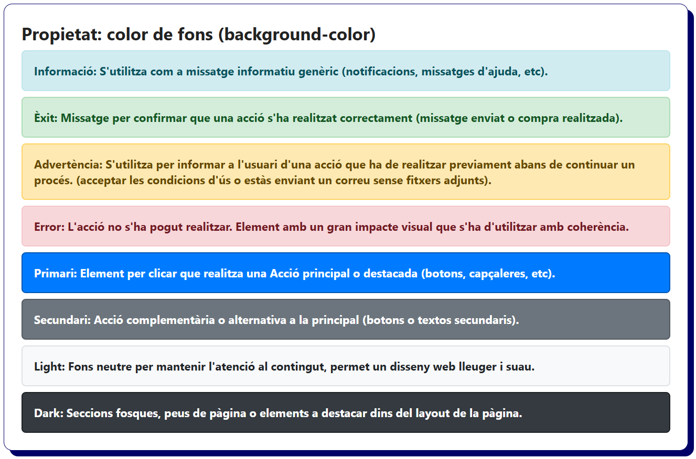
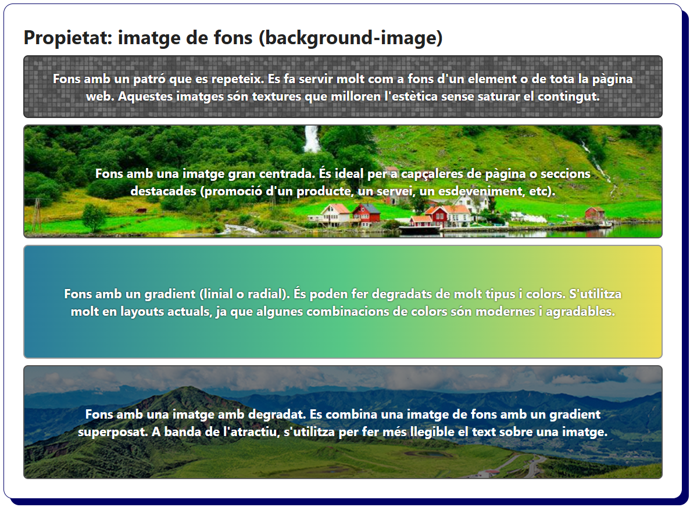
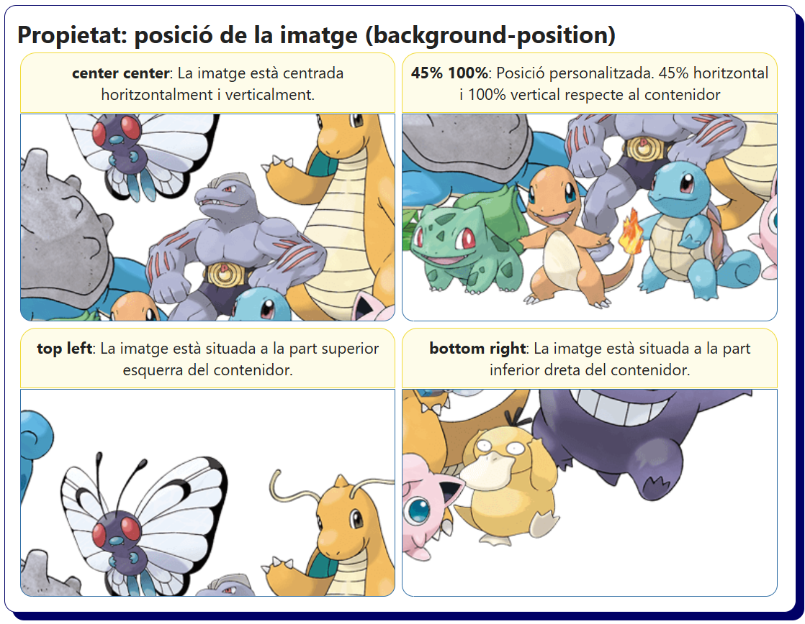
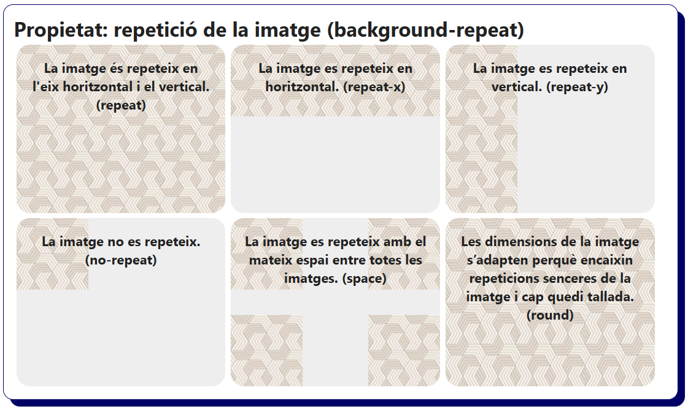
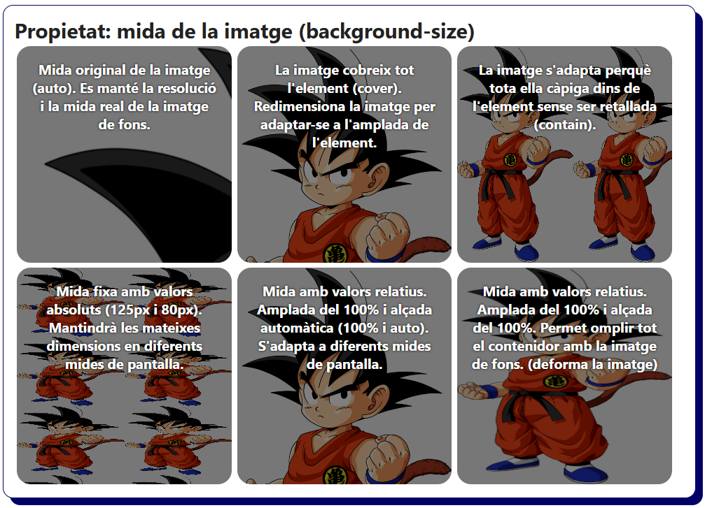
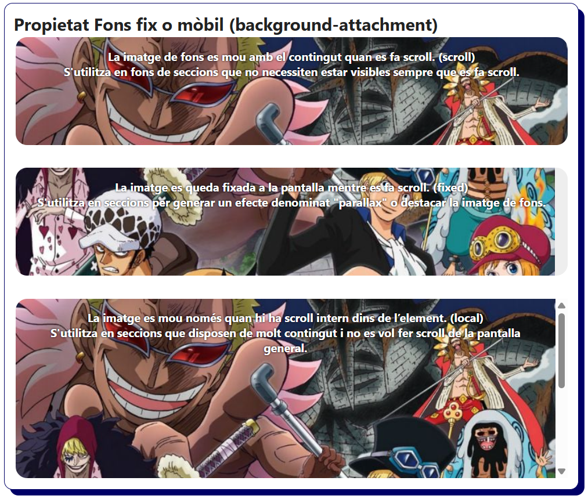
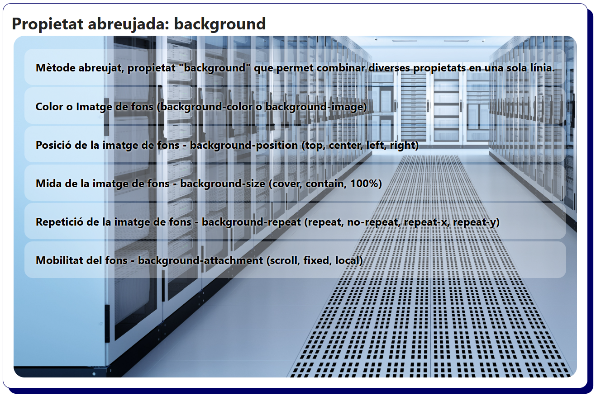

# Bloc 04. Propietats de Fons (Backgrounds)

Les propietats relacionades amb els fons d'elements permeten modificar l'aspecte visual de l'espai que hi ha darrera del contingut (el fons) d'un element HTML. Podem definir colors, imatges, la seva posició, la mida i efectes addicionals per aconseguir dissenys atractius i professionals.ç

| **Nom**                | **Propietat**           | **Descripció**                                                                                            |
| ---------------------- | ----------------------- | --------------------------------------------------------------------------------------------------------- |
| Color de fons          | `background-color`      | Estableix el color de fons d'un element aplicant un format (nom, hexadecimal, rgb, rgba, hsl, hsla)       |
| Imatge de fons         | `background-image`      | Defineix una o diverses imatges que es mostren al fons de l'element. S'utilitza per fer gradients.        |
| Posició de la imatge   | `background-position`   | Posiciona la imatge dins l'element indicant l'eix horitzontal i el vertical. (top left, center, 50% 50%). |
| Repetició de la imatge | `background-repeat`     | Estableix si la imatge no es repeteix, es repeteix horitzontalment, verticalment o en ambdues direccions. |
| Mida de la imatge      | `background-size`       | Estableix la mida de la imatge indicant l'amplada i l'alçada (px, %, cover, contain).                     |
| Fons fix o mòbil       | `background-attachment` | Permet indicar si la imatge de fons queda fixa a la pantalla o es mou amb el contingut al fer scroll.     |
| Mètode Abreujat        | `background`            | Propietat abreujada que permet definir múltiples propietats, s'utilitza molt per fer gradients senzills.  |

## Color de fons (`background-color`)

```css
/* Fons amb el color per defecte (blanc) */
.bg-default {
  /* background-color: white; */
  border: 2px solid lightgray;
}

/* Fons amb un color blau suau - Contenidor informatiu genèric. */
.bg-info {
  background-color: #d1ecf1;
  color: #0c5460;
  border: 2px solid #bee5eb;
}

/* Fons amb un color verd suau - Contenidor d'acció realitzada amb èxit. */
.bg-success {
  background-color: rgb(212, 237, 218);
  color: rgb(21, 87, 36);
  border: 2px solid rgb(173, 221, 182);
}

/* Fons amb un color groc suau - Contenidor d'advertencia. */
.bg-warning {
  background-color: hsl(43, 100%, 85%);
  color: hsl(43, 100%, 20%);
  border: 2px solid hsl(43, 100%, 70%);
}

/* Fons amb un color vermell suau - Contenidor d'error */
.bg-danger {
  background-color: #f8d7da;
  color: #721c24;
  border: 2px solid #f5c6cb;
}

/* Fons amb un blau intens i lletra blanca - Contenidor primari per botons d'acció principal, capçaleres, etc. */
.bg-primary {
  background-color: #007bff;
  color: white;
  border: 2px solid #0056b3;
}

/* Fons amb un color gris intens i lletra blanca - Contenidor secundari de complement al primari (també per realitzar accions).*/
.bg-secondary {
  background-color: #6c757d;
  color: white;
  border: 2px solid #545b62;
}

/* Fons amb un color blanquinós molt suau - Contenidor per múltiples usos amb un bon contrast per centrar-se en el contingut. */
.bg-light {
  background-color: #f8f9fa;
  color: #212529;
  border: 2px solid #dee2e6;
}

/* Fons amb un color fosc - Contenidor per seccions concretes, peus de pàgina o complements a destacar. */
.bg-dark {
  background-color: #343a40;
  color: white;
  border: 2px solid #1d2124;
}
```

```html
<h2>Propietat: color de fons (background-color)</h2>
<div class="bg-info">
  Informació: S'utilitza com a missatge informatiu genèric (notificacions, missatges d'ajuda, etc).
</div>
<div class="bg-success">
  Èxit: Missatge per confirmar que una acció s'ha realitzat correctament (missatge enviat o compra
  realitzada).
</div>
<div class="bg-warning">
  Advertència: S'utilitza per informar a l'usuari d'una acció que ha de realitzar previament abans
  de continuar un procés. (acceptar les condicions d'ús o estàs enviant un correu sense fitxers
  adjunts).
</div>
<div class="bg-danger">
  Error: L'acció no s'ha pogut realitzar. Element amb un gran impacte visual que s'ha d'utilitzar
  amb coherència.
</div>
<div class="bg-primary">
  Primari: Element per clicar que realitza una Acció principal o destacada (botons, capçaleres,
  etc).
</div>
<div class="bg-secondary">
  Secundari: Acció complementària o alternativa a la principal (botons o textos secundaris).
</div>
<div class="bg-light">
  Light: Fons neutre per mantenir l'atenció al contingut, permet un disseny web lleuger i suau.
</div>
<div class="bg-dark">
  Dark: Seccions fosques, peus de pàgina o elements a destacar dins del layout de la pàgina.
</div>
```



## Imatge de fons (`background-image`)

```css
/* Fons amb una imatge petita (icona, patró o textura) que es va repetint i ompla tot l'espai. */
.bg-pattern {
  background-image: url('./../img/textura_background_image.png');
  background-repeat: repeat;
  background-color: #444;
  border: 2px solid #333;
  color: white;
  text-shadow: 0 0 2px #000;
}

/* Fons amb una imatge que cobreix tot el contenidor i està centrada (banner o capçalera). */
.bg-banner {
  background-image: url('./../img/imatge_background_image.jpg');
  background-size: cover;
  background-position: center;
  background-repeat: no-repeat;
  color: white;
  text-shadow: 0 0 5px #000;
  padding: 3rem;
  border: 2px solid #555;
}

/* Fons amb gradient (degradat). Poden tenir un estil linial o circular (linear o radial). */
.bg-gradient {
  background-image: linear-gradient(90deg, #2a7b9b, #57c785 50%, #eddd53 100%);
  color: white;
  padding: 3rem;
  border: 2px solid #999;
  text-shadow: 0 0 2px #000;
}

/* Fons amb imatge i gradient (simulat) superposats per millorar el contrast i que el text sigui més llegible. */
.bg-gradient-overlay {
  background-image: linear-gradient(180deg, rgba(0, 0, 0, 0.5), rgba(0, 0, 0, 0.5)),
    url('./../img/imatge_gradient_background_image.jpg');
  background-size: cover;
  background-position: center center;
  color: white;
  padding: 3rem;
  border: 2px solid #555;
}
```

```html
<h2>Propietat: imatge de fons (background-image)</h2>
<div class="bg-pattern">
  Fons amb un patró que es repeteix. Es fa servir molt com a fons d'un element o de tota la pàgina
  web. Aquestes imatges són textures que milloren l'estètica sense saturar el contingut.
</div>
<div class="bg-banner">
  Fons amb una imatge gran centrada. És ideal per a capçaleres de pàgina o seccions destacades
  (promoció d'un producte, un servei, un esdeveniment, etc).
</div>
<div class="bg-gradient">
  Fons amb un gradient (linial o radial). És poden fer degradats de molt tipus i colors. S'utilitza
  molt en layouts actuals, ja que algunes combinacions de colors són modernes i agradables.
</div>
<div class="bg-gradient-overlay">
  Fons amb una imatge amb degradat. Es combina una imatge de fons amb un gradient superposat. A
  banda de l'atractiu, s'utilitza per fer més llegible el text sobre una imatge.
</div>
```



## Posició de la imatge (`background-position`)

```css
/* Fons centrat horitzontalment i verticalment */
.bg-center {
  background-image: url('./../img/fons_background_position.png');
  background-position: center center;
  background-repeat: no-repeat;
}

/* Fons amb posicionament personalitzat amb percentatges */
.bg-percentage {
  background-image: url('./../img/fons_background_position.png');
  background-position: 45% 100%;
  background-repeat: no-repeat;
}

/* Fons alineat a la part superior esquerra */
.bg-top-left {
  background-image: url('./../img/fons_background_position.png');
  background-position: top left;
  background-repeat: no-repeat;
}

/* Fons alineat a la part inferior dreta */
.bg-bottom-right {
  background-image: url('./../img/fons_background_position.png');
  background-position: bottom right;
  background-repeat: no-repeat;
}
```

```html
<h2>Propietat: posició de la imatge (background-position)</h2>
<p><strong>center center</strong>: La imatge està centrada horitzontalment i verticalment.</p>
<p>
  <strong>45% 100%</strong>: Posició personalitzada. 45% horitzontal i 100% vertical del contenidor.
</p>
<div class="bg-center">
  <!-- background-position: center center; -->
</div>
<div class="bg-percentage">
  <!-- background-position: 45% 100% -->
</div>
<p><strong>top left</strong>: La imatge està situada a la part superior esquerra del contenidor.</p>
<p>
  <strong>bottom right</strong>: La imatge està situada a la part inferior dreta del contenidor.
</p>
<div class="bg-top-left">
  <!-- background-position: top left; -->
</div>
<div class="bg-bottom-right">
  <!-- background-position: bottom right; -->
</div>
```



## Repetició de la imatge (`background-repeat`)

```css
.bg-repeat {
  background-image: url('./../img/patro_background_repeat.png');
  background-repeat: repeat;
}

.bg-repeat-x {
  background-image: url('./../img/patro_background_repeat.png');
  background-repeat: repeat-x;
}

.bg-repeat-y {
  background-image: url('./../img/patro_background_repeat.png');
  background-repeat: repeat-y;
}

.bg-no-repeat {
  background-image: url('./../img/patro_background_repeat.png');
  background-repeat: no-repeat;
}

.bg-repeat-space {
  background-image: url('./../img/patro_background_repeat.png');
  background-repeat: space;
}

.bg-repeat-round {
  background-image: url('./../img/patro_background_repeat.png');
  background-repeat: round;
}
```

```html
<h2>Propietat: repetició de la imatge (background-repeat)</h2>
<div class="bg-repeat">La imatge és repeteix en l'eix horitzontal i el vertical. (repeat)</div>
<div class="bg-repeat-x">La imatge es repeteix en horitzontal. (repeat-x)</div>
<div class="bg-repeat-y">La imatge es repeteix en vertical. (repeat-y)</div>
<div class="bg-no-repeat">La imatge no es repeteix i es centra al contenidor. (no-repeat)</div>
<div class="bg-repeat-space">
  La imatge es repeteix amb el mateix espai entre totes les imatges. Un espai horitzontal i un altre
  espai vertical. (space)
</div>
<div class="bg-repeat-round">
  Les dimensions de la imatge s'adapten perquè encaixin repeticions senceres de la imatge i cap
  quedi tallada. (round)
</div>
```



## Mida de la imatge (`background-size`)

```css
.bg-size-auto {
  background-image: linear-gradient(90deg, rgba(0, 0, 0, 0.5), rgba(0, 0, 0, 0.5)),
    url('./../img/imatge_background_size.png');
  background-size: auto;
}

.bg-size-cover {
  background-image: linear-gradient(90deg, rgba(0, 0, 0, 0.5), rgba(0, 0, 0, 0.5)),
    url('./../img/imatge_background_size.png');
  background-size: cover;
}

.bg-size-contain {
  background-image: linear-gradient(90deg, rgba(0, 0, 0, 0.5), rgba(0, 0, 0, 0.5)),
    url('./../img/imatge_background_size.png');
  background-size: contain;
}

.bg-size-fixed {
  background-image: linear-gradient(90deg, rgba(0, 0, 0, 0.5), rgba(0, 0, 0, 0.5)),
    url('./../img/imatge_background_size.png');
  background-size: 125px 80px;
}

.bg-size-full-width {
  background-image: linear-gradient(90deg, rgba(0, 0, 0, 0.5), rgba(0, 0, 0, 0.5)),
    url('./../img/imatge_background_size.png');
  background-size: 100% auto;
}

.bg-size-full {
  background-image: linear-gradient(90deg, rgba(0, 0, 0, 0.5), rgba(0, 0, 0, 0.5)),
    url('./../img/imatge_background_size.png');
  background-size: 100% 100%;
}
```

```html
<h2>Propietat: mida de la imatge (background-size)</h2>
<div class="bg-size-auto">
  Mida original de la imatge (auto). Es manté la resolució i la mida real de la imatge de fons.
</div>
<div class="bg-size-cover">
  La imatge cobreix tot l'element (cover). Redimensiona la imatge per adaptar-se a l'amplada de
  l'element.
</div>
<div class="bg-size-contain">
  La imatge s'adapta perquè tota ella càpiga dins de l'element sense ser retallada (contain).
</div>
<div class="bg-size-fixed">
  Mida fixa amb valors absoluts (125px i 80px). Mantindrà les mateixes dimensions en diferents mides
  de pantalla.
</div>
<div class="bg-size-full-width">
  Mida amb valors relatius. Amplada del 100% i alçada automàtica (100% i auto). S'adapta a diferents
  mides de pantalla.
</div>
<div class="bg-size-full">
  Mida amb valors relatius. Amplada del 100% i alçada del 100%. Permet omplir tot el contenidor amb
  la imatge de fons. (deforma la imatge)
</div>
```



## Fons fix o mòbil (`background-attachment`)

```css
/* Element amb una imatge de fons que es mou amb el contingut (scroll). */
.bg-scroll {
  background-image: url('./../img/imatge_background_attachment.jpg');
  background-repeat: no-repeat;
  background-size: cover;
  background-attachment: scroll;
}

/* Element amb una imatge de fons que queda fixada a la finestra quan es fa scroll (fixed). */
.bg-fixed {
  background-image: url('./../img/imatge_background_attachment.jpg');
  background-repeat: no-repeat;
  background-size: cover;
  background-attachment: fixed;
  background-position: center;
}

/* Element amb una imatge de fons que es mou amb l'element que el conté si aquest disposa d'una barra de scroll (local). */
.bg-local {
  background-image: url('./../img/imatge_background_attachment.jpg');
  background-repeat: no-repeat;
  background-size: cover;
  background-attachment: local;
  overflow: auto;
  max-height: 250px;
  padding: 1rem;
}

.container-buit {
  background: none;
  height: 900px;
}
```

```html
<h2>Propietat Fons fix o mòbil (background-attachment)</h2>
<div class="bg-scroll">
  <p>La imatge de fons es mou amb el contingut quan es fa scroll. (scroll)</p>
  <p>S'utilitza en fons de seccions que no necessiten estar visibles sempre que es fa scroll.</p>
</div>
<div class="bg-fixed">
  <p>La imatge es queda fixada a la pantalla mentre es fa scroll. (fixed)</p>
  <p>
    S'utilitza en seccions per generar un efecte denominat "parallax" o destacar la imatge de fons.
  </p>
</div>
<div class="bg-local">
  <p>La imatge es mou només quan hi ha scroll intern dins de l'element. (local)</p>
  <p>
    S'utilitza en seccions que disposen de molt contingut i no es vol fer scroll de la pantalla
    general.
  </p>
  <div class="container-buit"></div>
</div>
```



## Mètode Abreujat (`background`)

```css
* {
  margin: 0;
  padding: 0;
  box-sizing: border-box;
}

p {
  background-color: rgba(255, 255, 255, 0.3);
  padding: 1rem;
  margin-top: 0.2rem;
  border-radius: 12px;
}

div {
  min-height: 500px;
  padding: 1rem;
  margin: 0.2rem;
  border-radius: 1rem;
  background-color: #eee;
  color: black;
  text-shadow: 0 0 3px #fff;
  font-weight: bold;
}

/* Element amb el mètode abreujat background amb totes les propietats disposades en una sola línia */
.background {
  background: url('./../img/fons_background.jpg') bottom left/cover no-repeat fixed;
}
```

```html
<h2>Propietat abreujada: background</h2>
<div class="background">
  <p>
    Mètode abreujat, propietat "background" que permet combinar diverses propietats en una sola
    línia.
  </p>
  <p>Color o Imatge de fons (background-color o background-image)</p>
  <p>Posició de la imatge de fons - background-position (top, center, left, right)</p>
  <p>Mida de la imatge de fons - background-size (cover, contain, 100%)</p>
  <p>Repetició de la imatge de fons - background-repeat (repeat, no-repeat, repeat-x, repeat-y)</p>
  <p>Mobilitat del fons - background-attachment (scroll, fixed, local)</p>
</div>
```


