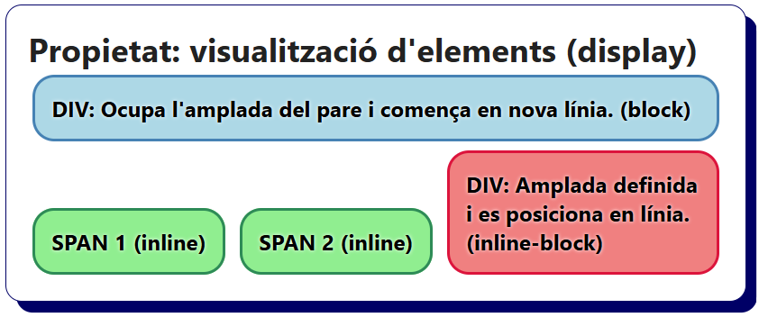

# Bloc 05. Propietats de visualització d’elements

La propietat display estableix la manera en com es representa un element HTML dins d'una pàgina web. És una de les propietats CSS més importants, ja que controla si l’element es mostra com un element de tipus block, inline, inline-block o none (si volem que quedi ocult).

Aquesta propietat controla com ocupa l'espai un element concret i com ha d'interactuar amb altres elements. Depenent del tipus que s'assigni trobarem elements uns a sobre d'altres, elements un al costat de l'altre, elements ocults, etc. En definitiva, s'encarrega d'estructurar el layout de la pàgina web.

També s'utilitza per crear layouts avançats com són els layouts o dissenys en graella i els dissenys flexibles (grid i flexbox).

| **Nom**                 | **Propietat**           | **Descripció**                                                                                       |
| ----------------------- | ----------------------- | ---------------------------------------------------------------------------------------------------- |
| Bloc                    | `display: block`        | L’element ocupa tota l’amplada disponible del contenidor pare. Es mostra en una línia nova.          |
| En línia                | `display: inline`       | L’element ocupa l'amplada o l'espai del seu contingut. Es mostra al costat d'altres elements inline. |
| Bloc en línia           | `display: inline-block` | Element de tipus bloc que es comporta com un element inline. Es mostra en línia però permet definir l'alçada i l'amplada. |
| Ocult                   | `display: none`         | L’element no es mostra (queda ocult) però tampoc ocupa espai en el disseny.                          |

## Propietat: visualització d'elements (display)

```css
/* Element que ocupa tota l'amplada disponible i s'inicia en una nova línia. (block) */
.display-block {
  display: block;
  border: 2px solid steelblue;
  background-color: lightblue;
}

/* Element ocupa l'amplada del seu contingut i que es disposa al costat d'un altre element si té espai. (inline) */
.display-inline {
  display: inline;
  border: 2px solid seagreen;
  background-color: lightgreen;
}

/* Element de tipus inline però que permet modificar l'amplada i l'alçada com un element de bloc. (inline-block) */
.display-inline-block {
  display: inline-block;
  border: 2px solid crimson;
  background-color: lightcoral;
  width: 200px;
}

/* Element que no es mostra a la pàgina web i que no ocupa espai al layout. (none) */
.display-none {
  display: none;
}
```

```html
<h2>Propietat: visualització d'elements (display)</h2>
<div class="display-block">DIV: Ocupa l'amplada del pare i comença en nova línia. (block)</div>
<span class="display-inline">SPAN 1 (inline)</span>
<span class="display-inline">SPAN 2 (inline)</span>
<div class="display-inline-block">DIV: Amplada definida i es posiciona en línia. (inline-block)</div>
<!-- L'elements amb display: none; no es mostrarà -->
<div class="display-none">Aquest no es mostrarà.</div>
```



### Contenidors genèrics (`div`)
Els `<div>` per defecte tenen la visualització inicialitzada a `display: block`. Si necessitem situar diversos DIV de costat (en línia), volem que ocupin menys amplada o l'amplada del seu contingut podem canviar la propietat a `inline-block`, `inline` o fer-los desaparèixer amb `none`.

### Contenidors genèrics (`span`)
Els `<span>` per defecte tenen la visualització inicialitzada a `display: inline`. Si volem que es comportin com un contenidor (DIV) per poder-li assignar una amplada i una alçada es poden transformar a `inline-block`. Molt comú en botons de menús o altres span amb contingut que volem fer més gran.

### Imatges (`img`)
Les `` són elements `inline-block` per defecte. Es situaran en línia si disposen d'espai i es pot modificar la seva amplada i alçada.

## Elements Block

| **Elements block més comuns**                           |
| ------------------------------------------------------- |
| `<div>`                                                 |
| `<p>`                                                   |
| `<h1>` - `<h6>`                                         |
| `<nav>`, `<section>`, `<article>` i `<aside>`           |
| `<header>`, `<main>` i `<footer>`                       |
| `<ul>`, `<ol>`, `<li>`                                  |
| `<table>`, `<thead>`, `<tbody>`, `<tr>`, `<th>`, `<td>` |
| `<form>`, `<fieldset>` i `<legend>`                     |
| `<fieldset>`, `<legend>`                                |
| `<figure>` i `<figcaption>`                             |

## Elements Inline

| **Elements inline més comuns**        |
| ------------------------------------- |
| `<span>`                              |
| `<a>`                                 |
| `<strong>` i `<em>`                   |
| `<label>`, `<select>` i `<textarea>`  |

## Elements Inline-Block més comuns

| **Elements inline-block més comuns**  |
| ------------------------------------- |
| ``                               |
| `<input>`, `<button>`                 |
| `<select>`, `<textarea>`              |


## Exemple de Layout amb diferents elements (`inline`, `inline-block` i `block`) modificats

