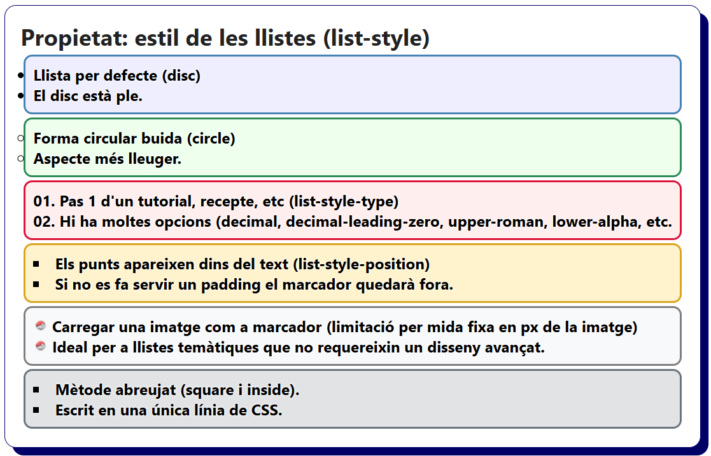

# Bloc 05. Propietats de les Llistes

Les llistes són estructures semàntiques que permeten organitzar la informació per mostrar informació mitjançant números, punts o altres símbols. Amb propietats de CSS es pot controlar l’estil d'aquests símbols, la seva posició i la distància respecte del contingut.

| **Nom**               | **Propietat**         | **Descripció**                                                                                      |
| --------------------- | --------------------- | --------------------------------------------------------------------------------------------------- |
| Tipus de marcador     | `list-style-type`     | Defineix el tipus de númeració o símbol utilitzat en cada "list item" (disc, circle, square, decimal, etc.). |
| Posició del marcador  | `list-style-position` | Estableix si el marcador es mostra dins o fora del contenidor (inside o outside).                   |
| Imatge com a marcador | `list-style-image`    | Substitueix el marcador de la llista per una imatge que carreguem.                                  |
| Mètode abreujat       | `list-style`          | Propietat abreujada que permet definir múltiples propietats en una sola línia (type, position i imatge).|

```css
/* Llista no ordenada amb el marcador per defecte (disc). */
.ul-default {
  list-style-type: disc;
  background-color: #eef;
  border: 2px solid steelblue;
}

/* Llista amb el marcador del cercle buit. */
.ul-circle {
  list-style-type: circle;
  background-color: #efe;
  border: 2px solid seagreen;
}

/* Llista amb números al marcador (números amb el zero al davant). */
.ol-decimal-zero {
  list-style-position: inside;
  list-style-type: decimal-leading-zero;
  background-color: #fee;
  border: 2px solid crimson;
}

/* Llista amb elmarcador dins del contenidor. */
.ul-inside {
  list-style-position: inside;
  list-style-type: square;
  background-color: #fff3cd;
  border: 2px solid goldenrod;
}

/* Llista amb una imatge de mida fixa fent de marcador. */
.ul-image {
  list-style-position: inside;
  list-style-image: url('./../img/pokeball_list_image.png');
  background-color: #f8f9fa;
  border: 2px solid gray;
}

/* Llista amb el mètode abreujat */
.ul-shorthand {
  list-style: square inside;
  background-color: #e2e3e5;
  border: 2px solid #6c757d;
}
```

```html
<h2>Propietat: estil de les llistes (list-style)</h2>
<ul class="ul-default">
    <li>Llista per defecte (disc)</li>
    <li>El disc està ple.</li>
</ul>
<ul class="ul-circle">
    <li>Forma circular buida (circle)</li>
    <li>Aspecte més lleuger.</li>
</ul>
<ol class="ol-decimal-zero">
    <li>Pas 1 d'un tutorial, recepte, etc (list-style-type)</li>
    <li>Hi ha moltes opcions (decimal, decimal-leading-zero, upper-roman, lower-alpha, etc).</li>
</ol>
<ul class="ul-inside">
    <li>Els punts apareixen dins del text (list-style-position)</li>
    <li>Si no es fa servir un padding el marcador quedarà fora.</li>
</ul>
<ul class="ul-image">
    <li>Carregar una imatge com a marcador (limitació per mida fixa en px de la imatge)</li>
    <li>Ideal per a llistes temàtiques que no requereixin un disseny avançat.</li>
</ul>
<ul class="ul-shorthand">
    <li>Mètode abreujat (square i inside).</li>
    <li>Escrit en una única línia de CSS.</li>
</ul>
```



