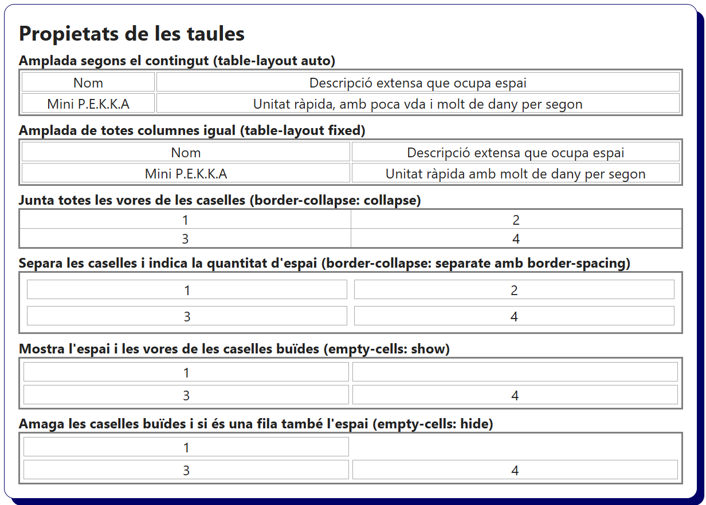
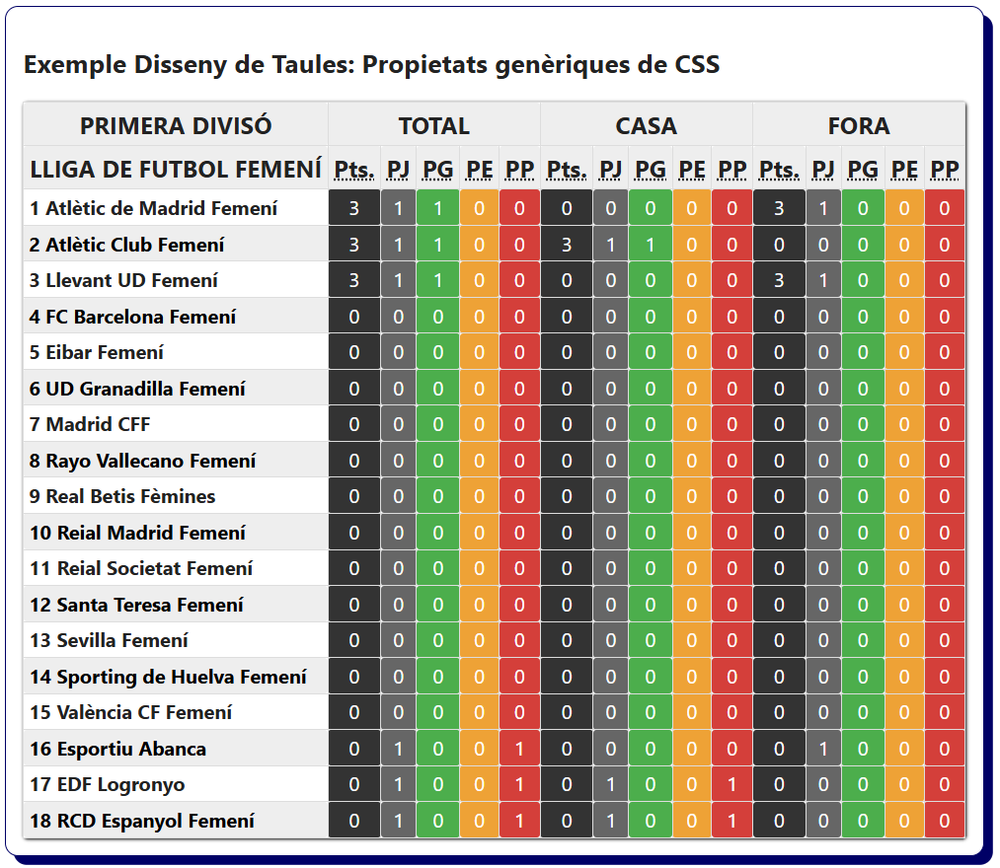

# Bloc 06. Propietats de les Taules

Les taules HTML són estructures pensades per mostrar informació en files i columnes (dades, horaris, resultats, classificacions, etc.). Tot i que les taules s'estan substituïnt per contenidors genèrics que permeten adaptarse a diferents pantalles, avui dia encara són essencials en molts entorns reals d'aplicacions d'ordinador on es presenten informes, panell d'administració (dashboards) i documents digitals com nòmines, factures, etc.

| **Nom**               | **Propietat**     | **Descripció**                                                             |
| --------------------- | ----------------- | -------------------------------------------------------------------------- |
| Amplada automàtica    | `table-layout`    | Controla si l'amplada de columnes es basa en el contingut o és fixa.       |
| Separació de cel·les  | `border-collapse` | Controla si les vores es separen o es fusionen.                            |
| Espai entre cel·les   | `border-spacing`  | Defineix la distància entre cel·les quan les vores estan separades.        |
| Amagar cel·les buides | `empty-cells`     | Si les vores estan separades es poden mostrar o amagar les cel·les buides. |

```css
/* Taula amb l'amplada basada en el contingut de cada casella (auto per defecte). */
.table-layout-auto {
  table-layout: auto;
  width: 100%;
  border: 2px solid gray;
}

/* Taula amb les columnes d'amplada fixa (el mateix espai per cada casella). */
.table-layout-fixed {
  table-layout: fixed;
  width: 100%;
  border: 2px solid gray;
}

/* Taula amb les vores de les caselles fusionades (no hi ha espai entre cel·les). */
.table-collapse {
  border-collapse: collapse;
  width: 100%;
  border: 2px solid gray;
}

/* Taules amb les vores separades i espai entre caselles (més separació visual). */
.table-separate {
  border-collapse: separate;
  border-spacing: 0.5rem;
  width: 100%;
  border: 2px solid gray;
}

/* Taules amb caselles buides visibles (espai entre cel·les). */
.table-empty-show {
  border-collapse: separate;
  empty-cells: show;
  border-spacing: 0.25rem;
  width: 100%;
  border: 2px solid gray;
}

/* Taules amb les caselles sense contingut amagades (no es mostren les vores). */
.table-empty-hide {
  border-collapse: separate;
  empty-cells: hide;
  border-spacing: 0.25rem;
  width: 100%;
  border: 2px solid gray;
}

td {
  border: 1px solid darkgray;
  text-align: center;
}
```

```html
<h2>Propietats de les taules</h2>
<p>Amplada segons el contingut (table-layout auto)</p>
<table class="table-layout-auto">
  <tr>
    <td>Nom</td>
    <td>Descripció extensa que ocupa espai</td>
  </tr>
  <tr>
    <td>Mini P.E.K.K.A</td>
    <td>Unitat ràpida, amb poca vda i molt de dany per segon</td>
  </tr>
</table>
<p>Amplada de totes columnes igual (table-layout fixed)</p>
<table class="table-layout-fixed">
  <tr>
    <td>Nom</td>
    <td>Descripció extensa que ocupa espai</td>
  </tr>
  <tr>
    <td>Mini P.E.K.K.A</td>
    <td>Unitat ràpida amb molt de dany per segon</td>
  </tr>
</table>
<p>Junta totes les vores de les caselles (border-collapse: collapse)</p>
<table class="table-collapse">
  <tr>
    <td>1</td>
    <td>2</td>
  </tr>
  <tr>
    <td>3</td>
    <td>4</td>
  </tr>
</table>
<p>
  Separa les caselles i indica la quantitat d'espai (border-collapse: separate amb border-spacing)
</p>
<table class="table-separate">
  <tr>
    <td>1</td>
    <td>2</td>
  </tr>
  <tr>
    <td>3</td>
    <td>4</td>
  </tr>
</table>
<p>Mostra l'espai i les vores de les caselles buïdes (empty-cells: show)</p>
<table class="table-empty-show">
  <tr>
    <td>1</td>
    <td></td>
  </tr>
  <tr>
    <td>3</td>
    <td>4</td>
  </tr>
</table>
<p>Amaga les caselles buïdes i si és una fila també l'espai (empty-cells: hide)</p>
<table class="table-empty-hide">
  <tr>
    <td>1</td>
    <td></td>
  </tr>
  <tr>
    <td>3</td>
    <td>4</td>
  </tr>
</table>
```



## Altres propietats per donar estil a les taules

A les etiquetes de les taules (`<table>`, `<tr>`,`<td>`,`<th>`, etc.) es poden aplicar altres estils com el color de fons d'una casella, el color de la lletra, les vores, propietatats del text com l'alineació, el gruix, el tipus de font, etc., l'amplada i l'alçada de la taula, el margin i el padding, etc.


