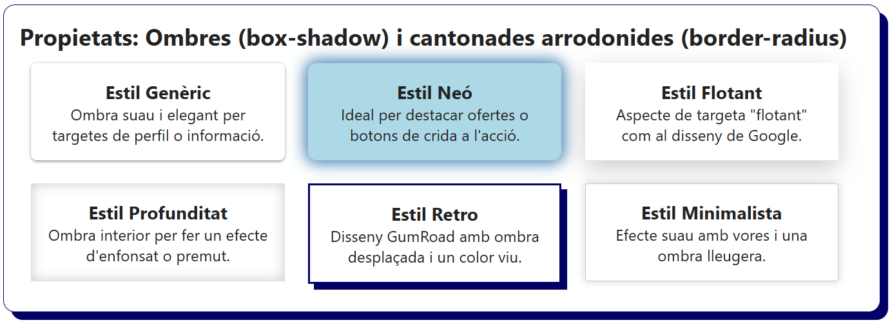
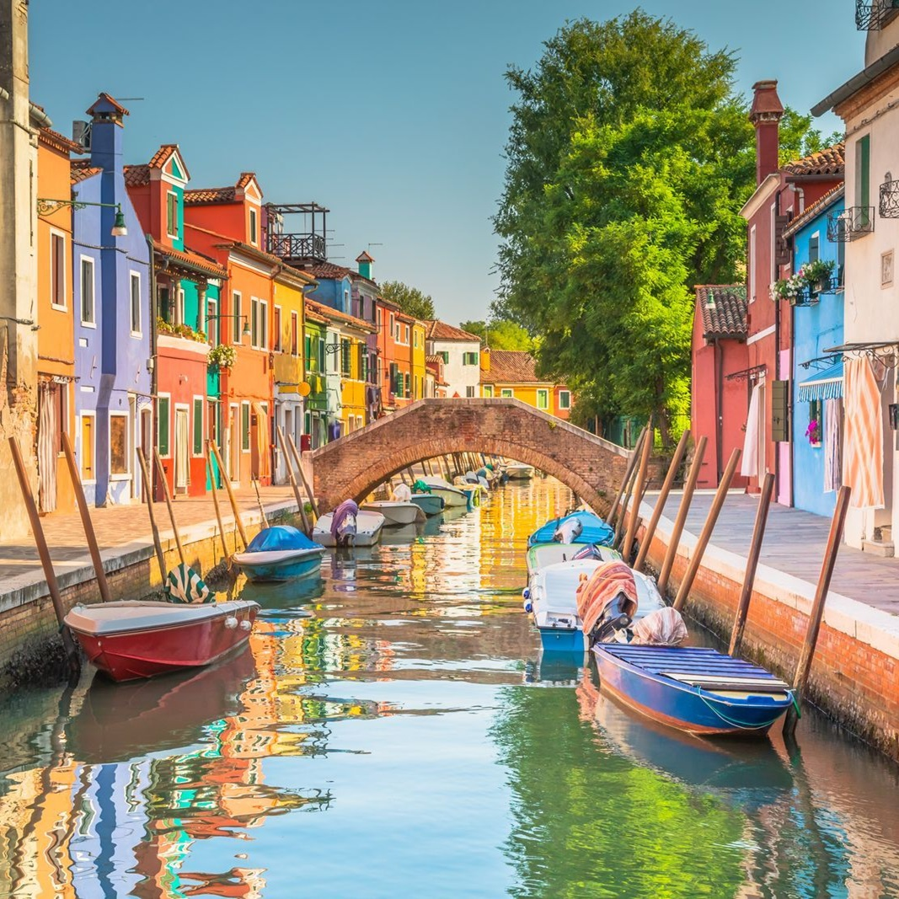
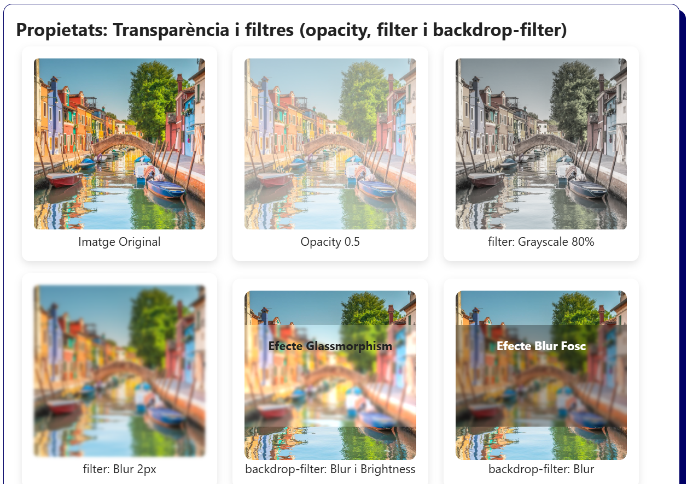
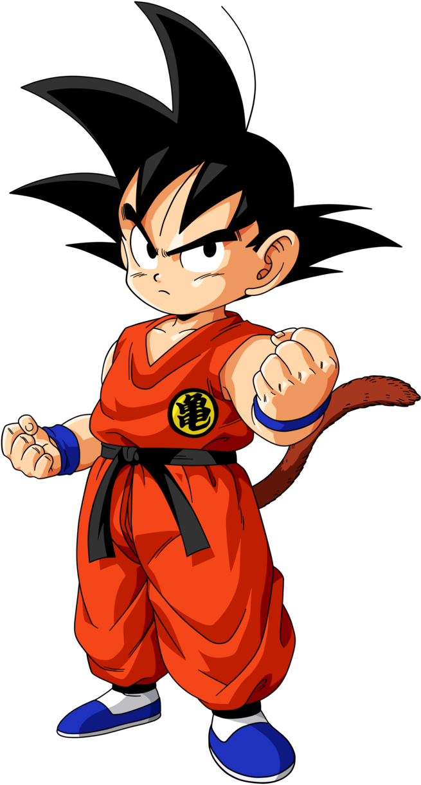
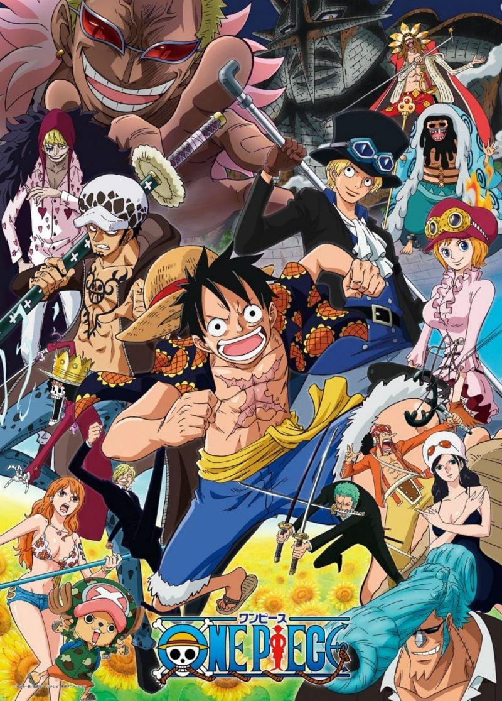
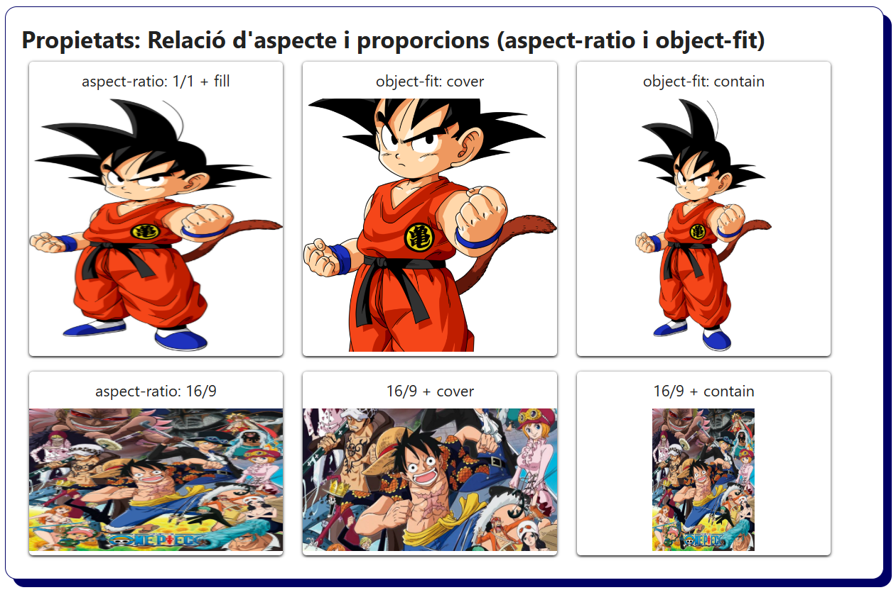
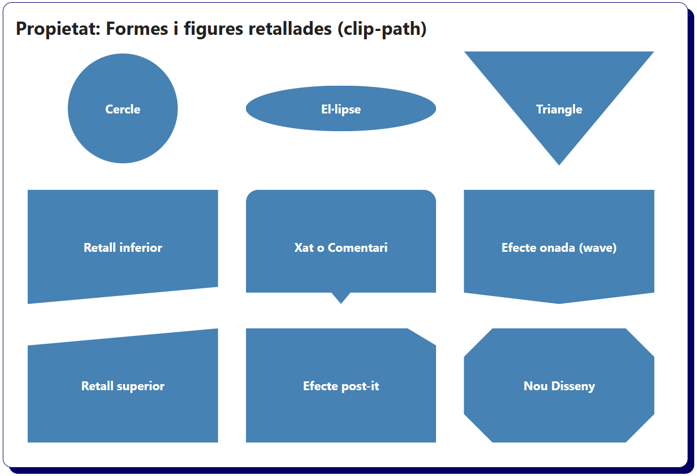
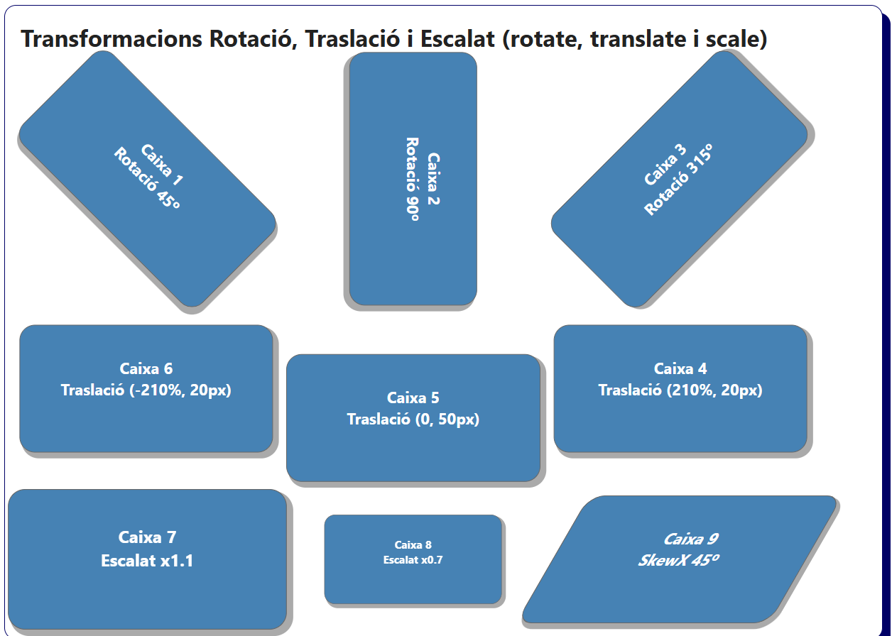
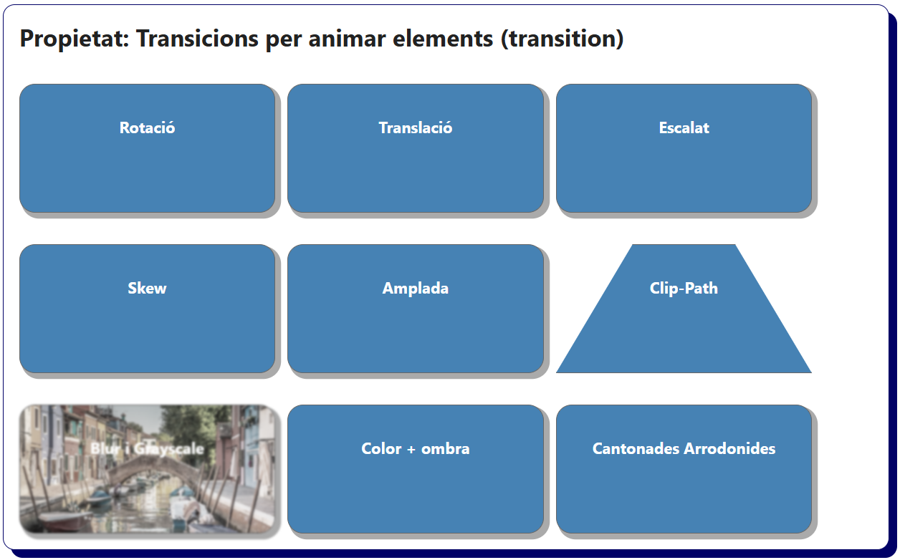
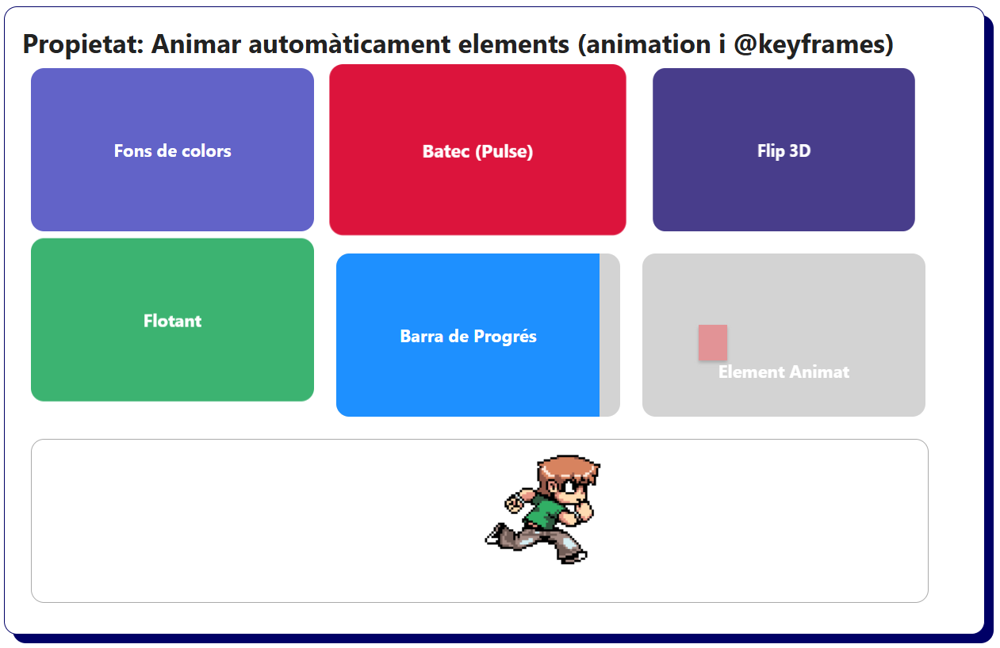

# Bloc 07. Estils CSS moderns amb transicions i animacions

Les propietats que es treballen en aquest bloc us permetran desmarcar-vos dels dissenys web convencionals, fent les vostres pàgines web més interactives, professionals i dinàmiques.

En el disseny web modern, els efectes visuals combinats amb petits moviments dels elements HTML poden millorar l'atenció i l'experiència de l'usuari, fent que la navegació sigui més fluida i entretinguda. Entre aquests efectes, destaquen les ombres, les transparències, les transformacions, les transicions i les animacions d'objectes.

| **Propietat**           | **Descripció**                                                                                                             |
| ----------------------- | -------------------------------------------------------------------------------------------------------------------------- |
| `box-shadow`            | Afegeix ombres a les caixes HTML. Dona profunditat i sensació de flotació o elevació de l'element.                         |
| `border-radius`         | Arrodoneix les cantonades d’elements com targetes, botons, imatges o contenidors en general.                               |
| `opacity`               | Controla la transparència d’un element (valors entre 0 i 1) on el 0 és invisible i l'1 és opac.                            |
| `filter`                | Aplica filtres visuals a un element com blur, escala de grisos, contrast, saturació, etc.                                  |
| `backdrop-filter`       | Aplica filtres al fons d'un element, creant efectes com el "glassmorphism" (un vidre translúcid).                          |
| `aspect-ratio`          | Permet mantenir les proporcions (la forma) dels elements com imatges, vídeos o contenidors (1:1 quadrat, 16:9 panoràmic).  |
| `object-fit`            | Controla com s'ajusta una imatge dins del seu contenidor controlat amb aspect-ratio (`cover`, `contain`, `fill`, etc.).    |
| `clip-path`             | Retalla elements amb formes (triangles, cercles, etc.), útil decorar i retallar seccions, separadors, imatges, vores, etc. |
| `transform`             | Modifica un element HTML a partir de transformacions visuals com la rotació, l'escalat, la translació o el cisallament.    |
| `transition`            | Fa una transició entre l'estat inicial i l'estat final d'un element de forma suau (color, mida, ombres, posició etc.).     |
| `animation`             | Genera animacions sobre els elements HTML que es poden iniciar automàticament, tenir una durada i repetir-se.              |

## Estil de les caixes (`box-shadow`, `border-radius`)

```css
.card {
  float: left;
  width: 30%;
  margin: 0.75rem;
  padding: 1rem;
  background-color: white;
  text-align: center;
}

/* Element amb una ombra suau */
.soft-shadow {
  box-shadow: 0 1px 3px rgba(0, 0, 0, 0.4);
  border-radius: 6px;
}

/* Element amb una ombra estil neó */
.neon-glow {
  box-shadow: 0 0 15px 3px steelblue;
  background-color: lightblue;
  border-radius: 9px;
}

/* Element amb una gran ombra que simula l'elevació */
.raised-depth {
  box-shadow: 0 8px 24px rgba(0, 0, 0, 0.2);
}

/* Element amb una ombra interior que simula un efecte d'enfonsat */
.inset-shadow {
  box-shadow: inset 0 0 12px #ccc;
  border: 1px solid #ddd;
}

/* Element amb un estil retro amb ombra pronunciada i unes vores marcades */
.retro-shadow {
  box-shadow: 6px 6px 0 0 rgba(0, 0, 102);
  border: 2px solid rgb(0, 0, 102);
}

/* Element amb vores suaus i una ombra suau difuminada */
.outlined-glow {
  border: 1px solid #ccc;
  box-shadow: 0 0 8px rgba(0, 0, 102, 0.2);
  border-radius: 3px;
}
```

```html
<h2>Propietats: Ombres (box-shadow) i cantonades arrodonides (border-radius)</h2>
<div class="card soft-shadow">
    <h3>Estil Genèric</h3>
    <p>Ombra suau i elegant per targetes de perfil o informació.</p>
</div>
<div class="card neon-glow">
    <h3>Estil Neó</h3>
    <p>Ideal per destacar ofertes o botons de crida a l'acció.</p>
</div>
<div class="card raised-depth">
    <h3>Estil Flotant</h3>
    <p>Aspecte de targeta "flotant" com al disseny de Google.</p>
</div>
<div class="card inset-shadow">
    <h3>Estil Profunditat</h3>
    <p>Ombra interior per fer un efecte d'enfonsat o premut.</p>
</div>
<div class="card retro-shadow">
    <h3>Estil Retro</h3>
    <p>Disseny GumRoad amb ombra desplaçada i un color viu.</p>
</div>
<div class="card outlined-glow">
    <h3>Estil Minimalista</h3>
    <p>Efecte suau amb vores i una ombra lleugera.</p>
</div>
```



## Transparència i filtres (`opacity`, `filter`, `backdrop-filter`)

```css
.box {
  display: inline-block;
  width: 30%;
  margin: 0.5rem;
  padding: 0.5rem;
}

.image-box {
  text-align: center;
  background-color: white;
  border-radius: 10px;
  padding: 1rem;
  box-shadow: 0 4px 10px rgba(0, 0, 0, 0.1);
}

.image-box img {
  width: 100%;
  border-radius: 6px;
}

/* Uma imatge amb opacitat al 50% (opacity). Permet valors entre 0 i 1. */
.opacity-low img {
  opacity: 0.5;
}

/* Una imatge amb filtre d'escala de grisos (grayscale). */
.grayscale img {
  filter: grayscale(80%);
}

/* Una imatge amb filtre difuminat (blur). */
.blur img {
  filter: blur(2px);
}

/* Imatge de fons per treballar amb backdrop-filter */
.backdrop-box {
  background: url('./../img/imatge_opacity_filter_backdrop-filter.jpg') center/cover no-repeat;
  border-radius: 10px;
  position: relative;
  overflow: hidden;
  font-weight: bold;
}

/* Efecte Glassmorphism (Vidre translúcid) Permet escriure text visible damunt d'una imatge. */
/* Treballa amb background-color blanc i backdrop-filter amb blur i brightness */
.backdrop-glass {
  padding: 1rem;
  margin: 20% 0;
  height: 225px;
  background-color: rgba(255, 255, 255, 0.1);
  backdrop-filter: blur(2px) brightness(1.2);
  color: #222;
}

/* Efecte Blur fosc. Permet escriure text blanc sobre un fons negre damunt d'una imatge. */
.backdrop-blur {
  padding: 1rem;
  margin: 20% 0;
  height: 225px;
  background-color: rgba(0, 0, 0, 0.3);
  backdrop-filter: blur(2px);
  color: white;
}
```

```html
<h2>Propietats: Transparència i filtres (opacity, filter i backdrop-filter)</h2>
<div class="box image-box">
  
  <p>Imatge Original</p>
</div>
<div class="box image-box opacity-low">
  
  <p>Opacity 0.5</p>
</div>
<div class="box image-box grayscale">
  
  <p>filter: Grayscale 80%</p>
</div>
<div class="box image-box blur">
  
  <p>filter: Blur 2px</p>
</div>
<div class="box image-box">
  <div class="backdrop-box">
    <div class="backdrop-glass">
      <p>Efecte Glassmorphism</p>
    </div>
  </div>
  <p>backdrop-filter: Blur i Brightness</p>
</div>
<div class="box image-box">
  <div class="backdrop-box">
    <div class="backdrop-blur">
      <p>Efecte Blur Fosc</p>
    </div>
  </div>
  <p>backdrop-filter: Blur</p>
</div>
```



## Relació d'aspecte i proporcions (`aspect-ratio`, `object-fit`)

```css
.box {
  display: inline-block;
  width: 30%;
  margin: 0.5rem;
  box-shadow: 0 1px 3px #222;
  border-radius: 0.25rem;
  text-align: center;
}

.box p {
  margin: 0.5rem;
}

/* Element amb una relació d'aspecte 1:1 (imatge quadrada) */
.img-box {
  aspect-ratio: 1 / 1;
}

/* Element amb una relació d'aspecte 16:9 (imatge rectangular) */
.rectangular {
  aspect-ratio: 16 / 9;
}

/* Imatge que ocupa el 100% de l'element i per defecte object-fit: fill */
.img-box img {
  width: 100%;
  height: 100%;
  object-fit: fill;
}

.cover img {
  object-fit: cover;
}

.contain img {
  object-fit: contain;
}
```

```html
<h2>Propietats: Relació d'aspecte i proporcions (aspect-ratio i object-fit)</h2>
<div class="box">
  <p>aspect-ratio: 1/1 + fill</p>
  <div class="img-box">
    
  </div>
</div>
<div class="box cover">
  <p>object-fit: cover</p>
  <div class="img-box">
    
  </div>
</div>
<div class="box contain">
  <p>object-fit: contain</p>
  <div class="img-box">
    
  </div>
</div>
<div class="box">
  <p>aspect-ratio: 16/9</p>
  <div class="img-box rectangular">
    
  </div>
</div>
<div class="box cover">
  <p>16/9 + cover</p>
  <div class="img-box rectangular">
    
  </div>
</div>
<div class="box contain">
  <p>16/9 + contain</p>
  <div class="img-box rectangular">
    
  </div>
</div>
```



## Formes i figures (`clip-path`)

```css
.card {
  display: inline-block;
  width: 250px;
  min-height: 150px;
  margin: 1rem;
  padding-top: 4rem;
  background: steelblue;
  color: white;
  font-weight: bold;
  text-align: center;
  clip-path: none;
}

/* Cercle centrat amb un 35% de radi del que mesura un costat de la caixa. Imatges de perfils, botons, icones, etc. */
.card.cercle {
  clip-path: circle(35%);
}

/* El·lipse amb un radi RX 50% i RY 20% centrada en X al 50% i Y al 50%. Seccions decoratives concretes. */
.card.elipse {
  clip-path: ellipse(50% 20% at 50% 50%);
}

/* Triangle invertit creat a partir de la funció "polygon" */
/* 1er punt: x=0 i y=0 (cantonada superior esquerra) */
/* 2n punt: x=100% i y=0 (cantonada superior dreta) */
/* 3er punt x=50% i y=100% (centrat en x i part inferior en y) i torna a l'inici */
.card.triangle {
  clip-path: polygon(0 0, 100% 0%, 50% 100%);
}

/* Retall diagonal superior. Element decoratiu com a separador, targeta de producte, secció decorativa, etc. */
.card.diagonal-cut {
  clip-path: polygon(0 0, 100% 0, 100% 85%, 0 100%);

}

/* Contenidor decoratiu. Element decoratiu com a notificació, contenidor de xat, comentari, etc. */
.card.comment {  
  clip-path: polygon(0 0, 100% 0, 100% 90%, 55% 90%, 50% 100%, 45% 90%, 0 90%);
  border-radius: 1rem;
}

/* Efecte onada (wave). Element separador visual o targetes de productes. */
.card.wave {
  clip-path: polygon(0 0, 100% 0, 100% 90%, 50% 100%, 0 90%);
}

/* Retall diagonal inferior. Element decoratiu com a separador, targeta de producte, secció decorativa, etc. */
.card.diagonal-inferior {
  clip-path: polygon(0 15%, 100% 0, 100% 100%, 0 100%);
}

/* Retall estil adhesiu (post-it). Element decoratiu en algunes seccions, productes, descomptes, destacats, etc. */
.card.corner-cut {
  clip-path: polygon(0 0, 85% 0, 100% 15%, 100% 100%, 0 100%);
}

/* Retall per les 4 cantonades. Exemple de l'ús de polygon per generar nous estils als elements HTML. */
.card.new-design {
  clip-path: polygon(15% 0%, 85% 0%, 100% 25%, 100% 75%, 85% 100%, 15% 100%, 0% 75%, 0% 25%);
}
```

```html
<h2>Propietat: Formes i figures retallades (clip-path)</h2>
<div class="card cercle">Cercle</div>
<div class="card elipse">El·lipse</div>
<div class="card triangle">Triangle</div>
<div class="card diagonal-cut">Retall inferior</div>
<div class="card comment">Xat o Comentari</div>
<div class="card wave">Efecte onada (wave)</div>
<div class="card diagonal-inferior">Retall superior</div>
<div class="card corner-cut">Efecte post-it</div>
<div class="card new-design">Nou Disseny</div>
```



## Transformacions 2D: Rotació, Traslació i Escalat (`transform: rotate`, `translate`, `scale`, `skew`)

```css
.box {
  display: inline-block;
  width: 30%;
  min-height: 20vh;
  margin: 8rem 0.5rem 0 0.5rem;
  padding: 2rem;
  background: steelblue;
  color: white;
  font-weight: bold;
  text-align: center;
  border-radius: 1rem;
  border: solid 1px #666;
  box-shadow: 4px 4px 0 2px #aaa;
}

/* Element amb una transformació de rotació de 45 graus. */
section div:nth-of-type(1) {
  transform: rotate(45deg);
}

/* Element amb una transformació de rotació de 90 graus. */
section div:nth-of-type(2) {
  transform: rotate(90deg);
}

/* Element amb una transformació de rotació de 315 graus. */
section div:nth-of-type(3) {
  transform: rotate(315deg);
}

/* Element amb una transformació de traslació de 210% en X i 20px en Y) */
section div:nth-of-type(4) {
  transform: translate(210%, 20px);
}

/* Element amb una transformació de traslació de 0px en X i 50px en Y) */
section div:nth-of-type(5) {
  transform: translate(0, 50px);
}

/* Element amb una transformació de traslació de -210% en X i 20px en Y) */
section div:nth-of-type(6) {
  transform: translate(-210%, 20px);
}

/* Element amb una transformació d'escalat de x1.1 en X i de x1.1 en Y. */
section div:nth-of-type(7) {
  transform: scale(1.1)
}

/* Element amb una transformació d'escalat de x0.7 en X i de x0.7 en Y. */
section div:nth-of-type(8) {
  transform: scale(0.7)
}

/* Element amb una transformació de cisallament de -30 graus en X i de 0 graus en Y. */
section div:nth-of-type(9) {
  transform: skew(-30deg)
}
```

```html
<section>
  <h2>Transformacions Rotació, Traslació i Escalat (rotate, translate i scale) </h2>
  <div class="box">
    <p>Caixa 1</p>
    <p>Rotació 45º</p>
  </div>
  <div class="box">
    <p>Caixa 2</p>
    <p>Rotació 90º</p>
  </div>
  <div class="box">
    <p>Caixa 3</p>
    <p>Rotació 315º</p>
  </div>
  <div class="box">
    <p>Caixa 4</p>
    <p>Traslació (210%, 20px)</p>
  </div>
  <div class="box">
    <p>Caixa 5</p>      
    <p>Traslació (0, 50px)</p>
  </div>
  <div class="box">
    <p>Caixa 6</p>
    <p>Traslació (-210%, 20px)</p>
  </div>
  <div class="box">
    <p>Caixa 7</p>
    <p>Escalat x1.1</p>
  </div>
  <div class="box">
    <p>Caixa 8</p>
    <p>Escalat x0.7</p>
  </div>
  <div class="box">
    <p>Caixa 9</p>
    <p>SkewX 45º</p>
  </div>
</section>
```



```css
/* Transició per totes les propietats de 0.6 segons amb un format "ease" */
.box {
  transition: all 0.6s ease;
  cursor: pointer;
  display: inline-block;
  width: 30%;
  min-height: 20vh;
  margin: 2rem 0.5rem 0 0;
  padding: 2rem;
  background-color: steelblue;
  color: white;
  font-weight: bold;
  text-align: center;
  border-radius: 1rem;
  border: solid 1px #666;
  box-shadow: 4px 4px 0 2px #aaa;
}

/* Transició de rotació */
.rotate:hover {
  transform: rotate(35deg);
}

/* Transició de traslació */
.translate:hover {
  transform: translate(0, -5vh);
}

/* Transició d'escalat */
.scale:hover {
  transform: scale(1.2);
}

/* Transició de cisallament */
.skew:hover {
  transform: skewX(-20deg);
}

/* Transició d'amplada */
.width {
  width: 20%;
}
.width:hover {
  width: 30%;
}

/* Transició amb clip-path (poligon amb el mateix número de costats) */
.clip {
  clip-path: polygon(30% 0%, 70% 0%, 100% 100%, 0% 100%);
  border-radius: 0px;
}
.clip:hover {
  clip-path: polygon(0% 0%, 100% 0%, 70% 100%, 30% 100%);
}

/* Transició amb filter grayscale i blur de la imatge de fons */
.blur {
  background: url('./../img/imatge_opacity_filter_backdrop-filter.jpg') center/cover;
  filter: grayscale(80%) blur(1px);
}
.blur:hover {
  filter: grayscale(0%) blur(0);
}

/* Transició de color de fons i de l'ombra */
.color:hover {
  background-color: slateblue;
  box-shadow: 0 3px 2px #000;
}

/* Transició de l'arrodoniment de les cantonades */
.border:hover {
  border-radius: 50%;
}
```

```html
<h2>Propietat: Transicions per animar elements (transition) </h2>
<div class="box rotate">Rotació</div>
<div class="box translate">Translació</div>
<div class="box scale">Escalat</div>
<div class="box skew">Skew</div>
<div class="box width">Amplada</div>
<div class="box clip">Clip-Path</div>
<div class="box blur">Blur i Grayscale</div>
<div class="box color">Color + ombra</div>
<div class="box border">Cantonades Arrodonides</div>
```



```css
.card {
  display: inline-block;
  width: 30%;
  margin: 0.5rem;
  height: 150px;
  text-align: center;
  line-height: 150px;
  color: white;
  background-color: lightgray;
  font-weight: bold;
  border-radius: 12px;
  overflow: hidden;
  position: relative;
}

/* Element amb el fons animat amb diferents colors */
.animacioColorFons {
  background-color: steelblue;
  animation: colorsBg 6s ease infinite;
}
@keyframes colorsBg {
    0% {background: steelblue;}
    25% {background: slateblue;}
    50% {background: dodgerblue;}
    75% {background: slateblue;}
}

/* Element animat simulant el batec del cor (Pulse) */
.animacioPulse {
  background: crimson;
  animation: pulse 2s infinite;
}
@keyframes pulse {
  0%, 100% { transform: scale(1); }
  50% { transform: scale(1.05); }
}

/* Element animat simulant el gir d'una carta (Flip 3D) */
.animacioFlip {
  background: darkslateblue;
  perspective: 1000px;
  animation: flipCard 6s infinite;
}
@keyframes flipCard {
  0%, 100% { transform: rotateY(0deg); }
  50% { transform: rotateY(180deg); }
}

/* Element animat simulant que sura a l'aigua (Floaty) */
.animacioFloat {
  background: mediumseagreen;
  animation: floaty 3s ease-in-out infinite;
}
@keyframes floaty {
  0%, 100% { transform: translateY(0); }
  50% { transform: translateY(-15px); }
}

/* Barra de càrrega de progrés dins de la caixa (Progress Bar) */
.animacioProgress {
  position: relative;
}
.animacioProgress .progressBar {
  position: absolute;
  left: 0;
  top: 0;
  height: 100%;
  width: 0%;
  background-color: dodgerblue;
  animation: carregant 10s forwards infinite;
}

@keyframes carregant {
  0% { width: 0%; }
  100% { width: 100%; }
}

/* Element animat que es desplaça dins del contenidor pare */
.miniBox {
    position: relative;
    padding: 10px;
    box-shadow: 0px 2px 3px #aaa;
    background: dodgerblue;
    color: white;
    width: 10%;
    height: 5vh;
    text-align: center;
}

.movimentAnimation {
    animation-name: moviment;
    animation-duration: 6s;
    animation-iteration-count: infinite;
}

@keyframes moviment {
  0% {background: lightblue; top: 20%; left:20%;}
  25% {background: lightcoral; top:20%; left:60%; }
  50% {background: lightgreen; top:50%; left: 60%;}
  75% {background: lightcoral; top:50%; left:20%; }
  100% {background:lightblue; top:20%; left:20%;}
}


/* Element animat una imatge de 8 fotogrames amb un jugador d'un joc. */
.card-runner {
  display: inline-block;
  width: 95%;
  margin: 0.5rem;
  height: 150px;
  text-align: center;
  border: solid 1px #aaa;
  background-color: #fff;
  font-weight: bold;
  border-radius: 12px;
  overflow: hidden;
  position: relative; 
}

/* Animació de l'sprite (imatge amb els 8 fotogrames) */
.runner {
    position: relative;
    height: 137px;
    width: 115px;
    background: url("./../img/runner_animation_sprite.png");
    animation: sprite 1s steps(8) infinite, move 3s linear infinite;
    animation-iteration-count: infinite;
    animation-direction: alternate-reverse;
}

@keyframes sprite {
    100% {
        background-position: -920px; /* 115px x 8 frames */
    }
}

@keyframes move {
    0% {
        left: 0%;
    }
    100% {
        left: calc(100% - 115px);
    }
}
```

```html
<h2>Propietat: Animar automàticament elements (animation i @keyframes) </h2>
<div class="card animacioColorFons">Fons de colors</div>
<div class="card animacioPulse">Batec (Pulse)</div>
<div class="card animacioFlip">Flip 3D</div>
<div class="card animacioFloat">Flotant</div>
<div class="card animacioProgress"><div class="progressBar">Barra de Progrés</div></div>
<div class="card animacioBlur"><div class="miniBox movimentAnimation"></div>Element Animat</div>
<div class="card-runner"><div class="runner"></div></div>
```

