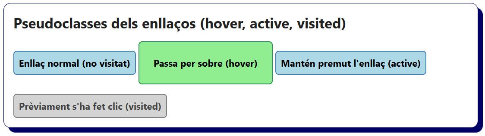
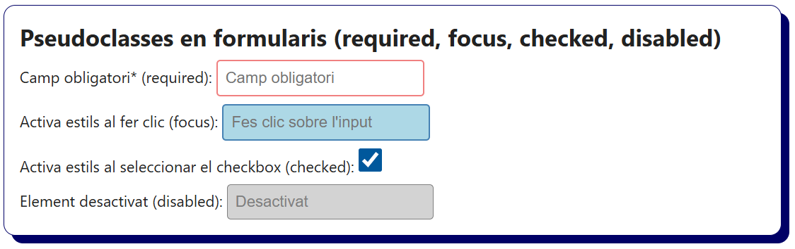
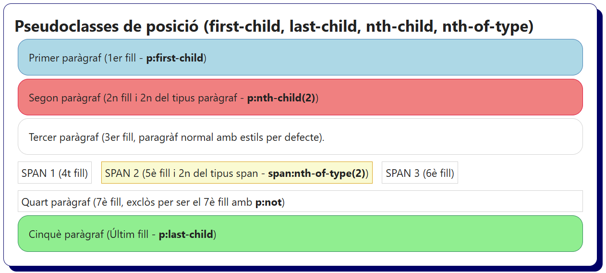
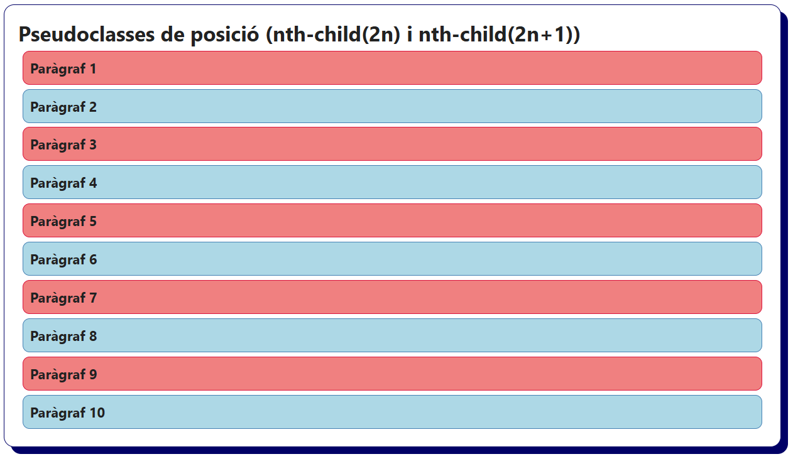
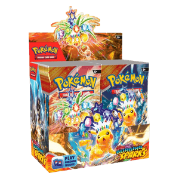
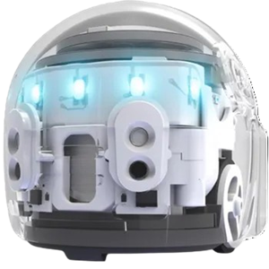
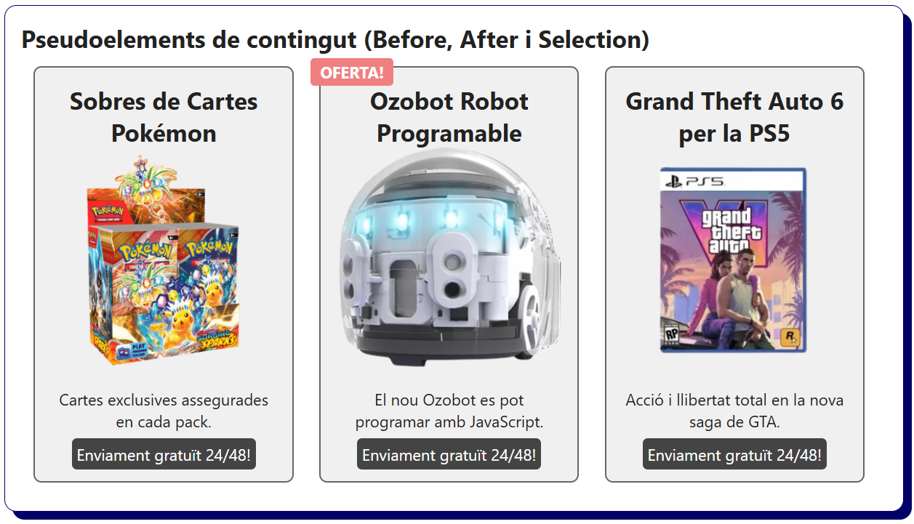

# Bloc 08. Pseudoestils: Pseudoclasses i Pseudoelements

Les pseudoclasses i pseudoelements són eines que permeten aplicar estils a elements HTML segons el seu estat, la posició dins del document o quan succeeix un esdeveniment concret sense haver de modificar el codi HTML. S'utiltizen per donar una resposta quan l'usuari interactua amb la pàgina web sense necessitat de disposar de codi de programació web (JavaScript).

## Pseudoclasses més utilitzades

| **Nom**           | **Descripció**                                                                                                                 |
| ----------------- | ------------------------------------------------------------------------------------------------------------------------------ |
| `:hover`          | Aplica uns estils concrets quan el ratolí passa per sobre de l'element.                                                        |
| `:active`         | Aplica estils quan l'element està sent clicat (mentre la tecla del ratolí està premuda).                                       |
| `:visited`        | Aplica estils a un enllaç que ja ha estat visitat.                                                                             |
| `:focus`          | Formularis: Aplica estils quan a l'element es fa un clic complet (camp de text seleccionat).                                   |
| `:required`       | Formularis: Aplica estils a elements `input` que són obligatoris dins d'un formulari.                                          |
| `:checked`        | Formularis: Aplica estils a un element `checkbox` o `radio` que s'ha seleccionat.                                              |
| `:disabled`       | Formularis: Aplica estils a elements desactivats (inputs o botons) Normalment de formularis.                                   |
| `:first-child`    | Aplica estils al primer fill del seu contenidor pare especificat.                                                              |
| `:last-child`     | Aplica estils a l'últim fill del seu contenidor pare espeficiat.                                                               |
| `:nth-child(n)`   | Aplica estils als elements (`div`,`p`...) que són el fill número (n) del seu contenidor pare (comptabilitzarà tots els fills). |
| `:nth-of-type(n)` | Aplica estils als elements que són el fill número (n) d'un tipus concret (comptabilitzarà només els fills d'aquell tipus).     |
| `:not(selector)`  | Aplica estils als elements que NO compleixen una condició especificada.                                                        |

## Pseudoelements més utilitzats

| **Nom**         | **Descripció**                                                               |
| --------------- | ---------------------------------------------------------------------------- |
| `::before`      | Afegeix contingut de text i/o HTML abans de l'element.                       |
| `::after`       | Afegeix contingut de text i/o HTML després de l'element.                     |
| `::selection`   | Aplica estils al text que l'usuari ha seleccionat amb el ratolí.             |
| `::placeholder` | Formularis: Aplica estils al text del placeholder dels `input` i `textarea`. |

## Pseudoclasses per a enllaços (`:hover`, `:active`, i `:visited`)

```css
a {
  display: inline-block;
  margin-top: 1rem;
  color: black;
  text-decoration: none;
  font-weight: bold;
  border: 2px solid steelblue;
  padding: 0.5rem;
  background-color: lightblue;
  border-radius: 6px;
}

/* Element que rep un acció de l'usuari. El ratolí passa per sobre. (hover) */
a:hover {
  background-color: lightgreen;
  color: black;
  border-color: seagreen;
  padding: 1.5rem;
}

/* Element que rep un acció de l'usuari. És fa clic amb el ratolí i es manté el clic. (active) */
a:active {
  background-color: lightcoral;
  color: crimson;
  border-color: crimson;
}

/* Element que ha rebut una acció de l'usuari. Ha fet clic prèviament. (visited) */
a:visited {
  background-color: lightgray;
  color: #444;
  border-color: gray;
}
```



```html
<h2>Pseudoclasses dels enllaços (hover, active, visited)</h2>
<a href="#1">Enllaç normal (no visitat)</a>
<a href="#2">Passa per sobre (hover)</a>
<a href="#3">Mantén premut l'enllaç (active)</a>
<a href="#4">Prèviament s'ha fet clic (visited)</a>
```

## Pseudoclasses en formularis (`:focus`, `:required`, `:checked`, `:disabled`)

```css
/* Estils genèrics pels input (sobretot l'efecte d'outline)*/
input {
  outline: none;
  padding: 0.5rem;
  border: 2px solid lightgray;
  border-radius: 4px;
  font-size: 1rem;
}

/* Element input requerit amb uns estils que destaquin per indicar que es obligatori. (required) */
input:required {
  border: solid 2px lightcoral;
}

/* Element input mentre està seleccionat, es fa focus en ell. (focus) */
input:focus {
  border: solid 2px steelblue;
  background-color: lightblue;
}

/* Element input que ha estat seleccionat, fent referència a un checkbox (checked) */
input:checked {
  width: 25px;
  height: 25px;
}

/* Element input que està desactivat i no es pot interactuar amb ell. (disabled) */
input:disabled {
  background-color: lightgray;
  border: 1px solid gray;
  color: gray;
}
```

```html
<h2>Pseudoclasses en formularis</h2>
<form>
  <label>
    Camp obligatori* (required):
    <input type="text" required placeholder="Camp obligatori" />
  </label>
  <label>
    Activa estils al fer clic (focus):
    <input type="email" placeholder="Fes clic sobre l'input" />
  </label>
  <label>
    Activa estils al seleccionar el checkbox (checked):
    <input type="checkbox" />
  </label>
  <label>
    Element desactivat (disabled):
    <input type="text" value="Desactivat" disabled />
  </label>
</form>
```



## Pseudoclasses de posició (`:first-child`, `:last-child`, `:nth-child`, `:nth-of-type`, `:not`)

```css
span {
  display: inline-block;
}

.container p,
.container span {
  padding: 5px;
  border: 1px solid lightgray;
  margin: 5px;
}

/* Element paràgraf que és el primer fill de .container (first-child) */
.container p:first-child {
  background-color: lightblue;
  border-color: steelblue;
}

/* Element paràgraf que és el segon fill de .container (nth-child) */
.container p:nth-child(2) {
  background-color: lightcoral;
  border-color: crimson;
}

/* Element span que és el segon fill de .container del tipus span (first-of-type) */
.container span:nth-of-type(2) {
  background-color: lightgoldenrodyellow;
  border-color: goldenrod;
}

/* Element paràgraf que NO és el 7è fill de .container (not) */
.container p:not(p:nth-child(7)) {
  padding: 1rem;
  border-radius: 1rem;
}

/* Element paràgraf que és l'últim fill de .container (last-child) */
.container p:last-child {
  background-color: lightgreen;
  border-color: seagreen;
}
```

```html
<h2>Pseudoclasses de posició (first-child, last-child, nth-child, nth-of-type)</h2>
<div class="container">
  <p>Primer paràgraf (1er fill - <strong>p:first-child</strong>)</p>
  <p>Segon paràgraf (2n fill i 2n del tipus paràgraf - <strong>p:nth-child(2)</strong>)</p>
  <p>Tercer paràgraf (3er fill, paragràf normal amb estils per defecte).</p>
  <span>SPAN 1 (4t fill)</span>
  <span>SPAN 2 (5è fill i 2n del tipus span - <strong>span:nth-of-type(2)</strong>)</span>
  <span>SPAN 3 (6è fill)</span>
  <p>Quart paràgraf (7è fill, exclòs per ser el 7è fill amb <strong>p:not</strong>)</p>
  <p>Cinquè paràgraf (Últim fill - <strong>p:last-child</strong>)</p>
</div>
```



```css
.container-nth p {
  font-weight: bold;
  border: 1px solid lightgray;
  padding: 0.5rem;
  margin: 5px;
  border-radius: 0.5rem;
}

/* Element paràgraf que és fill parell (even) de .container-nth (nth-child(2n)) */
.container-nth p:nth-child(2n) {
  background-color: lightblue;
  border-color: steelblue;
}

/* Element paràgraf que és fill senar (odd) de .container-nth (nth-child(2n+1)) */
.container-nth p:nth-child(2n + 1) {
  background-color: lightcoral;
  border-color: crimson;
}
```

```html
<div class="container-nth">
  <p>Paràgraf 1</p>
  <p>Paràgraf 2</p>
  <p>Paràgraf 3</p>
  <p>Paràgraf 4</p>
  <p>Paràgraf 5</p>
  <p>Paràgraf 6</p>
  <p>Paràgraf 7</p>
  <p>Paràgraf 8</p>
  <p>Paràgraf 9</p>
  <p>Paràgraf 10</p>
</div>
```



## Pseudoelements de contingut (`::before`, `::after` i `::selection`)

```css
/* Estils genèrics dels elements (exemple amb productes d'una botiga online). */
.product {
  float: left;
  width: 30%;
  border: 2px solid #666;
  background-color: #f0f0f0;
  padding: 1rem;
  margin: 0.5rem;
  border-radius: 0.5rem;
  position: relative;
  text-align: center;
}

.product .description {
  margin: 0.7rem 0;
}

.product img {
  width: 100%;
}

/* Pseudoelement que afegeix contingut abans del títol del producte. (::before) */
.oferta::before {
  content: 'OFERTA!';
  position: absolute;
  top: -10px;
  left: -10px;
  background-color: lightcoral;
  color: white;
  font-weight: bold;
  padding: 0.2rem 0.6rem;
  border-radius: 4px;
}

/* Pseudoelement que afegeix contingut després de la descripció del producte. (::after) */
.product::after {
  content: 'Enviament gratuït 24/48!';
  padding: 0.3rem;
  background-color: #444;
  color: white;
  border-radius: 5px;
}

/* Pseudoelement que modifica l'estil del text seleccionat per l'usuari. (::selection) */
.product p::selection {
  background-color: yellow;
  color: red;
}
```

```html
<div class="product">
  <h2 class="title">Sobres de Cartes Pokémon</h2>
  
  <p class="description">Cartes exclusives assegurades en cada pack.</p>
</div>
<div class="product oferta">
  <h2 class="title">Ozobot Robot Programable</h2>
  
  <p class="description">El nou Ozobot es pot programar amb JavaScript.</p>
</div>
<div class="product">
  <h2 class="title">Grand Theft Auto 6 per la PS5</h2>
  
  <p class="description">Acció i llibertat total en la nova saga de GTA.</p>
</div>
```


