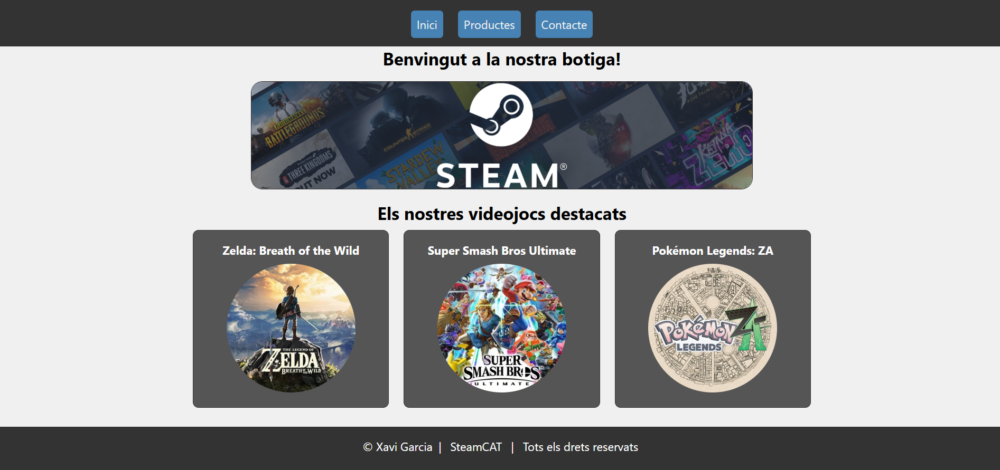
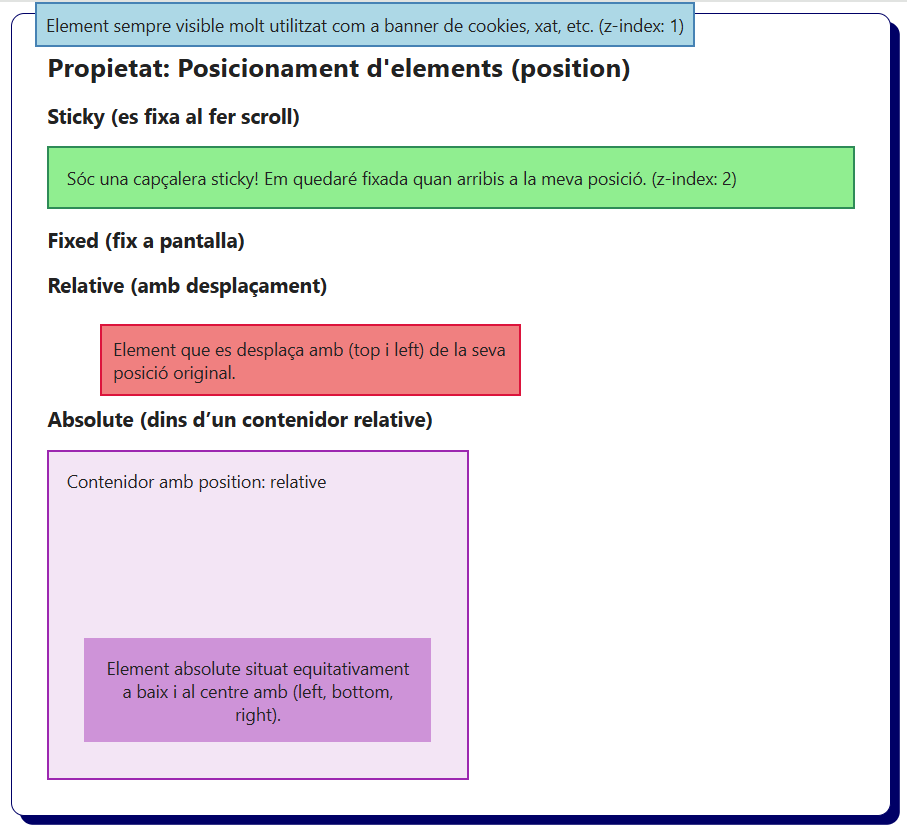
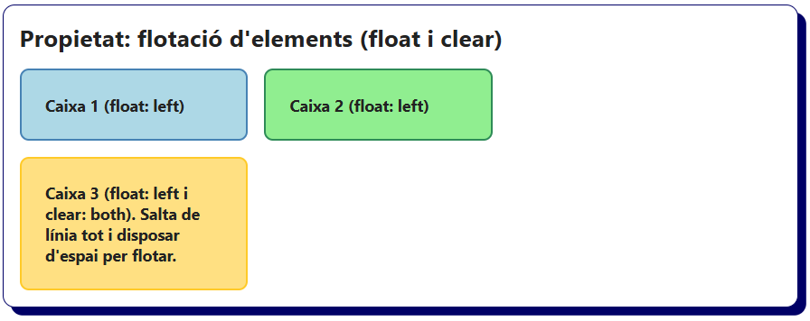

# Bloc 09. Disposició d’elements

El disseny de pàgines web combina l’aplicació d’estils visuals (com el color, la mida o la tipografia) amb la disposició dels elements dins del document. És a dir, on es situen i com es comporten uns elements respecte els altres.

Per defecte, els elements HTML es mostren de dalt a baix i d’esquerra a dreta, seguint l’ordre del codi HTML. Però aquest comportament es pot modificar utilitzant diferents propietats, que permeten controlar l’estructura i l’organització visual de la pàgina.


| Propietat                    | Descripció                                                                                       |
|------------------------------|--------------------------------------------------------------------------------------------------|
| **display**                  | Indica quin és el tipus de caixa (block, inline, inline-block, none, flex, grid, etc.)           |
| **position**                 | Permet posicionar elements respecte al seu pare, respecte a la pantalla i també fixar-los.       |
| **top, right, bottom, left** | Permet modificar la posició d'un element a partir d'una posició establerta amb position.         |
| **z-index**                  | Controla la profunditat dels elements. Permet establir un ordre dels elements superposats.       |
| **float**                    | Flota els elements a l'esquerra o a la dreta i permet que altres es posicionin al seu costat.    |
| **clear**                    | Evita que un element es posicioni al costat d'un element flotant (el fa saltar de línia).        |


### Tipus d'elements (`display`)

- `block`: l'element ocupa tota l’amplada disponible del contenidor pare. Permet modificar la seva amplada i alçada i es situa en una nova línia. Ex: `<div>`, `<p>`, `<h1>`.
- `inline`: l'element ocupa només l'amplada o l’espai del contingut. No permet modificar l'amplada i l'alçada i es situa al costat d'altres elements si disposa d'espai. Ex: `<span>`, `<a>`.
- `inline-block`: És un element que es comporta com un element de tipus inline (es mostra en línia), però es pot modificar l'alçada i l'amplada com un element de tipus block. Ex: ``
- `none`: l’element no es mostra (queda ocult) i tampoc ocupa espai en el disseny (layout).
- `flex`: l'element es converteix en un contenidor flexible que permet als seus elements fills adaptar-se segons l'espai disponible (pantalles de mòbils, tauletes, ordinadors, etc.).
- `grid`: l'element es converteix en un contenidor de graella que permet disposar els seus fills en files i columnes i controlar la seva posició dins el layout. També permet adaptar-se a diferents mides de pantalla.

La propietat display estableix la manera en com es representa un element HTML dins d'una pàgina web. És una de les propietats CSS més importants, ja que controla si l’element es mostra com un element de tipus block, inline, inline-block o none (si volem que quedi ocult). També s'utilitza per crear layouts avançats com són els dissenys en graella i els dissenys flexibles (grid i flexbox).

```css
/* Element que ocupa tota l'amplada disponible i s'inicia en una nova línia. (block) */
.display-block {
  display: block;
  border: 2px solid steelblue;
  background-color: lightblue;
}

/* Element ocupa l'amplada del seu contingut i que es disposa al costat d'un altre element si té espai. (inline) */
.display-inline {
  display: inline;
  border: 2px solid seagreen;
  background-color: lightgreen;
}

/* Element de tipus inline però que permet modificar l'amplada i l'alçada com un element de bloc. (inline-block) */
.display-inline-block {
  display: inline-block;
  border: 2px solid crimson;
  background-color: lightcoral;
  width: 200px;
}

/* Element que no es mostra a la pàgina web i que no ocupa espai al layout. (none) */
.display-none {
  display: none;
}
```

```html
<h2>Propietat: visualització d'elements (display)</h2>
<div class="display-block">DIV: Ocupa l'amplada del pare i comença en nova línia. (block)</div>
<span class="display-inline">SPAN 1 (inline)</span>
<span class="display-inline">SPAN 2 (inline)</span>
<div class="display-inline-block">DIV: Amplada definida i es posiciona en línia. (inline-block)</div>
<!-- L'elements amb display: none; no es mostrarà -->
<div class="display-none">Aquest no es mostrarà.</div>
```


### Contenidors genèrics (`div`)
Els `<div>` per defecte tenen la visualització inicialitzada a `display: block`. Si necessitem situar diversos DIV de costat (en línia), volem que ocupin menys amplada o l'amplada del seu contingut podem canviar la propietat a `inline-block`, `inline` o fer-los desaparèixer amb `none`.

### Contenidors genèrics (`span`)
Els `<span>` per defecte tenen la visualització inicialitzada a `display: inline`. Si volem que es comportin com un contenidor (DIV) per poder-li assignar una amplada i una alçada es poden transformar a `inline-block`. Molt comú en botons de menús o altres span amb contingut que volem fer més gran.

### Imatges (`img`)
Les `` són elements `inline-block` per defecte. Es situaran en línia si disposen d'espai i es pot modificar la seva amplada i alçada.

### Elements Block

| **Elements block més comuns**                           |
| ------------------------------------------------------- |
| `<div>`                                                 |
| `<p>`                                                   |
| `<h1>` - `<h6>`                                         |
| `<nav>`, `<section>`, `<article>` i `<aside>`           |
| `<header>`, `<main>` i `<footer>`                       |
| `<ul>`, `<ol>`, `<li>`                                  |
| `<table>`, `<thead>`, `<tbody>`, `<tr>`, `<th>`, `<td>` |
| `<form>`, `<fieldset>` i `<legend>`                     |
| `<fieldset>`, `<legend>`                                |
| `<figure>` i `<figcaption>`                             |

### Elements Inline

| **Elements inline més comuns**        |
| ------------------------------------- |
| `<span>`                              |
| `<a>`                                 |
| `<strong>` i `<em>`                   |
| `<label>`, `<select>` i `<textarea>`  |

### Elements Inline-Block més comuns

| **Elements inline-block més comuns**  |
| ------------------------------------- |
| ``                               |
| `<input>`, `<button>`                 |
| `<select>`, `<textarea>`              |


### Exemple de Layout amb diferents elements (`inline`, `inline-block` i `block`) modificats



### Posicionament d'Elements (`position`)

- `static`: és el valor de posició per defecte (segueix el flux normal del document), es posiciona de dalt a baixa i d'esquerra a dreta.
- `relative`: l'element manté la seva posició en el flux del document, permet moure'l respecte la seva posició original sense afectar als altres elements. (Útil per situar elements amb valor absolute dins seu)
- `absolute`: l'element ja no apareix en el flux del document (no ocupa espai) i es posiciona respecte al primer element predecessor amb el valor de position que no sigui "static" (Si no hi ha cap element predecessor diferent de "static es posiciona sobre l'element arrel "html").
- `fixed`: l'element ja no apareix en el flux del document (no ocupa espai), es posiciona respecte la finestra del navegador, es manté fix a la mateixa posició i visible tot i que es faci scroll. (És molt útil per menús, banner de cookies, contenidors de xat, etc. sempre fixes a pantalla).
- `sticky`: l'element es mou amb el contingut al fer scroll actuant com a "relative" però quan arriba a la seva posició actua com a "fixed", es queda fixat a la pantalla. (És molt útil per menús o elements que volem fer sempre visibles un cop fet scroll).

> Les propietats `top`, `left`, `right`, `bottom` permeten modificar el posicionament quan estan definides com a `absolute` o `fixed`.

> L'ús de `z-index` es interessant per donar prioritat a elements que queden superposats amb propietats com `absolute` o `fixed`. Per defecte el seu valor és 0. Si volem donar prioritat (posar al davant) uns elements respecte a altres es poden asignar valors de z-index creixents com 1,2,3,4,5,etc. Si volem enviar un element al fons (treure-li prioitat) podem donar valors negatius com -1. 

```css
/* Element sempre visible i fixat a la mateixa posició tot i fer scroll (fixed) */
/* Element amb z-index: 1 es posicionarà al davant de la resta d'elements (z-index: 0 per defecte)*/
.fixed-box {
  position: fixed;
  top: 0;
  left: 2rem;
  z-index: 1;
  padding: 8px;
  background-color: lightblue;
  border: solid 2px steelblue;
}

/* Element que es mou al fer scroll però queda fixat quan arriba a la seva posició (sticky) */
/* Element amb z-index: 2 es posicionarà al davant de la resta d'elements (z-index: 0 i 1) */
.sticky-header {
  position: sticky;
  top: 0;
  z-index: 2;
  padding: 1rem;
  background-color: lightgreen;
  border: solid 2px seagreen;
}

.sticky-comprovacio {
  height: 1200px;
}

/* Element que es desplaça respecte la seva posició original però no afecta als altres elements. (relative) */
.relative-box {
  position: relative;
  top: 0.5rem;
  left: 3rem;
  width: 50%;
  padding: 10px;
  background-color: lightcoral;
  border: solid 2px crimson;
}

/* Element que s'inicialitza amb la propietat de position relative per incoure dins seu un element amb position absolute. */
.container {
  position: relative;
  width: 50%;
  min-height: 300px;
  padding: 1rem;
  background-color: #f3e5f5;
  border: 2px solid #9c27b0;
}

/* Element que es posiciona absolutament dins del contenidor anterior que disposa de position relative. (absolute) */
.absolute-box {
  position: absolute;
  left: 1rem;
  bottom: 1rem;
  right: 1rem;
  padding: 1rem;
  background-color: #ce93d8;
  text-align: center;
}
```

```html
<h2>Propietat: Posicionament d'elements (position)</h2>
<h3>Sticky (es fixa al fer scroll)</h3>
<div class="sticky-header">Sóc una capçalera sticky! Em quedaré fixada quan arribis a la meva posició. (z-index: 2)</div>
<h3>Fixed (fix a pantalla)</h3>
<p class="fixed-box">Element sempre visible molt utilitzat com a banner de cookies, xat, etc. (z-index: 1)</p>
<h3>Relative (amb desplaçament)</h3>
<div class="relative-box">Element que es desplaça amb (top i left) de la seva posició original.</div>
<h3>Absolute (dins d’un contenidor relative)</h3>
<div class="container">
  Contenidor amb position: relative
  <div class="absolute-box">Element absolute situat equitativament a baix i al centre amb (left, bottom, right).</div>
</div>
<p class="sticky-comprovacio"></p>
```



### Maquetació Tradicional (`float` i `clear`)

- `float`: permet que un element "floti" a un costat (dreta o esquerra) del seu contenidor i que els altres elements s’adaptin al seu voltant. (S'utilitza per disposar elements de tipus block en la mateixa línia quan no ocupen el 100% del seu contenidor pare).
- `clear`: evita que un element es posicioni al costat d’elements flotants i el fa saltar a la següent línia. (S'utilitza per organitzar elements flotants en diferents files per importància, temàtiques, etc.)

> Cal destacar que `float` i `clear` són propietats que s'utilitzaven per crear layouts abans d'aparèixer Grid i Flexbox, que ofereixen opcions per una maquetació més eficients.

```css
/* Estil genèrics de les caixes. Tots els elements floten a l'esquerra (float) */
.box {
  float: left;
  width: 30%;
  padding: 1.5rem;
  margin: 1rem 1rem 0 0;
  font-weight: bold;
  border-radius: 9px;
}

/* Element flotant 1 amb diferents estils */
.box-1 {
  background-color: lightblue;
  border: 2px solid steelblue;
}

/* Element flotant 2 amb diferents estils */
.box-2 {
  background-color: lightgreen;
  border: 2px solid seagreen;
}

/* Element flotant 3. Tot i disposar d'espai salta de línia. (clear) */
.box-3 {
  float: left;
  clear: both;
  background-color: #ffe082;
  border: 2px solid #ffca28;
}
```

```html
<h2>Propietat: flotació d'elements (float i clear)</h2>
<div class="container">
  <div class="box box-1">Caixa 1 (float: left)</div>
  <div class="box box-2">Caixa 2 (float: left)</div>
  <div class="box box-3">Caixa 3 (float: left i clear: both). Salta de línia tot i disposar d'espai per flotar.</div>
</div>
```


