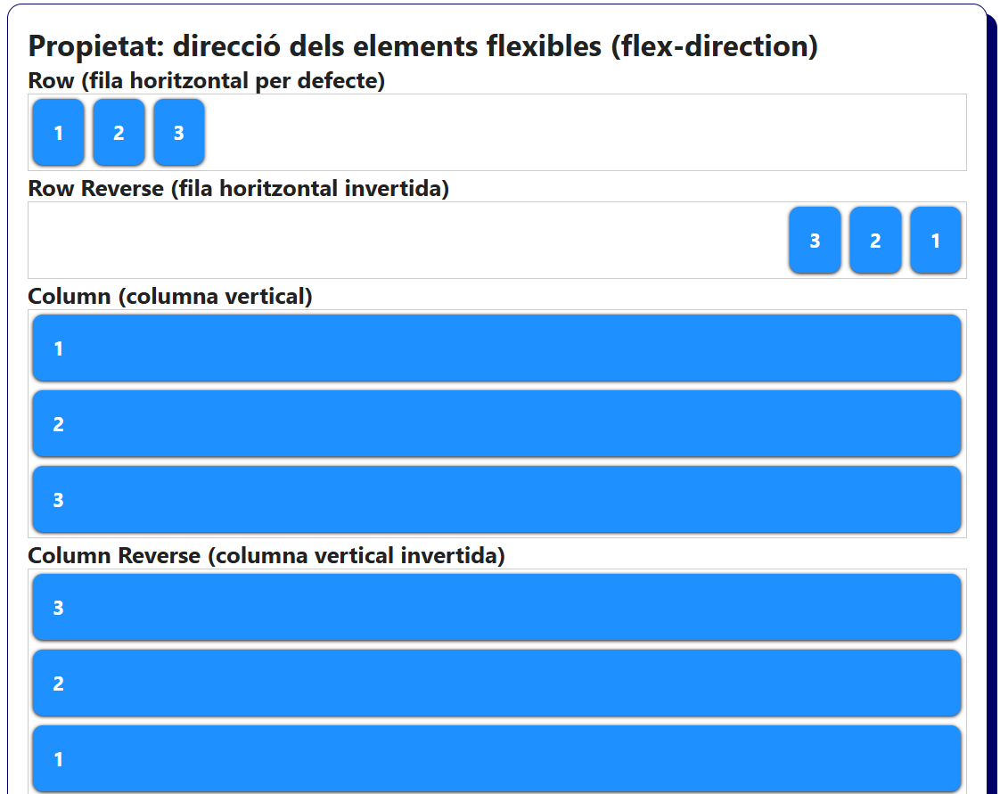
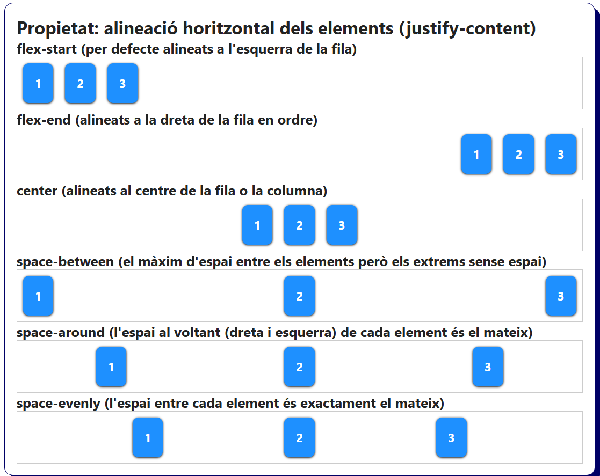
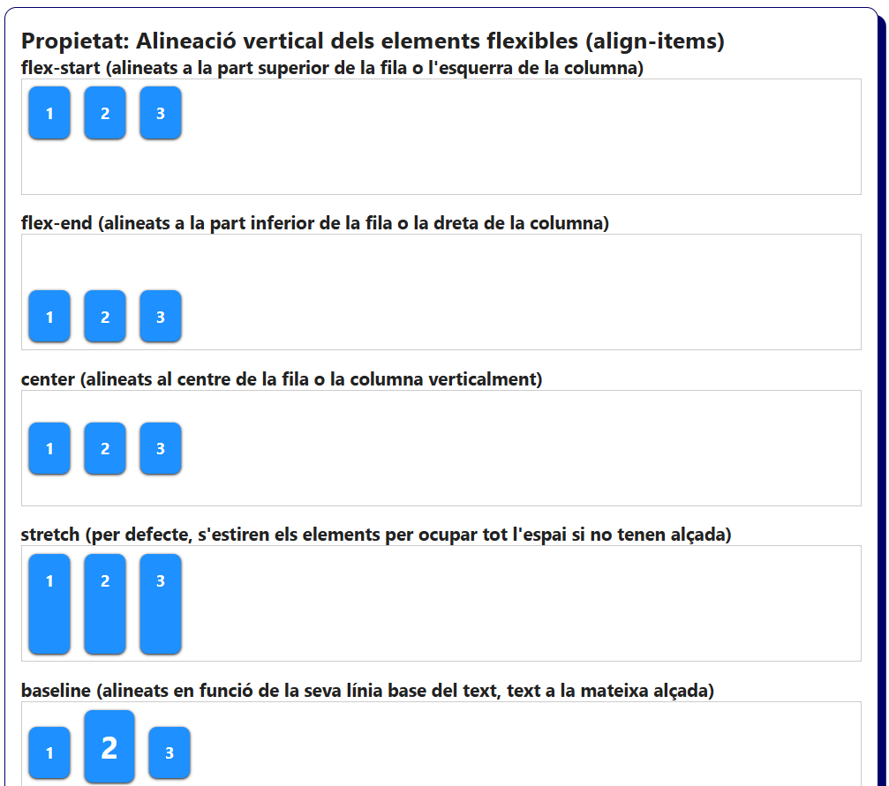
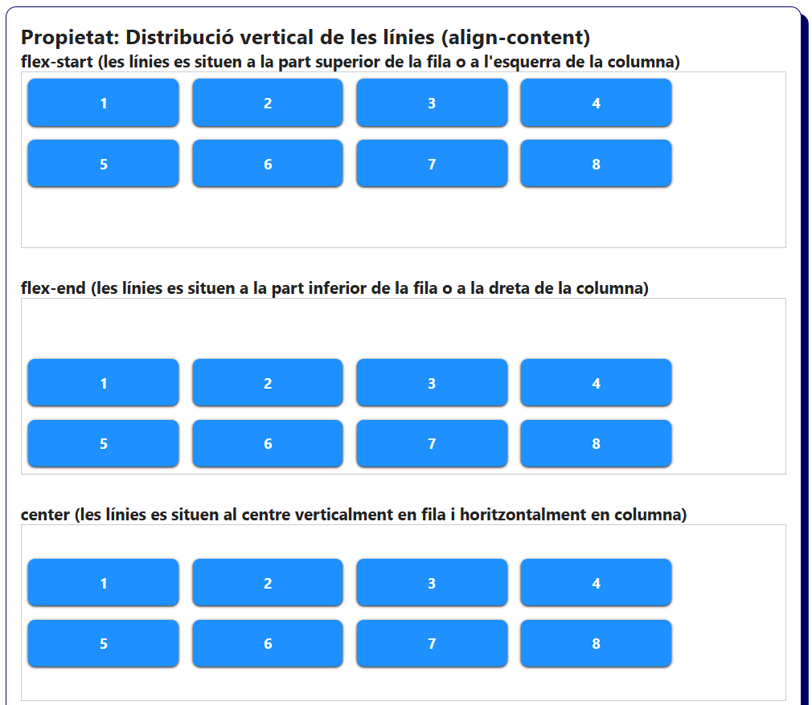
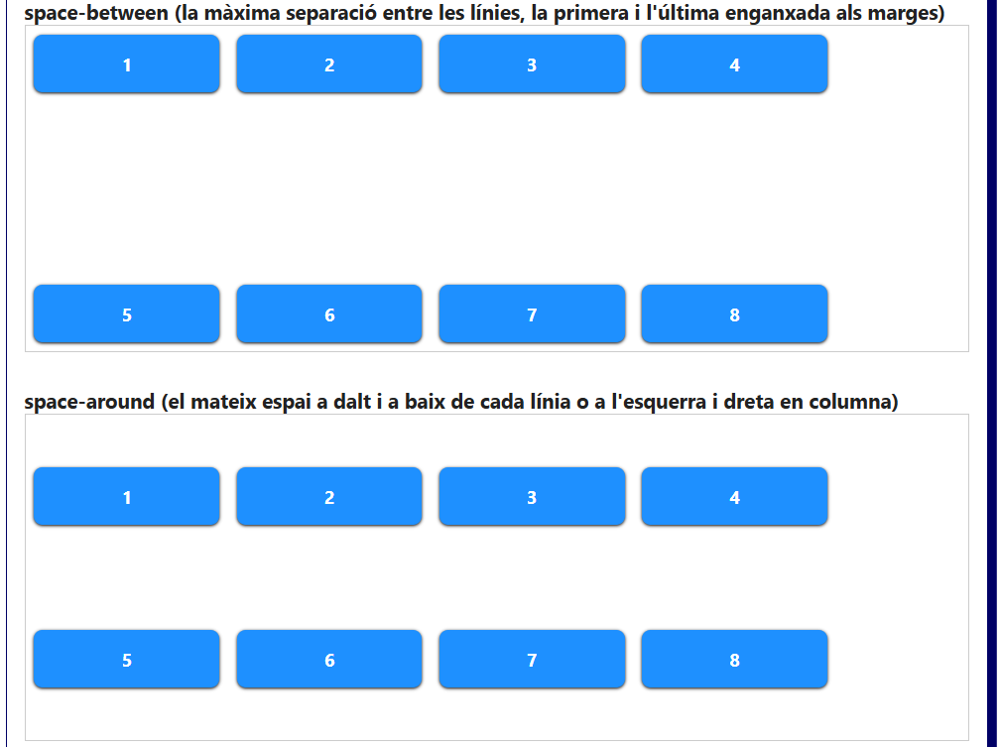
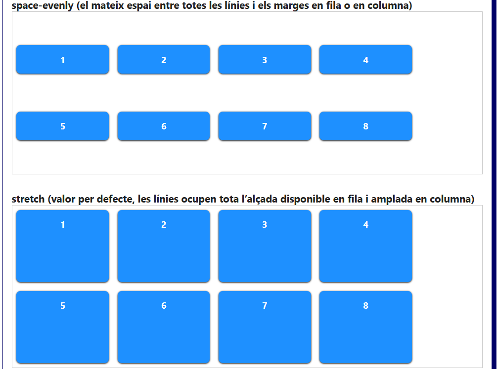
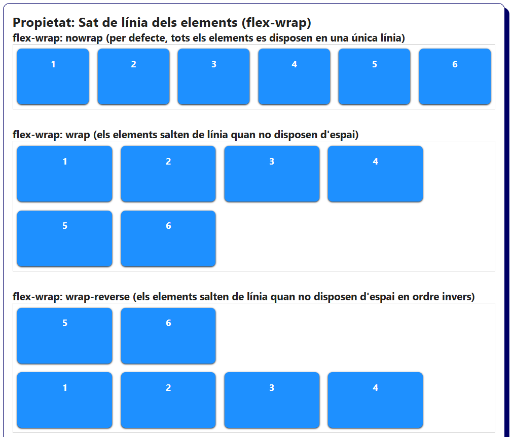
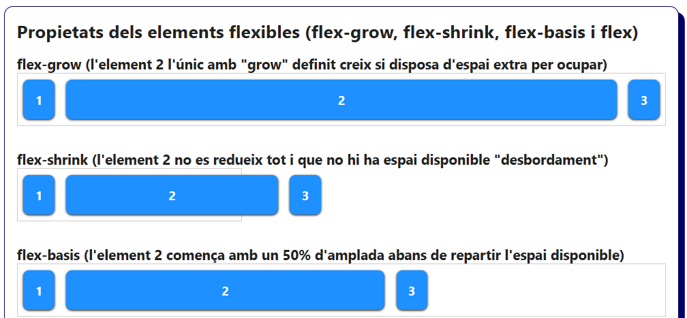
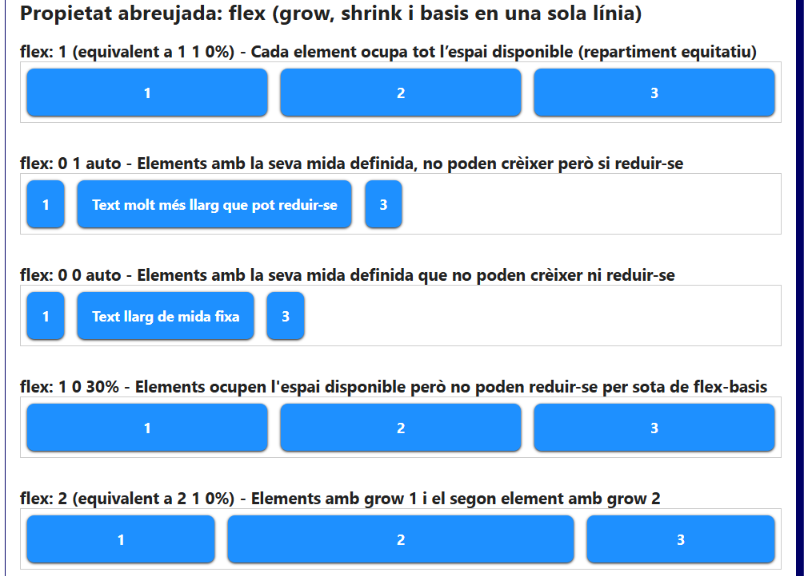
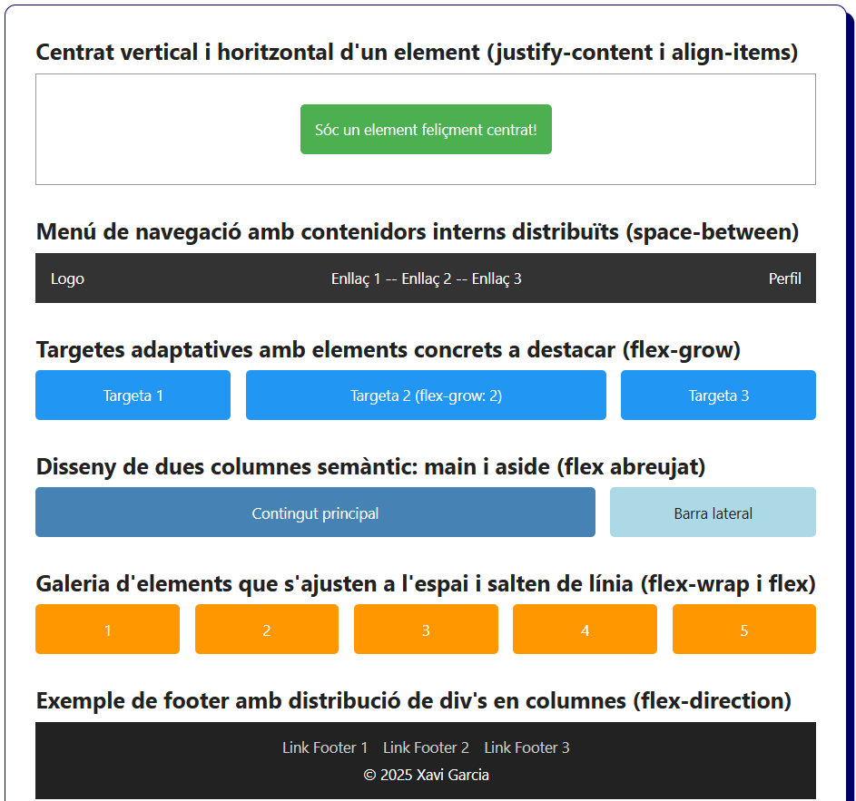

# Bloc 10. Disseny flexible amb Flexbox

El disseny flexible és l'eina que ens permet crear contenidors flexibles perquè els elements del seu interior puguin alinear-se i distribuir-se l'espai disponible automàticament. És a dir, el contenidor flexible podrà modificar l'amplada i l'alçada dels elements del seu interior perquè aquests puguin repartir-se l'espai si la pàgina web es visualitza en pantalles de diferents mides. Aquest és el primer pas per la creació de layouts (interfícies web) més modernes i adaptables a diferents dispositius.

El model Flexbox (display: flex) s'utilitza molt per:
- Centrar elements horitzontalment i verticalment en qualsevol mida de pantalla.
- Repartir l'espai entre columnes o files de manera automàtica i equitativa.
- Crear dissenys adaptables sense fer servir el mètode tradicional (float) o posicionaments (position).

## Propietats del contenidor flexible (pare)

| **Propietat**     | **Descripció**                                                                                                                                                            |
| ----------------- | ------------------------------------------------------------------------------------------------------------------------------------------------------------------------- |
| `display: flex`   | Converteix un contenidor en un "contenidor flexible" de tipus block.                                                                                                      |
| `flex-direction`  | Estableix la direcció de col·locació dels elements fills flexibles (row, column, row-reverse, column-reverse, etc.).                                                      |
| `justify-content` | Distribueix els elements flexibles a partir de l'espai disponible en l'eix X (flex-start, flex-end, center, space-between, space-around, space-evenly, etc).              |
| `align-items`     | Distribueix els elements flexibles a partir de l'espai disponible en l'eix Y (flex-start, flex-end, center, stretch, baseline, etc.)                                      |
| `align-content`   | Si hi ha espai sobrant i diverses files d'elements, distribueix els elements en l'eix Y (flex-start, center, space-between, space-around, space-evenly, etc.)             |
| `flex-wrap`       | Indica si els elements s'han d'ajustar en una fila o columna o si han d'ocupar diverses files o columnes segons l'espai que necessitin (nowrap, wrap, wrap-reverse, etc.) |
| `gap`             | Estableix l’espai entre els elements fills sense la necessitat d'utilitzar marges i permet mantenir la separació entre files i columnes (px, %, rem, em, etc.).           |

## Propietats dels contenidors flexibles (fills)

| **Propietat**     | **Descripció**                                                                                                                                                            |
| ----------------- | ------------------------------------------------------------------------------------------------------------------------------------------------------------------------- |
| `flex-grow`       | Indica quant ha de créixer de més un element flexible respecte els altres si hi ha espai disponible. Valors enters positius, 0 és el valor per defecte (0,1,2,3,4,5,etc.) |
| `flex-shrink`     | Indica quant ha de decréixer un element flexible respecte els altres si NO hi ha espai disponible. Valors enters positius, 0 no és reudeix i 1 és el valor per defecte (1,2,3,4,5,etc.)     |
| `flex-basis`      | Estableix la mida mínima (inicial) d'un element flexible abans que es distribueixi l'espai disponible. S'utilitzen les magnituds (px, %, rem, auto, etc.)                 |
| `flex`            | Propietat abreujada (grow, shrink i basis). Fent ús de flex: 1 equival a (flex-grow: 1, flex-shrink: 1 i flex-basis: 0%) perquè tots els elements ocupin el mateix espai. |
| `align-self`      | Alinea un element fill concret dins del contenidor diferent a la "d'align items" (stretch, flex-start, flex-end, center, baseline, etc.).                                 |
| `order`           | Estableix l'ordre dels elements flexibles. Podem establir un ordre concret utilitzant valors enters positius, on 0 és el valor per defecte (0,1,2,3,4,5,etc.)             |

## Direcció dels elements (`flex-direction`)

```css
* {
  box-sizing: border-box;
}

.flex-item {
  padding: 1rem;
  font-weight: bold;
  color: white;
  background-color: dodgerblue;
  border-radius: 0.5rem;
  box-shadow: 0 1px 3px #000;
}

/* Contenidor flexible (flex) amb cadascun dels flex-items */
.flex {
  display: flex;
  gap: 0.5rem;
  padding: 0.25rem;
  border: 1px solid #ccc;
}

/* Flex-Direction per defecte amb orientació horitzontal (esquerra a dreta) */
.flex-row {
  flex-direction: row;
}

/* Flex-Direction amb orientació horitzontal inversa (dreta a esquerra) */
.flex-row-reverse {
  flex-direction: row-reverse;
}

/* Flex-Direction amb orientació vertical (de dalt a baix) */
.flex-column {
  flex-direction: column;
}

/* Flex-Direction amb orientació vertical invertida (de baix a dalt) */
.flex-column-reverse {
  flex-direction: column-reverse;
}
```

```html
<h2>Propietat: direcció dels elements flexibles (flex-direction)</h2>
<h3>Row (fila horitzontal per defecte)</h3>
<div class="flex flex-row">
    <div class="flex-item">1</div>
    <div class="flex-item">2</div>
    <div class="flex-item">3</div>
</div>
<h3>Row Reverse (fila horitzontal invertida)</h3>
<div class="flex flex-row-reverse">
    <div class="flex-item">1</div>
    <div class="flex-item">2</div>
    <div class="flex-item">3</div>
</div>
<h3>Column (columna vertical)</h3>
<div class="flex flex-column">
    <div class="flex-item">1</div>
    <div class="flex-item">2</div>
    <div class="flex-item">3</div>
</div>
<h3>Column Reverse (columna vertical invertida)</h3>
<div class="flex flex-column-reverse">
    <div class="flex-item">1</div>
    <div class="flex-item">2</div>
    <div class="flex-item">3</div>
</div>
```



## Alineació horitzontal dels elements (`justify-content`)

```css
* {
  box-sizing: border-box;
}

.flex-item {
  padding: 1rem;
  font-weight: bold;
  color: white;
  background-color: dodgerblue;
  border-radius: 0.5rem;
  box-shadow: 0 1px 3px #000;
}

/* Contenidor flexible (flex) amb direció de fila "row" per defecte */
.flex {
  display: flex;
  gap: 1rem;
  padding: 0.5rem;
  border: 1px solid #ccc;
}

/* Els elements es situen a l'inici del contenidor (a l'esquerra si flex-direction és "row" o a dalt si és "column") */
.justify-start {
  justify-content: flex-start;
}

/* Els elements es situen al final del contenidor (a la dreta si flex-direction és "row" o a baix si és "column") */
.justify-end {
  justify-content: flex-end;
}

/* Els elements es situen al centre del contenidor (al centre horitzontal si flex-direction és "row" o al centre vertical si és "column" */
.justify-center {
  justify-content: center;
}

/* Els elements tenen el màxim d'espai entre ells però sense espai als extrems (primer i últim element) en horitzontal si és "row" si en vertical si és "column" */
.justify-between {
  justify-content: space-between;
}

/* Els elements tenen el mateix espai a la seva dreta i la seva esquerra si flex-direction és "row" o a dalt i a baix si és "column". */
.justify-around {
  justify-content: space-around;
}

/* Tots els elements tenen exactament el mateix espai entre ells independentment de la seva posició. (en horitzontal o en vertical) */
.justify-evenly {
  justify-content: space-evenly;
}
```

```html
<h2>Propietat: alineació horitzontal dels elements (justify-content)</h2>
<h3>flex-start (per defecte alineats a l'esquerra de la fila i a dalt de la columna)</h3>
<div class="flex justify-start">
  <div class="flex-item">1</div>
  <div class="flex-item">2</div>
  <div class="flex-item">3</div>
</div>
<h3>flex-end (alineats a la dreta de la fila en ordre i a baix de la columna)</h3>
<div class="flex justify-end">
  <div class="flex-item">1</div>
  <div class="flex-item">2</div>
  <div class="flex-item">3</div>
</div>
<h3>center (alineats al centre horitzontal en la fila o al centre vertical de la columna)</h3>
<div class="flex justify-center">
  <div class="flex-item">1</div>
  <div class="flex-item">2</div>
  <div class="flex-item">3</div>
</div>
<h3>space-between (el màxim d'espai entre els elements però els extrems sense espai)</h3>
<div class="flex justify-between">
  <div class="flex-item">1</div>
  <div class="flex-item">2</div>
  <div class="flex-item">3</div>
</div>
<h3>space-around (l'espai al voltant (dreta i esquerra) de cada element és el mateix)</h3>
<div class="flex justify-around">
  <div class="flex-item">1</div>
  <div class="flex-item">2</div>
  <div class="flex-item">3</div>
</div>
<h3>space-evenly (l'espai entre cada element és exactament el mateix)</h3>
<div class="flex justify-evenly">
  <div class="flex-item">1</div>
  <div class="flex-item">2</div>
  <div class="flex-item">3</div>
</div>
```



## Alineació vertical dels elements (`align-items`)

```css
* {
  box-sizing: border-box;
}

.flex-item {
  padding: 1rem;
  font-weight: bold;
  color: white;
  background-color: dodgerblue;
  border-radius: 0.5rem;
  box-shadow: 0 1px 3px #000;
  text-align: center;
}

/* Contenidor flexible amb alçada perquè l'alineació sigui visible */
.flex {
  display: flex;
  gap: 1rem;
  padding: 0.5rem;
  border: 1px solid #ccc;
  height: 120px;
  margin-bottom: 1rem;
}

/* Elements alineats a la part superior en row (fila) o la part esquerra en column (columna) */
.align-items-start {
  align-items: flex-start;
}

/* Elements alineats a la part inferior en row (fila) o la part dreta en column (columna) */
.align-items-end {
  align-items: flex-end;
}

/* Elements alineats al centre de l'eix Y (en vertical) */
.align-items-center {
  align-items: center;
}

/* Elements alineats a la part superior i els estira els ítems per ocupar tota l'alçada si no tenen una fixada */
.align-items-stretch {
  align-items: stretch;
}

/* Elements alineats a la part superior però segons la línia base del text (tots els textos a la mateixa alçada) */
.align-items-baseline {
  align-items: baseline;
}

.align-items-baseline .flex-item:nth-child(2) {
  font-size: 2rem;
}
```

```html
<h2>Propietat: Alineació vertical dels elements flexibles (align-items)</h2>
<h3>flex-start (alineats a la part superior de la fila o l'esquerra de la columna)</h3>
<div class="flex align-items-start">
  <div class="flex-item">1</div>
  <div class="flex-item">2</div>
  <div class="flex-item">3</div>
</div>
<h3>flex-end (alineats a la part inferior de la fila o la dreta de la columna)</h3>
<div class="flex align-items-end">
  <div class="flex-item">1</div>
  <div class="flex-item">2</div>
  <div class="flex-item">3</div>
</div>
<h3>center (alineats al centre de la fila o la columna verticalment)</h3>
<div class="flex align-items-center">
  <div class="flex-item">1</div>
  <div class="flex-item">2</div>
  <div class="flex-item">3</div>
</div>
<h3>stretch (per defecte, s'estiren els elements per ocupar tot l'espai si no tenen alçada)</h3>
<div class="flex align-items-stretch">
  <div class="flex-item">1</div>
  <div class="flex-item">2</div>
  <div class="flex-item">3</div>
</div>
<h3>baseline (alineats en funció de la seva línia base del text, text a la mateixa alçada)</h3>
<div class="flex align-items-baseline">
  <div class="flex-item">1</div>
  <div class="flex-item">2</div>
  <div class="flex-item">3</div>
</div>
```



## Alineació vertical de les línies d'elements (`align-content`)

```css
* {
  margin: 0;
  padding: 0;
  box-sizing: border-box;
}

/* Elements amb una amplada mínima per generar 2 línies (flex-basis) */
.flex-item {
  padding: 1rem;
  font-weight: bold;
  color: white;
  background-color: dodgerblue;
  border-radius: 0.5rem;
  box-shadow: 0 1px 3px #000;
  text-align: center;
  flex-basis: 20%;
}

/* Contenidor flexible que permet múltiples línies flexibles (flex-wrap: wrap) */
.flex {
  display: flex;
  flex-wrap: wrap;
  gap: 1rem;
  height: 300px;
  border: 1px solid #ccc;
  padding: 0.5rem;
  margin-bottom: 2rem;
}

/* Només si hi ha diverses línies (siguin files o columnes) amb flex-wrap: wrap actiu */

/* Línies alineades a la part superior del contenidor (a dalt si és "row" i a l'esquerra si és "column") */
.align-content-start {
  align-content: flex-start;
}

/* Línies alineades a la part inferior del contenidor (a baix si és "row" i a la dreta si és "column") */
.align-content-end {
  align-content: flex-end;
}

/* Línies alineades al centre vertical del contenidor si és "row" i al centre horitzontal si és "column" */
.align-content-center {
  align-content: center;
}

/* Línies amb el màxim d'espai entre elles, però la primera i l’última enganxada als marges (superior i inferior en "row" ó esquerre i dret en "column") */
.align-content-between {
  align-content: space-between;
}

/* Línies distribuïdes amb el mateix espai abans i després de cada línia (espai superior i inferior en "row" ó espai esquerre i dret en "column" ) */
.align-content-around {
  align-content: space-around;
}

/* Línies distribuïdes amb el exactament el mateix espai entre totes elles (espai superior i inferior en "row" ó espai esquerre i dret en "column" ) */
.align-content-evenly {
  align-content: space-evenly;
}

/* Els elements de les línies s'estiren per omplir tot l’espai disponible (espai vertical en "row" i espai horitzontal en "column" */
.align-content-stretch {
  align-content: stretch;
}
```

```html
<h2>Propietat: Distribució vertical de les línies d'elements (align-content)</h2>
<h3>flex-start (les línies es situen a la part superior de la fila o a l'esquerra de la columna)</h3>
<div class="flex align-content-start">
  <div class="flex-item">1</div><div class="flex-item">2</div>
  <div class="flex-item">3</div><div class="flex-item">4</div>
  <div class="flex-item">5</div><div class="flex-item">6</div>
  <div class="flex-item">7</div><div class="flex-item">8</div>
</div>
<h3>flex-end (les línies es situen a la part inferior de la fila o a la dreta de la columna)</h3>
<div class="flex align-content-end">
  <div class="flex-item">1</div><div class="flex-item">2</div>
  <div class="flex-item">3</div><div class="flex-item">4</div>
  <div class="flex-item">5</div><div class="flex-item">6</div>
  <div class="flex-item">7</div><div class="flex-item">8</div>
</div>
<h3>center (les línies es situen al centre verticalment en fila i horitzontalment en columna)</h3>
<div class="flex align-content-center">
  <div class="flex-item">1</div><div class="flex-item">2</div>
  <div class="flex-item">3</div><div class="flex-item">4</div>
  <div class="flex-item">5</div><div class="flex-item">6</div>
  <div class="flex-item">7</div><div class="flex-item">8</div>
</div>
<h3>space-between (la màxima separació entre les línies, la primera i l'última enganxada als marges)</h3>
<div class="flex align-content-between">
  <div class="flex-item">1</div><div class="flex-item">2</div>
  <div class="flex-item">3</div><div class="flex-item">4</div>
  <div class="flex-item">5</div><div class="flex-item">6</div>
  <div class="flex-item">7</div><div class="flex-item">8</div>
</div>
<h3>space-around (el mateix espai a dalt i a baix de cada línia o a l'esquerra i dreta en columna)</h3>
<div class="flex align-content-around">
  <div class="flex-item">1</div><div class="flex-item">2</div>
  <div class="flex-item">3</div><div class="flex-item">4</div>
  <div class="flex-item">5</div><div class="flex-item">6</div>
  <div class="flex-item">7</div><div class="flex-item">8</div>
</div>
<h3>space-evenly (el mateix espai entre totes les línies i els marges en fila o en columna)</h3>
<div class="flex align-content-evenly">
  <div class="flex-item">1</div><div class="flex-item">2</div>
  <div class="flex-item">3</div><div class="flex-item">4</div>
  <div class="flex-item">5</div><div class="flex-item">6</div>
  <div class="flex-item">7</div><div class="flex-item">8</div>
</div>
<h3>stretch (valor per defecte, les línies ocupen tota l’alçada disponible en fila i amplada en columna)</h3>
<div class="flex align-content-stretch">
  <div class="flex-item">1</div><div class="flex-item">2</div>
  <div class="flex-item">3</div><div class="flex-item">4</div>
  <div class="flex-item">5</div><div class="flex-item">6</div>
  <div class="flex-item">7</div><div class="flex-item">8</div>
</div>
```





## Salt de línia dels elements (`flex-wrap`)

```css
* {
  box-sizing: border-box;
}

/* Elements amb una amplada mínima per generar 2 línies (flex-basis) */
.flex-item {
  height: 100px;
  padding: 1rem;
  font-weight: bold;
  color: white;
  background-color: dodgerblue;
  border-radius: 0.5rem;
  box-shadow: 0 1px 3px #000;
  text-align: center;
  flex-basis: 20%;
}

/* Contenidor flexible */
.flex {
  display: flex;
  gap: 1rem;
  border: 1px solid #ccc;
  padding: 0.5rem;
  margin-bottom: 2rem;
}

/* Els elements es mantenen en una sola línia (poden sobresortir del contenidor o reduir la seva mida) */
.flex-nowrap {
  flex-wrap: nowrap;
}

/* Els elements es distribueixen en diverses línies (files en vertical amb "row" i columnes en horitzontal amb "column") */
.flex-wrap {
  flex-wrap: wrap;
}

/* Els elements es distribueixen en diverses línies en ordre invers (files en vertical amb "row" i columnes en horitzontal amb "column") */
.flex-wrap-reverse {
  flex-wrap: wrap-reverse;
}
```

```html
<h2>Propietat: Sat de línia dels elements (flex-wrap)</h2>
<h3>flex-wrap: nowrap (per defecte, tots els elements es disposen en una única línia)</h3>
<div class="flex flex-nowrap">
  <div class="flex-item">1</div>
  <div class="flex-item">2</div>
  <div class="flex-item">3</div>
  <div class="flex-item">4</div>
  <div class="flex-item">5</div>
  <div class="flex-item">6</div>
</div>
<h3>flex-wrap: wrap (els elements salten de línia quan no disposen d'espai)</h3>
<div class="flex flex-wrap">
  <div class="flex-item">1</div>
  <div class="flex-item">2</div>
  <div class="flex-item">3</div>
  <div class="flex-item">4</div>
  <div class="flex-item">5</div>
  <div class="flex-item">6</div>
</div>
<h3>flex-wrap: wrap-reverse (els elements salten de línia quan no disposen d'espai en ordre invers)</h3>
<div class="flex flex-wrap-reverse">
  <div class="flex-item">1</div>
  <div class="flex-item">2</div>
  <div class="flex-item">3</div>
  <div class="flex-item">4</div>
  <div class="flex-item">5</div>
  <div class="flex-item">6</div>
</div>
```



## Propietats dels elements flexibles (`flex-grow`, `flex-shrink`, `flex-basis` i `flex` )

```css
* {
  box-sizing: border-box;
}

/* Elements amb una amplada mínima per generar 2 línies (flex-basis) */
.flex-item {
  padding: 1rem;
  font-weight: bold;
  color: white;
  background-color: dodgerblue;
  border-radius: 0.5rem;
  box-shadow: 0 1px 3px #000;
  text-align: center;
}

/* Contenidor flexible */
.flex {
  display: flex;
  gap: 1rem;
  border: 1px solid #ccc;
  padding: 0.5rem;
  margin-bottom: 2rem;
}

/* Quantitat proporcional que ha de crèixer un element respecte els altres (flex-grow) */
.flex-grow-example .grow {
  flex-grow: 1; /* creix proporcionalment com altres elements que tinguin grow 1 */
}

/* Indica si un element redueix la seva mida o no, si el valor és 0 no es redueix (flex-shrink) */
.flex-shrink-example {
  width: 300px;
}

.flex-shrink-example .noshrink {
  flex-shrink: 0; /* no es redueix */
  width: 100%;
}

/* Mida inicial d'un element abans de la distribució de l'espai disponible (flex-basis) */
.flex-basis-example .basis {
  flex-basis: 50%;
}

/* Flex, el mètode abreujat de 3 propietats (grow, shrink i basis) */

/* flex: 1 equival a (1 1 0%) - Cada element ocupa tot l’espai disponible (es distribueixen l'espai equitativament) */
.flex-1 .flex-item {
  flex: 1;
}

/* flex: 0 1 auto - Els elements tenen la seva mida natural no poden crèixer però si poden reduir-se */
.flex-0-1-auto .flex-item {
  flex: 0 1 auto;
}

/* flex: 0 0 auto - Els elements tenen la seva mida natural, però no poden crèixer ni decrèixer */
.flex-0-0-auto .flex-item {
  flex: 0 0 auto;
}

/* flex: 1 0 0% - Els elements es distribueixen l'espai disponible però no poden reduir-se */
.flex-1-0-0 .flex-item {
  flex: 1 0 30%;
}

/* flex: 2 (2 1 0%) - Els elements es distribueixen proporcionalment l'espai extra segons el seu valor de creixement (grow) */
.flex-2 .flex-item {
  flex: 1 1 0%;
}

.flex-2 .doble {
  flex: 2 1 0%;
}
```

```html
<h2>Propietats dels elements flexibles (flex-grow, flex-shrink, flex-basis i flex)</h2>
<h3>flex-grow (l'element 2 l'únic amb "grow" definit creix si disposa d'espai extra per ocupar)</h3>
<div class="flex flex-grow-example">
  <div class="flex-item">1</div>
  <div class="flex-item grow">2</div>
  <div class="flex-item">3</div>
</div>
<h3>flex-shrink (l'element 2 no es redueix tot i que no hi ha espai disponible "desbordament")</h3>
<div class="flex flex-shrink-example">
  <div class="flex-item">1</div>
  <div class="flex-item noshrink">2</div>
  <div class="flex-item">3</div>
</div>
<h3>flex-basis (l'element 2 comença amb un 50% d'amplada abans de repartir l'espai disponible)</h3>
<div class="flex flex-basis-example">
  <div class="flex-item">1</div>
  <div class="flex-item basis">2</div>
  <div class="flex-item">3</div>
</div>
<h2>Propietat abreujada: flex (grow, shrink i basis en una sola línia)</h2>
<h3>flex: 1 (equivalent a 1 1 0%) - Cada element ocupa tot l’espai disponible (repartiment equitatiu)</h3>
<div class="flex flex-1">
  <div class="flex-item">1</div>
  <div class="flex-item">2</div>
  <div class="flex-item">3</div>
</div>
<h3>flex: 0 1 auto - Elements amb la seva mida definida, no poden crèixer però si reduir-se</h3>
<div class="flex flex-0-1-auto">
  <div class="flex-item">1</div>
  <div class="flex-item">Text molt més llarg que pot reduir-se</div>
  <div class="flex-item">3</div>
</div>
<h3>flex: 0 0 auto - Elements amb la seva mida definida que no poden crèixer ni reduir-se</h3>
<div class="flex flex-0-0-auto">
  <div class="flex-item">1</div>
  <div class="flex-item">Text molt més llarg de mida fixa</div>
  <div class="flex-item">3</div>
</div>
<h3>flex: 1 0 30% - Elements ocupen l'espai disponible però no poden reduir-se per sota de flex-basis</h3>
<div class="flex flex-1-0-0">
  <div class="flex-item">1</div>
  <div class="flex-item">2</div>
  <div class="flex-item">3</div>
</div>
<h3>flex: 2 (equivalent a 2 1 0%) - Elements amb grow 1 i el segon element amb grow 2</h3>
<div class="flex flex-2">
  <div class="flex-item">1</div>
  <div class="flex-item doble">2</div>
  <div class="flex-item">3</div>
</div>
```




## Propietats combinades de Flexbox

```css
* {
  box-sizing: border-box;
}

h2 {
  margin-bottom: 0.5rem;
}

section {
  padding: 1rem;
}

/* Centrat total d'un element en un contenidor o pàgina web (justify-content i align-items) */
.center-container {
  display: flex;
  justify-content: center;
  align-items: center;
  height: 150px;
  border: solid 1px #999;
}

.center-box {
  padding: 1rem;
  background: #4caf50;
  color: white;
  border-radius: 5px;
}

/* Menú de navegació que distribueix en l'espai els contenidors interns (space-between)  */
.navbar {
  display: flex;
  justify-content: space-between;
  flex-wrap: wrap;
  background: #333;
  color: white;
  padding: 1rem;
}

/* Elements que es reparteixen l'espai però es vol destcar un dells (flex i flex-grow) */
.card-container {
  display: flex;
  gap: 1rem;
}

.card {
  flex: 1;
  padding: 1rem;
  background: #2196f3;
  color: white;
  text-align: center;
  border-radius: 5px;
}

.card.grow {
  flex-grow: 2;
}

/* Layout de dues columnes contingut principal (main) i contingut lateral (aside) amb espai establert (flex: 3 i flex: 1) */
.two-columns {
  display: flex;
  gap: 1rem;
  text-align: center;
}
.two-columns main {
  flex: 3;
  background: steelblue;
  padding: 1rem;
  border-radius: 5px;
  color: white;
}
.two-columns aside {
  flex: 1;
  background: lightblue;
  padding: 1rem;
  border-radius: 5px;
}

/* Galeria d'elements que es distribueixen l'espai i salten de línies (flex-wrap: wrap i flex) */
.gallery {
  display: flex;
  flex-wrap: wrap;
  gap: 1rem;
}
.gallery .item {
  flex: 1 0 150px;
  background: #ff9800;
  color: white;
  text-align: center;
  padding: 1rem;
  border-radius: 5px;
}

/* Footer flexible amb distribució en columnes (flex-direction: column)*/
.footer {
  display: flex;
  flex-direction: column;
  align-items: center;
  padding: 1rem;
  background: #222;
  color: white;
}
.footer-links {
  display: flex;
  gap: 1rem;
  margin-bottom: 0.5rem;
}
.footer-links a {
  color: #ccc;
  text-decoration: none;
}
```

```html
<section>
  <h2>Centrat vertical i horitzontal d'un element (justify-content i align-items)</h2>
  <div class="center-container">
    <div class="center-box">Sóc un element feliçment centrat!</div>
  </div>
</section>
<section>
  <h2>Menú de navegació amb contenidors interns distribuïts (space-between)</h2>
  <nav class="navbar">
    <div>Logo</div>
    <div>Enllaç 1 -- Enllaç 2 -- Enllaç 3</div>
    <div>Perfil</div>
  </nav>
</section>
<section>
  <h2>Targetes adaptatives amb elements concrets a destacar (flex-grow)</h2>
  <div class="card-container">
    <div class="card">Targeta 1</div>
    <div class="card grow">Targeta 2 (flex-grow: 2)</div>
    <div class="card">Targeta 3</div>
  </div>
</section>
<section>
  <h2>Disseny de dues columnes semàntic: main i aside (flex abreujat)</h2>
  <div class="two-columns">
    <main>Contingut principal</main>
    <aside>Barra lateral</aside>
  </div>
</section>
<section>
  <h2>Galeria d'elements que s'ajusten a l'espai i salten de línia (flex-wrap i flex)</h2>
  <div class="gallery">
    <div class="item">1</div>
    <div class="item">2</div>
    <div class="item">3</div>
    <div class="item">4</div>
    <div class="item">5</div>
  </div>
</section>
<section>
  <h2>Exemple de footer amb distribució de div's en columnes (flex-direction)</h2>
  <footer class="footer">
    <div class="footer-links">
      <a href="#">Link Footer 1</a>
      <a href="#">Link Footer 2</a>
      <a href="#">Link Footer 3</a>
    </div>
    <div class="copyright">
        &copy; 2025 Xavi Garcia
    </div>
  </footer>
</section>
```



