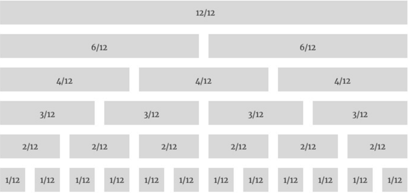
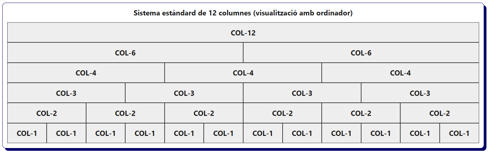
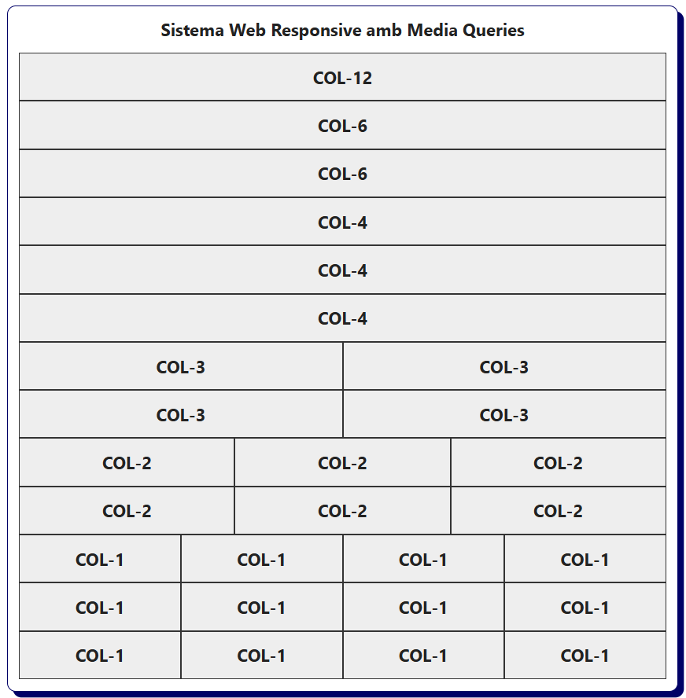

# Bloc 11. Web Responsive amb Media Queries

Una pàgina web responsive és aquella que, amb un únic document HTML, pot adaptar-se a diferents mides de pantalla (mòbil, tauleta, ordinador, etc.) fent ús exclusivament de CSS. Aquesta tècnica es denomina **media queries** i permet ajustar l'amplada i l'alçada dels elements HTML per adaptar-se a les mides del dispositiu on s'està visualitzant. 

Les media queries no només es centren en adaptar el disseny, sinó que també permeten modificar qualsevol propietat CSS (l'aspecte visual) i així oferir una millor experiència d’usuari depenent del context.


El disseny responsiu amb "media queries" es basa en:
- Mobile First: Es centra en fer el disseny del layout per dispositius mòbils i posteriorment per la resta de dispositius. 
- Mostrar o amagar el contingut (elements) en funció de la mida de la pantalla però mai eliminar-lo.
- Modificar les propietats d'amplada i/o alçada dels elements segons el dispositiu de visualització.
- Modificar altres propietats (mides de text, marges, imatges, etc.) segons el tipus dispositiu per millorar l'experiència d'ús.

> El model de **Media Queries** es pot combinar amb **Flexbox** per desenvolupar interfícies flexibles i adaptables, que ajusten el contingut a l'espai disponible i també a diferents mies de pantalla dels dispositius.

## El Sistema de Quadrícula (Grid System)

Per entendre el funcionament de les Media Queries cal conèixer abans el sistema de quadrícula. Aquest sistema és el més utilitzat en els frameworks moderns (com Bootstrap o Tailwind CSS) i és la base sobre la qual es construeixen els layouts responsive.

El sistema de quadrícula divideix l’amplada total del contenidor en parts iguals (normalment 12 columnes) que totes juntes representen el 100% de l'espai disponible (el 100% de la finestra del navegador). A partir d’aquí, es poden combinar columnes per ocupar l’espai necessari (per exemple, una columna que ocupa 6 espais tindrà una amplada del 50%). Això permet disposar els elements amb precisió i tenir un layout més coherent.



Segons el dispositiu que estigui consultant la pàgina web (que tindrà una mida de pantalla diferent), els elements es reorganitzaran gràcies a les Media Queries, ja que s'indicarà quantes columnes ocuparà un element en una pantalla de mòbil, de tablet, d'ordinador, etc.

** Per què l'estàndard és un sistema de 12 columnes o elements? **
Perquè 12 és un número que es pot dividir per 2, 3, 4 i 6 (això proporciona un layout molt simètric) i es poden generar els següents dissenys en cada fila d'elements:

- Fila amb 2 elements que ocupen 6 columnes (2x6) = 12
- Fila amb 3 elements que ocupen 4 columnes (3x4) = 12
- Fila amb 4 elements que ocupen 3 columnes (4x3) = 12
- Fila amb 6 elements que ocupen 2 columnes (6x2) = 12

## El Sistema estàndard de 12 columnes (grid system o quadrícula)

```css
* {
  padding: 0;
  margin: 0;
  box-sizing: border-box;
}

h2 {
  text-align: center;
  margin-bottom: 1rem;
}

/* Contenidor flexible que permet el salt de línia dels elements */
.row {
  display: flex;
  flex-wrap: wrap;
}

/* Els elements no creixen (grow=0), no es redueixen (shrink=0) i l'amplada és el width que tinguin */
[class^="col-"] {
  flex: 0 0 auto;
  /*Estils per la demostració */
  padding: 1rem;
  background: #eee;
  border: 1px solid #333;
  text-align: center;
  font-weight: bold;
  font-size: 1.5rem;
 }

/* Sistema de 12 columnes de la mateixa mida amb un màxim, col-12, que ocupa el 100% */
.col-1  { width: 8.33333333%; }
.col-2  { width: 16.66666667%; }
.col-3  { width: 25%; }
.col-4  { width: 33.33333333%; }
.col-5  { width: 41.66666667%; }
.col-6  { width: 50%; }
.col-7  { width: 58.33333333%; }
.col-8  { width: 66.66666667%; }
.col-9  { width: 75%; }
.col-10 { width: 83.33333333%; }
.col-11 { width: 91.66666667%; }
.col-12 { width: 100%; }
```

```html
<h2>Sistema estàndard de 12 columnes (visualització amb ordinador)</h2>
<div class="row">
  <div class="col-12">COL-12</div>
</div>
<div class="row">
  <div class="col-6">COL-6</div><div class="col-6">COL-6</div>
</div>
<div class="row">
  <div class="col-4">COL-4</div><div class="col-4">COL-4</div><div class="col-4">COL-4</div>
</div>
<div class="row">
  <div class="col-3">COL-3</div><div class="col-3">COL-3</div>
  <div class="col-3">COL-3</div><div class="col-3">COL-3</div>
</div>
<div class="row">
  <div class="col-2">COL-2</div><div class="col-2">COL-2</div><div class="col-2">COL-2</div>
  <div class="col-2">COL-2</div><div class="col-2">COL-2</div><div class="col-2">COL-2</div>
</div>
<div class="row">
  <div class="col-1">COL-1</div><div class="col-1">COL-1</div><div class="col-1">COL-1</div>
  <div class="col-1">COL-1</div><div class="col-1">COL-1</div><div class="col-1">COL-1</div>
  <div class="col-1">COL-1</div><div class="col-1">COL-1</div><div class="col-1">COL-1</div>
  <div class="col-1">COL-1</div><div class="col-1">COL-1</div><div class="col-1">COL-1</div>
</div>
```



## Sistema de Web Responsive amb Media Queries

```css
* {
  padding: 0;
  margin: 0;
  box-sizing: border-box;
}

h2 {
  text-align: center;
  margin-bottom: 1rem;
}

.row {
  display: flex;
  flex-wrap: wrap;
}

[class^="col-"] {
  flex: 0 0 auto;
  /*Estils per la demostració */
  padding: 1rem;
  background: #eee;
  border: 1px solid #333;
  text-align: center;
  font-weight: bold;
  font-size: 1.5rem;
 }

/* Mobile First (Tots els dispositius, principalment smartphones, amb l'amplada menor de 576px)  */
.col-1  { width: 8.333333%; }
.col-2  { width: 16.666667%; }
.col-3  { width: 25%; }
.col-4  { width: 33.333333%; }
.col-5  { width: 41.666667%; }
.col-6  { width: 50%; }
.col-7  { width: 58.333333%; }
.col-8  { width: 66.666667%; }
.col-9  { width: 75%; }
.col-10 { width: 83.333333%; }
.col-11 { width: 91.666667%; }
.col-12 { width: 100%; }

/* Small ≥576px (Dispositius petits, poden ser smartphones grans o tauletes en portrait majors de 576px i menors de 768px) */
@media (min-width: 576px) {
  .col-sm-1  { width: 8.333333%; }
  .col-sm-2  { width: 16.666667%; }
  .col-sm-3  { width: 25%; }
  .col-sm-4  { width: 33.333333%; }
  .col-sm-5  { width: 41.666667%; }
  .col-sm-6  { width: 50%; }
  .col-sm-7  { width: 58.333333%; }
  .col-sm-8  { width: 66.666667%; }
  .col-sm-9  { width: 75%; }
  .col-sm-10 { width: 83.333333%; }
  .col-sm-11 { width: 91.666667%; }
  .col-sm-12 { width: 100%; }
}

/* Medium ≥768px (Dispositius mitjans, poden ser tablets en landscape o netbooks majors de 768px i menors de 992px) */
@media (min-width: 768px) {
  .col-md-1  { width: 8.333333%; }
  .col-md-2  { width: 16.666667%; }
  .col-md-3  { width: 25%; }
  .col-md-4  { width: 33.333333%; }
  .col-md-5  { width: 41.666667%; }
  .col-md-6  { width: 50%; }
  .col-md-7  { width: 58.333333%; }
  .col-md-8  { width: 66.666667%; }
  .col-md-9  { width: 75%; }
  .col-md-10 { width: 83.333333%; }
  .col-md-11 { width: 91.666667%; }
  .col-md-12 { width: 100%; }
}

/* Large ≥992px (Dispositius grans, ordinadors portàtils o de sobretaula amb pantalles més grans de 992px i menors a 1200px) */
@media (min-width: 992px) {
  .col-lg-1  { width: 8.333333%; }
  .col-lg-2  { width: 16.666667%; }
  .col-lg-3  { width: 25%; }
  .col-lg-4  { width: 33.333333%; }
  .col-lg-5  { width: 41.666667%; }
  .col-lg-6  { width: 50%; }
  .col-lg-7  { width: 58.333333%; }
  .col-lg-8  { width: 66.666667%; }
  .col-lg-9  { width: 75%; }
  .col-lg-10 { width: 83.333333%; }
  .col-lg-11 { width: 91.666667%; }
  .col-lg-12 { width: 100%; }
}

/* Extra Large ≥1200px (Dispositius molt grans, ordinadors portàtils i de sobretaula amb pantalles més grans de 1200) */
@media (min-width: 1200px) {
  .col-xl-1  { width: 8.333333%; }
  .col-xl-2  { width: 16.666667%; }
  .col-xl-3  { width: 25%; }
  .col-xl-4  { width: 33.333333%; }
  .col-xl-5  { width: 41.666667%; }
  .col-xl-6  { width: 50%; }
  .col-xl-7  { width: 58.333333%; }
  .col-xl-8  { width: 66.666667%; }
  .col-xl-9  { width: 75%; }
  .col-xl-10 { width: 83.333333%; }
  .col-xl-11 { width: 91.666667%; }
  .col-xl-12 { width: 100%; }
}
```

```html
<h2>Sistema de Web Responsive amb Media Queries</h2>
<div class="row">
  <div class="col-12">COL-12</div>
</div>
<div class="row">
  <div class="col-12 col-lg-6 col-xl-6">COL-6</div>
  <div class="col-12 col-lg-6 col-xl-6">COL-6</div>
</div>
<div class="row">
  <div class="col-12 col-lg-4 col-xl-4">COL-4</div>
  <div class="col-12 col-lg-4 col-xl-4">COL-4</div>
  <div class="col-12 col-lg-4 col-xl-4">COL-4</div>
</div>
<div class="row">
  <div class="col-12 col-md-6 col-lg-3 col-xl-3">COL-3</div>
  <div class="col-12 col-md-6 col-lg-3 col-xl-3">COL-3</div>
  <div class="col-12 col-md-6 col-lg-3 col-xl-3">COL-3</div>
  <div class="col-12 col-md-6 col-lg-3 col-xl-3">COL-3</div>
</div>
<div class="row">
  <div class="col-12 col-sm-6 col-md-4 col-lg-2 col-xl-2">COL-2</div>
  <div class="col-12 col-sm-6 col-md-4 col-lg-2 col-xl-2">COL-2</div>
  <div class="col-12 col-sm-6 col-md-4 col-lg-2 col-xl-2">COL-2</div>
  <div class="col-12 col-sm-6 col-md-4 col-lg-2 col-xl-2">COL-2</div>
  <div class="col-12 col-sm-6 col-md-4 col-lg-2 col-xl-2">COL-2</div>
  <div class="col-12 col-sm-6 col-md-4 col-lg-2 col-xl-2">COL-2</div>
</div>
<div class="row">
  <div class="col-12 col-sm-6 col-md-3 col-lg-2 col-xl-1">COL-1</div>
  <div class="col-12 col-sm-6 col-md-3 col-lg-2 col-xl-1">COL-1</div>
  <div class="col-12 col-sm-6 col-md-3 col-lg-2 col-xl-1">COL-1</div>
  <div class="col-12 col-sm-6 col-md-3 col-lg-2 col-xl-1">COL-1</div>
  <div class="col-12 col-sm-6 col-md-3 col-lg-2 col-xl-1">COL-1</div>
  <div class="col-12 col-sm-6 col-md-3 col-lg-2 col-xl-1">COL-1</div>
  <div class="col-12 col-sm-6 col-md-3 col-lg-2 col-xl-1">COL-1</div>
  <div class="col-12 col-sm-6 col-md-3 col-lg-2 col-xl-1">COL-1</div>
  <div class="col-12 col-sm-6 col-md-3 col-lg-2 col-xl-1">COL-1</div>
  <div class="col-12 col-sm-6 col-md-3 col-lg-2 col-xl-1">COL-1</div>
  <div class="col-12 col-sm-6 col-md-3 col-lg-2 col-xl-1">COL-1</div>
  <div class="col-12 col-sm-6 col-md-3 col-lg-2 col-xl-1">COL-1</div>
</div>
```

