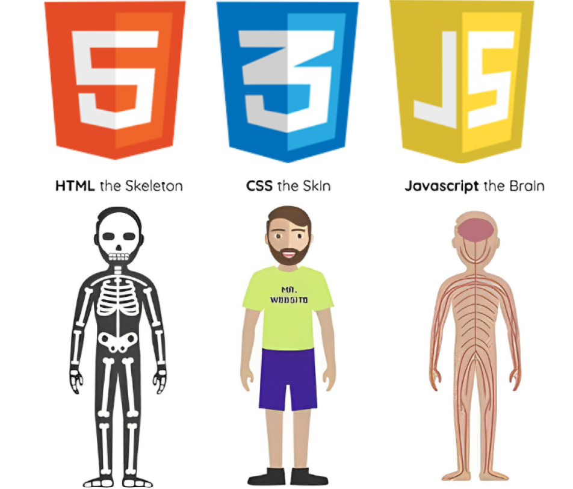
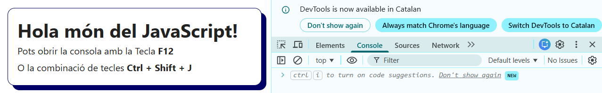
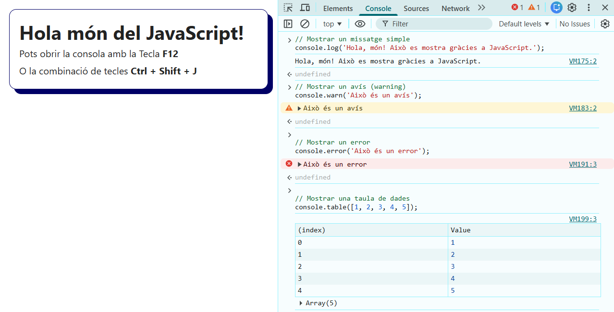
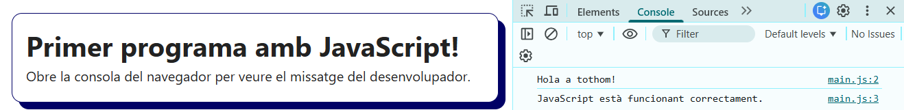

# Tema 01. Introducció a JavaScript

## L'origen de JavaScript

L'any **1995**, l'empresa **Netscape Communications** necessitava un llenguatge de programació que permetés fer les pàgines web **interactives** i **dinàmiques**. Les pàgines web eren **estàtiques**, només mostraven text i imatges sense cap capacitat de respondre a les interaccions de l'usuari.

L'enginyer **Brendan Eich** que treballava a Netscape, va crear en només **10 dies** un llenguatge de programació senzill que es podia executar **dins del navegador**. Inicialment es va anomenar **Mocha**, després **LiveScript**, i finalment va adoptar el nom de **JavaScript** per aprofitar la popularitat del llenguatge Java tot i que **no tenen res a veure**.

JavaScript va revolucionar la web perquè va permetre:

- **Validar la informació de formularis** abans d'enviar-los al servidor.
- **Modificar el contingut** de la pàgina web sense haver de recarregar-la.
- **Respondre a accions de l'úsuari**, com els clics del teclat, moviments del ratolí, etc.
- Crear **animacions** i efectes visuals abans que ho fes CSS de manera independent.
  - Això va permetre crear: Menús desplegables, Sliders, Jocs simples, Formularis dinàmics, etc.

Avui dia, JavaScript és un dels llenguatges de programació **més utilitzats del món** i és essencial per al desenvolupament web modern.

## Què és JavaScript?

**JavaScript** és un **llenguatge de programació** que s'executa principalment als **navegadors web**. Permet que les pàgines web **interaccionin amb els usuaris** i disposin d'un **comportament dinàmic**, complementant els llenguatges d'estructura i d'estils HTML i CSS.

Per diferencia els tres llenguatges web:

- **HTML**: Llenguatge que marques que defineix l'**estructura** i el contingut.
- **CSS**: Llenguatge d'estils que defineix l'**aspecte** i el disseny visual.
- **JavaScript** Llenguatge de programació que defineix el **comportament** i la **lògica** de la pàgina.



### Característiques principals de JavaScript

- **Llenguatge interpretat**: El navegador executa el codi JavaScript línia per línia, sense necessitat de compilar-lo prèviament.
- **Orientat a esdeveniments**: Pot donar resposta a accions de l'usuari com clics i moviments del ratolí, prèmer tecles del teclat, etc.
- **Manipulació del DOM**: Pot accedir i modificar l'estructura HTML i els estils CSS de forma dinàmica (a temps real).
- **Asíncron**: Pot executar tasques sense bloquejar la càrrega de la pàgina (sol·licitar dades a un servidor i actualitzar una part de la pàgina).
- **Multiplataforma**: Funciona en qualsevol navegador modern (Chrome, Firefox, Safari, etc.).

## Com enllaçar JavaScript amb HTML

Per incloure codi JavaScript a una pàgina web, fem servir l'etiqueta `<script>`. Hi ha diverses maneres de fer-ho:

### 1. JavaScript extern amb `type="module"` (format modern i recomanat)

Per incloure codi JavaScript dins l'HTML, es recomana crear un **fitxer extern** amb extensió `.js` i enllaçar-lo des de l'HTML al `<head>`.

Hi ha diverses opcions, la forma **més moderna**, ordenada i recomanada és indicar que sigui de tipus "module". El **mòduls** de JavaScript permeten organitzar el codi en fitxers independents i importar/exportar funcionalitats entre ells.

```html
<!DOCTYPE html>
<html lang="ca">
  <head>
    <meta charset="UTF-8" />
    <title>Pàgina amb mòduls JS</title>
    <!-- JavaScript com a mòdul -->
    <script type="module" src="./main.js"></script>
  </head>
  <body>
    <h1>Hola món!</h1>
  </body>
</html>
```

**Avantatges**:

- Garanteix que el codi JS s'executi després de carregar l'HTML i manté el fitxers agrupats al `<head>` juntament amb els fitxers de CSS.
- Els mòduls es descarreguen en paral·lel i s'executen després que el DOM estigui carregat, sense bloquejar la lectura del codi HTML.
- Permeten utilitzar `import` i `export` per modularitzar el codi (així es pot dividir el codi en mòduls reutilizables).
- Cada mòdul disposa del seu propi àmbit, evitant la "contaminació" de l'àmbit global.
- Facilita l'organització, manteniment i escalabilitat dels projectes i el seu rendiment.

## La consola del navegador

La **consola del navegador** és una eina fonamental per **depurar** (trobar errors i mostrar missatges temporals) i **fer proves** de codi JavaScript. Tots els navegadors moderns inclouen una consola accessible des de les **eines de desenvolupador**.

### Com obrir la consola

- **Windows/Linux**: Tecla `F12` o combinació de `Ctrl + Shift + J` (Chrome/Edge) o `Ctrl + Shift + K` (Firefox)
- **Des del menú**: Botó dret → "Inspeccionar" → pestanya "Consola"



### Mostrar informació a la consola amb `console.log()`

La funció més bàsica i utilitzada a JavaScript és `console.log()`. Permet **mostrar informació** a la consola, i s'utilitza principalment per depurar el codi i comprovar valors durant l'execució d'un programa web.

```javascript
// Mostrar un missatge simple
console.log('Hola, món! Això es mostra gràcies a JavaScript.');

// Mostrar un avís (warning)
console.warn('Això és un avís');

// Mostrar un error
console.error('Això és un error');

// Mostrar una taula de dades
console.table([1, 2, 3, 4, 5]);

// Netejar la consola
console.clear();
```



## Exemple pràctic HTML i JavaScript

Amb el següent exemple crearem el nostre primer programa amb JavaScript que mostrarà un missatge per la consola del navegador.

### 1. Crear el document HTML

Fitxer: `index.html`

```html
<!DOCTYPE html>
<html lang="ca">
  <head>
    <meta charset="UTF-8" />
    <meta name="viewport" content="width=device-width, initial-scale=1" />
    <title>El meu primer programa amb JavaScript</title>
    <script type="module" src="./main.js"></script>
  </head>
  <body>
    <h1>Primer programa amb JavaScript!</h1>
    <p>Obre la consola del navegador per veure el missatge del desenvolupador.</p>
  </body>
</html>
```

### 2. Crear el fitxer JavaScript

Fitxer: `main.js`

```javascript
// El meu primer programa en JavaScript
console.log('Hola a tothom!');
console.log('JavaScript està funcionant correctament.');
```

### 3. Obrir el fitxer i veure els resultats

1. Obre amb el **`LIVE SERVER`** el fitxer `index.html`
2. Obre la consola (`F12` o `Ctrl + Shift + J`)
3. Veuràs els missatges que hem escrit amb `console.log()`


