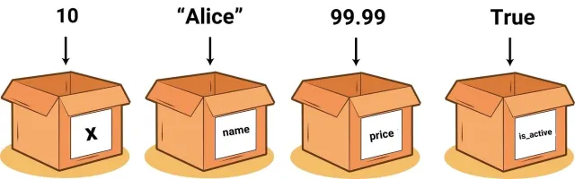

# 01. Variables i Constants

## Què són les variables?

Una **variable** és com una **caixa** on podem guardar informació que necessitem utilitzar al nostre programa. Aquesta informació pot ser un número, un text, un valor de cert/fals, etc.

Imagina que estàs creant un joc: necessites guardar la vida del jugador, la seva puntuació, el nivell actual, el nom del personatge, etc. Tota aquesta informació es guarda en **variables**.



### Exemples de variables amb JavaScript

```javascript
let vidaJugador = 100;
let puntuacio = 0;
let nomPersonatge = 'Link';
let estaViu = true;
let nivell = 1;
```

Cada variable disposa:

- **Un nom** (vidaJugador, puntuacio, nomPersonatge...)
- **Un valor** (100, 0, "Link"...)
- **Un tipus de dada** (número, text, booleà...)

## Per què necessitem variables?

Les variables ens permeten:

✅ **Emmagatzemar informació** per utilitzar-la més endavant  
✅ **Modificar valors** durant l'execució del programa  
✅ **Fer càlculs** amb la informació guardada  
✅ **Reutilitzar la informació** en diferents parts del codi

## Com crear variables: `let`

Per crear una variable utilitzem la paraula reservada **`let`** seguida del nom que volem donar-li:

```javascript
let vidaJugador = 100;
let nomPersonatge = 'Mario';
let municio = 30;
```

### Regles per nomenar variables

**Poden contenir**: lletres, números, guions baixos (_) i el símbol del dòlar ($)  
**Han de començar**: per una lletra, guió baix (_) o dòlar ($)  
**NO poden**: començar per un número  
**NO poden**: contenir espais  
**NO poden**: ser paraules reservades de JavaScript (let, if, for, etc.)

```javascript
// CORRECTE
let vidaJugador = 100;
let puntuacio_total = 0;
let nivel1Completat = false;
let _vidaTemporal = 50
let $preu = 29.99;

// INCORRECTE
let 1nivel = 1;           // No pot començar per número
let vida jugador = 100;   // No pot tenir espais
let let = 5;              // 'let' és paraula reservada
```

### Convencions de nomenclatura (camelCase)

En JavaScript s'utilitza la convenció **camelCase**: la primera paraula en minúscula i les següents amb la primera lletra en majúscula.

```javascript
let vidaJugador = 100; // camelCase
let puntuacioMaxima = 9999; // camelCase
let nomCompletPersonatge = 'Zelda'; // camelCase

let VidaJugador = 100; // PascalCase (per a classes)
let vida_jugador = 100; // snake_case (altres llenguatges com Python)
```

## Modificar el valor d'una variable

Un cop hem creat una variable amb `let`, podem canviar el seu valor tantes vegades com sigui necessari:

```javascript
let vida = 100;
console.log(`Vida inicial: ${vida}`); // 100

vida = 75; // El jugador rep dany
console.log(`Després del dany: ${vida}`); // 75

vida = 95; // El jugador es cura
console.log(`Després de curar-se: ${vida}`); // 95
```

**Important:** Quan modifiquem una variable, **NO utilitzem `let`**, només el nom de la variable.

```javascript
let puntuacio = 0;
puntuacio = 10; // CORRECTE
let puntuacio = 20; // ERROR: ja existeix
```

## Constants: `const`

Una **constant** és com una variable però amb una diferència important: **el seu valor NO es pot modificar** després de ser assignat.

```javascript
const VIDES_MAXIMES = 3;
const NOM_JOC = 'Super Adventure';
const VELOCITAT_MAXIMA = 10;
console.log(`Constant VIDES_MAXIMES: ${VIDES_MAXIMES}`);
console.log('Intentant modificar el valor de VIDES_MAXIMES...');
VIDES_MAXIMES = 4; //ERROR (no és pot modificar el valor d'una constant)
```

### Quan utilitzar constants?

Utilitza `const` quan el valor **NO hauria de canviar** durant l'execució del programa:

```javascript
const MAX_PUNTS_NIVELL = 100; // Sempre seran 100 punts
const DANY_ESPASA = 25; // L'espasa sempre fa 25 de dany
const MAX_JUGADORS = 4; // Màxim 4 jugadors
const PI = 3.14159; // El valor de PI no canvia
```

### Intentar modificar una constant (ERROR)

```javascript
const VIDES_MAXIMES = 3;
VIDES_MAXIMES = 5; // ERROR: No es pot reassignar una constant
```

### Convenció de nomenclatura per constants

Per convencions, les constants que representen **valors fixos** s'escriuen en **MAJÚSCULES** amb guions baixos:

```javascript
const PUNTS_PER_ENEMIC = 50;
const VELOCITAT_ENEMIC = 5;
const NOM_CONSOLA = 'Nintendo';
```
