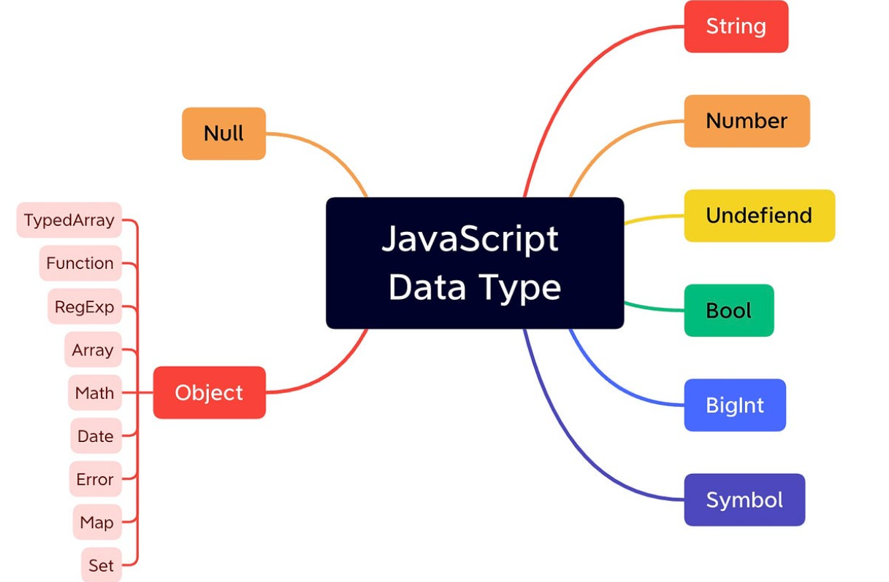

# 02. Tipus de Dades

## Què són els tipus de dades?

Quan guardem informació en una variable, aquesta informació pot ser de diferents **tipus**. No és el mateix guardar un número (100) que guardar un text ("Hola") o un valor de veritat (true/false).

JavaScript li proporciona una **etiqueta de tipus** per saber quin tipus de dada està guardada en una variable i així poder treballar correctament amb ella (fer operacions matemàtiques, comparar valors numèrics, comparar valors de text, etc.).

JavaScript és dinàmic, determina automàticament el tipus de dada en funció del valor assignat a les constants o variables. Aquests poden ser:

- Tipus de dades Primitius: String, Number, Boolean, Null, Undefined
- Tipus de dades Compostes: Arrays, Functions, Dates, etc.



## Els 5 tipus de dades bàsics (primitius)

### 1. Number (Números)

Serveix per emmagatzemar **números**, poden ser números enters o decimals.

```javascript
let vida = 100; // Enter positiu
let temperatura = -15; // Enter negatiu
let velocitat = 3.5; // Decimal
let puntuacio = 1500; // Enter gran
let dany = 0; // Zero
```

### 2. String (Cadenes de text)

Serveix per emmagatzemar **text**. Es pot escriure entre cometes simples `'...'`, dobles `"..."` o backticks `` `...` ``.

```javascript
let nom = 'Link';
let missatge = 'Has guanyat!';
let msgGameOver = 'GAME OVER';
let descripcio = `Un joc d'aventures`;
```

**Operació bàsica - Unir o Concatenar strings (adjuntar textos):**

```javascript
let nom = 'Link';
// Amb template literals i backticks
let missatge = `Benvingut, ${nom}!`;
console.log(missatge); // "Benvingut, Link!"
```

### 3. Boolean (Booleà)

Serveix per emmagatzemar valors de **cert/fals**: Només pot tenir els valors `true` (cert) o `false` (fals).

Són molt importants per prendre decisions segons l'estat (cert o fals) d'una variable.

```javascript
let estaViu = true;
let estaAtacant = false;
let jocAcabat = false;
let portaOberta = true;
let nivellCompletat = false;
```

### 4. Undefined (Indefinit)

Una variable té valor `undefined` quan **s'ha declarat però NO se li ha assignat cap valor**.

Si feu errades de programació, molts cops podeu trobar valors "undefined".

```javascript
let puntuacio;
console.log(puntuacio); // undefined

// Després li assignem un valor
puntuacio = 0;
console.log(puntuacio); // 0
```

### 5. Null (Nul)

`null` representa **l'absència intencionada de valor**. L'utilitzem quan volem indicar explícitament que una variable no té cap valor.

```javascript
let objecteEquipat = null; // El jugador no té res equipat
let enemicoObjetiu = null; // No hi ha cap enemic seleccionat
```

**Diferència entre `undefined` i `null`:**

- `undefined`: El valor **encara no s'ha establert**
- `null`: El valor s'ha establert **intencionadament com a "res"**

## Comprovar el tipus d'una dada: `typeof`

L'operador `typeof` ens diu quin tipus de dada és un valor:

```javascript
console.log(typeof 100); // "number"
console.log(typeof 'Hola'); // "string"
console.log(typeof true); // "boolean"
console.log(typeof undefined); // "undefined"
console.log(typeof null); // "object" (error històric de JS)
```
