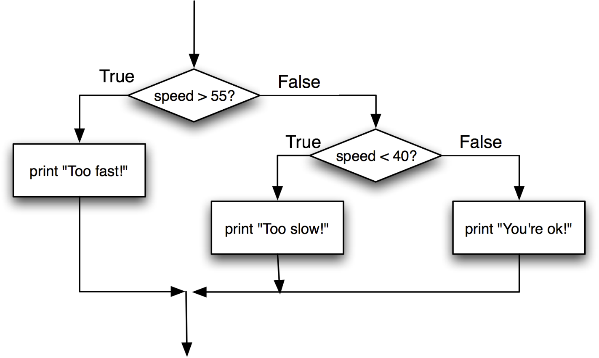

# 04. Estructures Condicionals

## Què són les estructures de control condicional?

Les **estructures condicionals** permeten al nostre programa prendre decisions de quin bloc de codi executar en funció del resultat d'operacions aritmètiques, relacionals i lògiques (segons si es compleixen o no certes condicions).

Veieu l'ús d'estructures condicionals en el següent exemple de desenvolupament d'un videojoc:

- **Si** la vida arriba a 0 → Game Over
- **Si** reculls 100 monedes → Vida extra

---

- **Si** arribes a la porta i tens una clau → La porta s'obra
- **Sinó** → La porta es manté tancada

Sense condicionals, els nostres programes sempre farien exactament el mateix. Amb condicionals, poden **"reaccionar"** a diferents esdeveniments o situacions.

