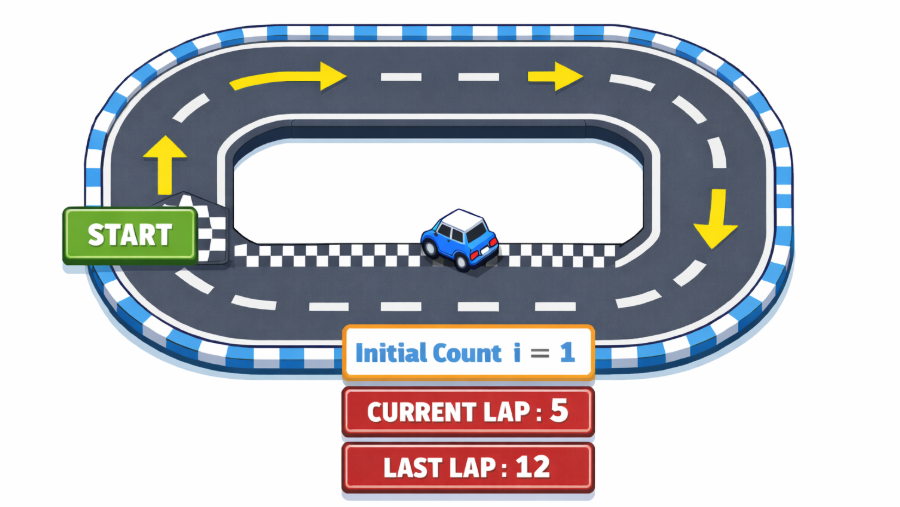

# 05. Estructures Iteratives (Bucles)

## Què són les estructures de control iteratiu (bucles)?

Els **bucles** o **loops** són estructures que permeten **repetir** l'execució d'un bloc de codi fins que es compleixi una condició o es realitzi un número determinat d'iteracions. Això ens permet executar un bloc de codi múltiples vegades sense haver d'escriure el mateix codi una i altra vegada.

Imaginem els següents casos en el desenvolupament de videojocs:

- Generar 100 enemics a la pantalla.
- Moure un projectil fins que surti de la pantalla.
- Recórrer tots els objectes de l'inventari per comprovar si disposa d'una clau.
- Comprovar si un projectil ha col·lisionat amb algun dels 100 enemics actius.
- Actualitzar la posició de tots els NPC que apareixen a la pantalla.
- Aplicar un dany concret a X enemics dins del rang d'una explosió (tipus d'atac).

Sense bucles, hauries d'escriure el mateix codi 10, 20 o 100 vegades! Amb bucles, ho pots fer amb **poques línies de codi**.



## Bucles niuats (nested loops)

Per crear graelles, taules o mapes de jocs és molt habitual utilitzar bucles per generar cada posició. Per crear elements bidimensionals o multidimensionals podem incloure **bucles dins d'altres bucles**.

### Exemple: Graella de joc (mapa)

```javascript
const FILES = 3;
const COLUMNES = 4;

console.log('Generant mapa del joc:');

for (let fila = 0; fila < FILES; fila++) {
  let caselles = '';

  for (let col = 0; col < COLUMNES; col++) {
    caselles += '[X] ';
  }

  console.log(caselles);
}

// Sortida per la consola:
// [X] [X] [X] [X]
// [X] [X] [X] [X]
// [X] [X] [X] [X]
```

### Exemple: Comprovar combats entre jugadors

```javascript
const jugadors = ['Pep', 'Pepet', 'Pepito'];
const enemics = ['Enemic1', 'Enemic2', 'Enemic3', 'Enemic4'];

console.log('Cada jugador atacarà a tots els enemics en el seu torn');

for (let i = 0; i < jugadors.length; i++) {
  for (let j = 0; j < enemics.length; j++) {
    console.log(`Combat: ${jugadors[i]} vs ${enemics[j]}`);
  }
}
```
