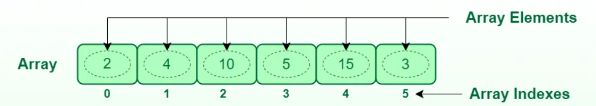

# 06. Vectors i Cadenes (Arrays i Strings - Estructures de Dades)

## Què són les estructures de dades?

Les **estructures de dades** són eines que ens permeten **organitzar i emmagatzemar múltiples elements o valors** en una única variable. Gràcies a aquesta tècnica, en lloc de disposar de 100 variables individuals, podem tenir una "caixa amb 100 compartiments", és a dir, **una variable que contingui els 100 valors**.

En l'àmbit dels videojocs necessitem:

- **Vectors (Arrays)**: Múltiples objectes a l'inventari, diversos enemics a la pantalla, llista d'efectes de so del joc, etc.
- **Cadenes (Strings)**: Cadenes de caràcters com: noms de personatges, diàlegs, missatges del joc, etc.

