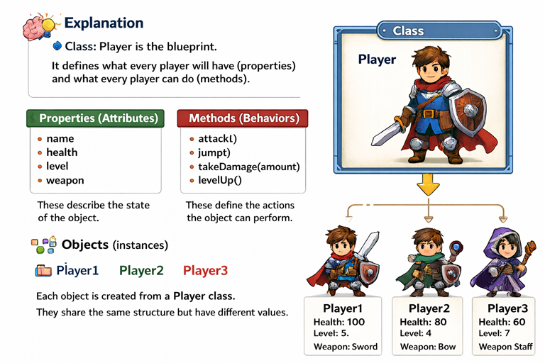

# 08. Introducció a la Programació Orientada a Objectes (POO)

## Què és la POO?

La **Programació Orientada a Objectes** és un paradigma de programació que
organitza el codi en **objectes** que representen entitats del món real. Cada objecte disposa d'unes **propietats** (característiques) i d'uns **mètodes** (funcions) que defineixen la seva aparença i el seu comportament.



## Fonaments de la POO

### L'Abstracció:

És la capacitat de representar una entitat del món real en una forma simplificada dins del codi. Això s'aconsegueix definint classes que modelen característiques (propietats) i comportaments (mètodes) dels objectes i amagant els detalls innecessaris o complexos.

**Una Classe:**
És una plantilla que permet crear objectes. Defineix l'estructura de l'objecte a partir de definir unes característiques i comportaments.

**Un Objecte:**
És una instància d'una classe (element creat a partir d'una classe). Representa una entitat del món real i disposa d'unes característiques (propietats) i uns comportaments (mètodes) associats. Cada objecte pot tenir valors de propietats diferents però comparteixen els mateixos mètodes definits a la classe.

### L'Encapsulat:

És el mecanisme per amagar els detalls interns d'un objecte (propietats i mètodes), exposant únicament una interfície per poder interactuar-hi. Mitjançant mètodes i propietats privades es controla l'accés a les propietats i mètodes d'un objecte. L'encapsulat garanteix la integritat de les dades i permet ocultar la seva implementació (el codi) del seu ús extern.

### L'Herència:

Permet definir noves classes a partir de classes ja existents (superclasse). Les noves classes (subclasses) hereten les propietats i mètodes de la classe pare. També poden afegir noves funcionalitats o modificar el comportament heretat. L'herència es útil per la reutilització de codi i establir una jerarquia de classes.

### El Polimorfisme:

És la capacitat que disposa un objecte per respondre o comportar-se de manera diferent a una mateixa acció o mètode (en funció del context). Això permet a un mètode amb el mateix nom realitzar diferents tasques en funció de la classe que l'implementi. Aquest procés s'implementa mitjançant l'herència i la possibilitat de sobreescriure mètodes a les subclasses.

## Classes i Objectes

**Analogia del món real:**

- **Classe**: Plànol d'una casa
- **Objecte**: Casa construïda segons el plànol

**En videojocs:**

- **Classe `Personatge`**: Defineix què és un personatge
- **Objecte `jugador`**: Un personatge específic (Link, Mario...)

## Declaració de Classes

**Mètode constructor**: És un mètode especial que s'executa automàticament al crear un objecte. Serveix per inicialitzar de les propietats de l'objecte.

**La paraula this**: Dins d'una classe, "this" s'utilitza per accedir a les propietats i mètodes de l'objecte i no a variables i funcions externes.

**Propietats**: Variables que representen les característiques o l'estat d'un objecte. Poden ser tipus de dades com números, booleans, cadenes, arrays, altres objectes, etc.

**Mètodes**: Funcions que defineixen el comportament d'un objecte. Poden rebre paràmetres d'entrada, retornar resultats i manipular les propietats de l'objecte.

### Declaració de la Classe Personatge

```javascript
class Personatge {
  constructor(nom, vida, atac, posicio) {
    this.nom = nom;
    this.vida = vida;
    this.atac = atac;
    this.posicio = posicio;
    this.punts = 0;
  }

  atacar() {
    console.log(`Atac: ${this.atac} de dany!`);
  }

  moure() {
    this.posicio += 10;
    console.log(`Posició: ${this.posicio}`);
  }
}
```

### Instanciació i Gestió d'Objectes

```javascript
// Crear objectes
const jugador1 = new Personatge('Link', 100, 35, 10);
const jugador2 = new Personatge('Zelda', 80, 20, 50);

jugador1.atacar(); // Atac: 35 de dany!
jugador2.atacar(); // Atac: 20 de dany!

jugador1.moure(); // Posició: 20
jugador2.moure(); // Posició: 60
```
