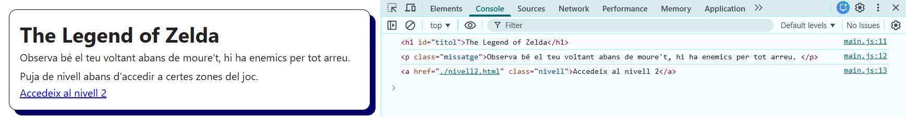
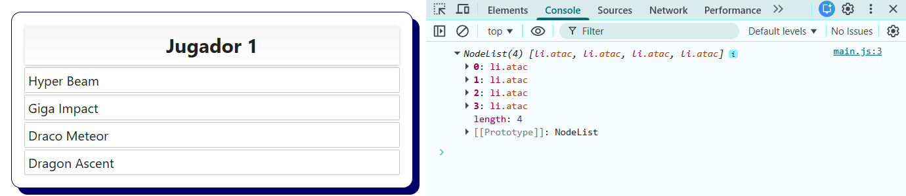
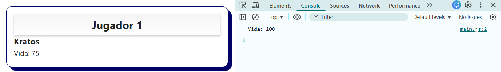
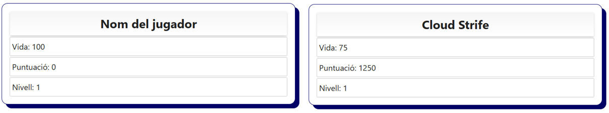
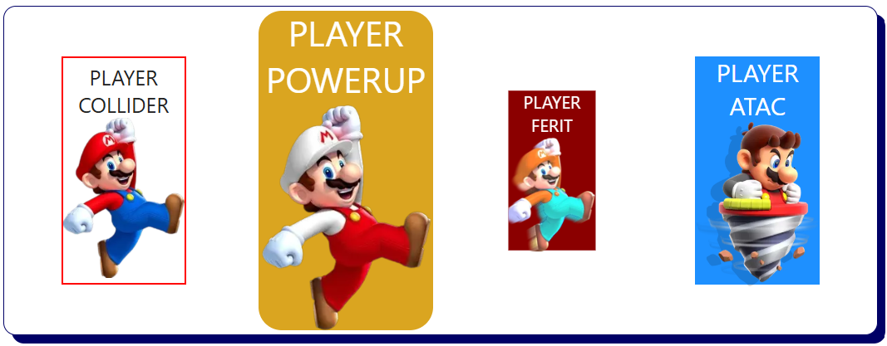
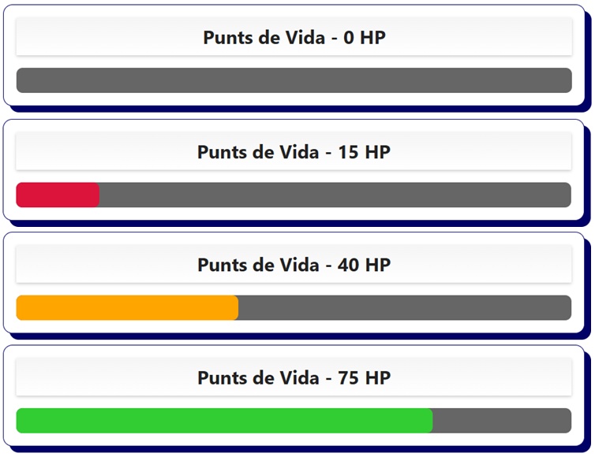
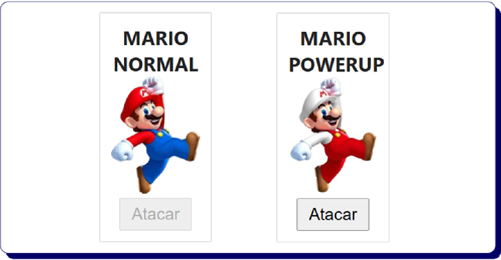
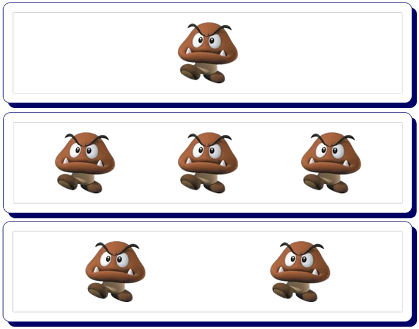

# 03. Manipulació del DOM (Document Object Model)

El **DOM (Document Object Model)** és la representació en forma d'**arbre d'elements** nodes que fa el navegador d'una pàgina pàgina HTML. Cada etiqueta HTML es converteix en un node d'aquest arbre, i és el propi navegador el que proporciona eines per poder interactuar amb els elements HTML a través de JavaScript.

Amb JS podem modificar el contingut de text, l'estructura HTML i els estils CSS dels diferents elements de manera dinàmica (sense haver de recarregar la pàgina). També permet donar resposta als esdeveniments generats per l'usuari (clics i moviments del ratolí, entrades de teclat, etc.).

## Manipulació dinàmica del DOM

Al carregar la pàgina web es genera l'element o objecte `DOCUMENT` que emmagatzema tot el contingut HTML de la pàgina web. Amb Javascript podem accedir als seus mètodes i propietats per interactuar amb els elements de la pàgina.

Sobre els elements HTML es poden realitzar les següents accions:

- Seleccionar elements
- Modificar el elements existents:
  - El contingut (pot ser text o altres elements HTML)
  - Els estils CSS
  - Els atributs i les classes
- Afegir elements nous
- Eliminar elements existents


## Estructura HTML i DOM

Quan el navegador interpreta el següent HTML:

```html
<div id="jugador-stats">
  <h2>Xavi</h2>
  <p class="nivell">Nivell: 17</p>
  <p class="vida">Vida: 100</p>
</div>
```

Crea la següent estructura DOM (arbre):

```
div#jugador-stats
├── h2 (text: "Nom del Jugador")
├── p.nivell (text: "Nivell: 17")
└── p.vida (text: "Vida: 100")
```

Amb JavaScript podem accedir i modificar qualsevol part d'aquest arbre (etiquetes, contingut, classes, ids, etc.).

## 1. Seleccionar elements del DOM

Abans de modificar un element, primer l'hem de **seleccionar** (identificar-lo dins l'arbre).

Actualment hi ha dues maneres de selecionar elements del DOM.

### 1.1 `document.querySelector()`

Seleccionar un únic element HTML que coincideix amb un selector CSS especificat (si hi ha diversos iguals escull el primer)

```html
<h1 id="titol">The Legend of Zelda</h1>
<p class="missatge">Observa bé el teu voltant abans de moure't, hi ha enemics per tot arreu.</p>
<p class="missatge">Puja de nivell abans d'accedir a certes zones del joc.</p>
<a href="./nivell2.html" class="nivell">Accedeix al nivell 2</a>
```

```javascript
// Selecciona el primer element amb el id "titol"
const titol = document.querySelector('#titol');

// Selecciona el primer element amb classe "missatge"
const primerMissatge = document.querySelector('.missatge');

// També es poden seleccionar etiquetes, etc.
const primerAnchor = document.querySelector('a');

// Mostrem per consola els diferents elements seleccionats
console.log(titol);
console.log(primerMissatge);
console.log(primerAnchor);
```



### 1.2 `document.querySelectorAll()`

Selecciona **TOTS** els elements HTML que coincideixen amb un selector CSS especificat i els agrupa en una única **llista o vector** que ens permetrà una gestió individual i més eficient de cada element.

```html
<ul id="jugador1">
  <li class="atac">Hyper Beam</li>
  <li class="atac">Giga Impact</li>
  <li class="atac">Draco Meteor</li>
  <li class="atac">Dragon Ascent</li>
</ul>
```

```javascript
// Selecciona tots els elements de la classe ".atac" del id "#jugador"
const atacsJugador1 = document.querySelectorAll('#jugador1 .atac');
console.log(atacsJugador1);
```



## 2. Modificar contingut d'elements del DOM

### 2.1 `textContent` - Modificar només el text

```html
<h2>Jugador 1</h2>
<div id="jugador1">
  <h3 id="nom">Kratos</h3>
  <p id="vida">Vida: 100</p>
</div>
```

```javascript
// Inicialment la Vida = 100 però es modifica el valor i es mostra vida = 75.
const vida = document.querySelector('#jugador1 #vida');
console.log(vida.textContent);
vida.textContent = 'Vida: 75';

// Exercici: Modifica el nom de Kratos per el d'un altre personatge
```



### 2.2 `innerHTML` - Modificar tot l'HTML (text i etiquetes)

```html
<div id="inventari">
  <p>Inventari buit</p>
</div>
```

```javascript
// Inicialment el DIV inventari es buit i després s'afegeix l'HTML.
const inventari = document.querySelector('#inventari');
console.log(inventari.innerHTML);
inventari.innerHTML = `
  <ul>
    <li>Poció de vida</li>
    <li>Clau daurada</li>
    <li>Espasa de foc</li>
  </ul>
`;
console.log(inventari.innerHTML);

// Exercici: modifica la llista anterior per afegir un element nou a l'inventari
```


**Ves amb Compte:** `innerHTML` pot ser perillós si inserim al DOM directament informació rebuda de l'input d'un usuari. (Ens exposem a rebre atacs de XSS). Per a inserir text simple sempre utilitza `textContent`.

### `Template Literals` - Actualitzar stats del jugador

```html
<div id="stats-jugador">
  <h2 id="nom">Nom del jugador</h2>
  <p id="vida">Vida: 100</p>
  <p id="puntuacio">Puntuació: 0</p>
  <p id="nivell">Nivell: 1</p>
</div>
```

```javascript
// Actualitzar nom
const nomJugador = document.querySelector('#nom');
nomJugador.textContent = 'Cloud Strife';

// Actualitzar vida
const vidaJugador = document.querySelector('#vida');
let vidaActual = 75;
vidaJugador.textContent = `Vida: ${vidaActual}`;

// Actualitzar puntuació
const puntuacioJugador = document.querySelector('#puntuacio');
let punts = 1250;
puntuacioJugador.textContent = `Puntuació: ${punts}`;

// Actualitzar nivell
const nivellJugador = document.querySelector('#nivell');
let nivell = 5;
nivellJugador.textContent = `Nivell: ${nivell}`;

//Exercici: Modifica els valors de les variables i verifica que canvia l'HTML
```



## 3. Modificar estils CSS d'elements del DOM

Per realitzar canvis simples o puntuals d'estils directament des de JavaScript i que no disposen d'una referència al fitxer de CSS podem fer servir les següents propietats:

### 3.1 Propietat `style` amb `setProperty` i `removeProperty`

```html
<div class="jugador">
  <p>PLAYER COLLIDER</p>
  
</div>
<div class="jugador power">
  <p>PLAYER POWERUP</p>
  
</div>
<div class="jugador dany">
  <p>PLAYER FERIT</p>
  
</div>
<div class="jugador atac">
  <p>PLAYER ATAC</p>
  
</div>
```

```css
* {
  margin: 0;
  padding: 0;
}

section {
  margin-top: 1rem;
  display: flex;
  justify-content: space-around;
}

.jugador {
  margin: 2rem 0;
  width: 120px;
  height: 220px;
  display: flex;
  align-items: center;
  justify-content: center;
  flex-direction: column;
  text-align: center;
  font-size: 1.25rem;
}

.jugador img {
  width: 100%;
}
```

```javascript
// Selecciona el primer mario i canviar la vora
const jugador = document.querySelector('.jugador');
jugador.style.setProperty('border', 'solid 2px red');

// Selecciona el segon mario, canviar color de fons, la mida i color de lletra, arrodonir les vores i redimensionar l'element
const jugadorPower = document.querySelector('.jugador.power');
jugadorPower.style.setProperty('background-color', 'goldenrod');
jugadorPower.style.setProperty('color', 'white');
jugadorPower.style.setProperty('font-size', '1.5rem');
jugadorPower.style.setProperty('transform', 'scale(1.4)');
jugadorPower.style.setProperty('border-radius', '1rem');

// Exercici: Selecciona el tercer mario, canviar color de fons, vores, opacitat, mida i color de lletra i redimensionar l'element

// Exercici: Selecciona el quart mario, canviar color de fons, vores, color de lletra i mida de lletra
```



## 4. Modificar classes CSS d'elements del DOM

Tot i que podem afegir o eliminar estils CSS amb style.setProperty o style.removeProperty. L'opció recomanada és utilitzar **classes CSS** predefinides i afegir-les o treure-les mitjançant JavaScript.

### 4.1 `classList.add()` i `classList.remove()` - Afegir i eliminar classes

```html
<div id="jugador">
  <h2 id="punts-vida">Punts de Vida - 0 HP</h2>
  <div class="barra">
    <div class="vida"></div>
  </div>
</div>
```

```css
#jugador {
  width: 100%;
}

.barra {
  margin-top: 1rem;
  width: 100%;
  height: 2rem;
  background-color: #666;
  border-radius: 0.5rem;
}

.vida {
  height: 100%;
  width: 0%;
  border-radius: 0.5rem;
}

.normal {
  background-color: limegreen;
}

.alerta {
  background-color: orange;
}

.critic {
  background-color: crimson;
}
```

```javascript
// Seleccionar l'element de Punts de Vida i la Barra de Vida
const puntsVida = document.querySelector('#punts-vida');
const barraVida = document.querySelector('.vida');

// Assigna un valor de 0-100 als punts de vida
let hp = 0;

// Eliminar les possibles classes assignades previament
barraVida.classList.remove('normal', 'alerta', 'critic');

// Descomenta la línia de codi segons el % de vida.

//barraVida.classList.add('normal'); //Modifica hp per un valor entre 50-100

//barraVida.classList.add('alerta'); //Modifica hp per un valor entre 21-49

//barraVida.classList.add('critic'); //Modifica hp per un valor entre 0-20

// Modificar el contingut de text dels Punts de Vida i el CSS (%) de la barra de vida
puntsVida.textContent = `Punts de Vida - ${hp} HP`;
barraVida.style.setProperty('width', `${hp}%`);
```



## 5. Modificar atributs d'elements del DOM

Els atributs dels elements HTML com (src, href, alt, title, etc.) es poden modificar amb JavaScript.

### 5.1 `setAttribute()` i `removeAttribute()` - Afegir i eliminar atributs

```html
<div class="jugador">
  <h3>MARIO NORMAL</h3>
  
  <button id="atacar" disabled>Atacar</button>
</div>
```

```css
.jugador {
  padding: 1rem;
  width: 160px;
  text-align: center;
  box-shadow: 0 0 1px black;
  font-size: 1.5rem;
}

.jugador img {
  width: 100%;
}

button {
  padding: 0.5rem 1rem;
  font-size: 1.5rem;
}
```

```javascript
// Seleccionar el l'element H3 i modificar el contingut de text
const jugadorNom = document.querySelector('.jugador h3');
jugadorNom.textContent = 'MARIO POWERUP';

// Seleccionar l'element IMG i modificar l'atribut SRC.
const jugadorImg = document.querySelector('.jugador img');
jugadorImg.setAttribute('src', './img/mario-power.webp');

// Seleccionar l'element BUTTON i eliminar l'atribut DISABLED.
const jugadorAtac = document.querySelector('.jugador button');
jugadorAtac.removeAttribute('disabled');
```



## 6. Crear nous elements, afegir-los al DOM i eliminar-los

Podem crear elements HTML des de JavaScript i afegir-los a la pàgina. També podem eliminar elements ja existents.

### 6.1 `createElement()`, `elementPare.append()` i `element.remove()`;

```html
<div id="pantalla">
  <div class="enemic"></div>
</div>
```

```css
#pantalla {
  width: 50%;
  padding: 1rem;
  box-shadow: 0 0 1px black;
  display: flex;
  justify-content: space-around;
}

.enemic {
  width: 100px;
  height: 100px;
  background-image: url('./../img/enemic-mario.webp');
  background-repeat: no-repeat;
  background-size: contain;
  box-shadow: 0 0 3px red;
}
```

```javascript
// Seleccionem la pantalla (element pare) on afegirem el nou element que crearem
const pantalla = document.querySelector('#pantalla');

// Crear un Segon enemic amb JS
// Crear un nou element HTML, aplica estils CSS i afegir-lo al DOM
const enemic2 = document.createElement('div');
enemic2.classList.add('enemic');
pantalla.append(enemic2);

// Crear un Tercer enemic amb JS
// Crear un nou element HTML, aplica estils CSS i afegir-lo al DOM
const enemic3 = document.createElement('div');
enemic3.classList.add('enemic');
pantalla.append(enemic3);

//Eliminar el Primer enemic amb JS
enemic2.remove();
```


