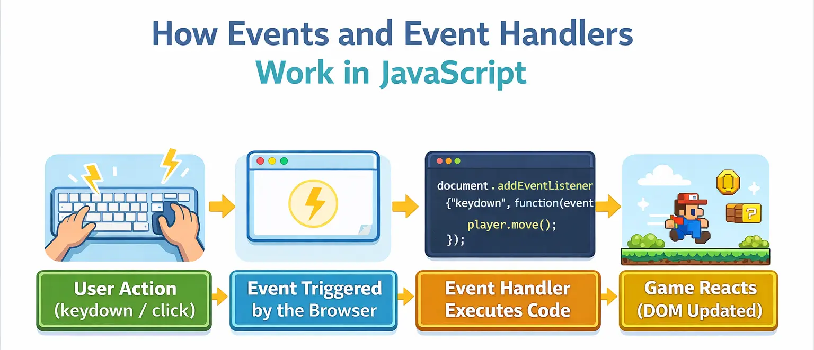

# 04. Esdeveniments

Els esdeveniments són **accions que es produeixen a la pàgina web** i que poden ser detectades i gestionades per JavaScript. Quan un esdeveniment es produeix, el navegador el detecta i executar una funció per donar una resposta (codi associat a l'esdeveniment que pot manipular el DOM si és necessari).

Els esdeveniments poden ser generats per:

- **L'usuari**: clics o moviments del ratolí, tecles premudes, enviament d'un formulari, etc.
- **El navegador**: càrrega completa del HTML, finalitza una animació CSS, es redimensiona la finestra del navegador, etc.

La gestió d'esdeveniments al frontend és fonamental perquè permet:

- Respondre a les accions de l'usuari en temps real.
- Donar una resposta pràcticament immediata.
- Crear una UX (experiència d'usuari) més dinàmica i interactiva.



## Com funcionen els esdeveniments?

JavaScript proporciona diversos mètodes per gestionar els esdeveniments. El mètode modern i recomanat és `addEventListener()` que permet:

- Afegir múltiples "funcions d'escolta" sobre el mateix element.
- Es pot generar íntegrament amb JS. Manté el codi separat de l'HTML.
- Ofereix diferents opcions (capturar un esdeveniment, eliminar-lo, etc.).

```javascript
element.addEventListener(tipusEsdeveniment, funcio);
```

**Paràmetres:**

- `tipusEsdeveniment`: El nom de l'esdeveniment (click,mouseover,keydown, etc.)
- `funcio`: La funció amb el codi que s'executarà quan es produeixi l'esdeveniment

## Tipus d'esdeveniments més utilitzats

| Esdeveniment | Descripció                                            |
| ------------ | ----------------------------------------------------- |
| `click`      | Quan l'usuari fa clic amb el ratolí.                  |
| `dblclick`   | Quan l'usuari fa doble clic.                          |
| `mousedown`  | Quan l'usuari prem el botó del ratolí.                |
| `mouseup`    | Quan l'usuari deixa de prem el botó del ratolí.       |
| `mouseover`  | Quan el ratolí passa per sobre d'un element.          |
| `mouseout`   | Quan el ratolí surt de l'element.                     |
| `keydown`    | Quan l'usuari prem una tecla.                         |
| `keyup`      | Quan l'usuari deixa anar una tecla.                   |
| `submit`     | Quan s'envia un formulari.                            |
| `load`       | Quan la pàgina o un recurs han carregat completament. |
| `resize`     | Quan es canvia la mida de la finestra.                |

## Treballar amb esdeveniments

Per treballar amb esdeveniments necessitem:

1. **Seleccionar l'element** del DOM
2. **Escoltar** un tipus d'esdeveniment (click, keydown, etc.)
3. **Associar una funció**, codi a executar quan l'esdeveniment es produeix

```javascript
// 1. Seleccionar element
const boto = document.querySelector('#boto-atacar');
// 2. Afegir l'opció d'escoltar esdeveniment a l'element (click)
// 3. Associar una funció (bloc de codi a executar)
boto.addEventListener('click', () => {
  console.log('Has atacat!');
});
```

### Arrow function (format modern)

S'utilitza quan el codi a executar és curt i no es vol reutilitzar per altres esdeveniments o funcionalitats del programa.

```javascript
boto.addEventListener('click', () => {
  console.log('Botó clicat!');
});
```

### Funció clàssica (definida a part)

S'utilitza quan el codi a executar és llarg i es vol reutilitzar la funció per altres esdeveniments o funcionalitats del programa.

```javascript
function gestorClic() {
  console.log('Botó clicat!');
  // ...
  // Resta del codi de la funció
}

boto.addEventListener('click', gestorClic);
```

## Exemples: Esdeveniments de ratolí

### `dblclick` - Doble clic

```html
<div id="cofre">📦 Cofre</div>
```

```javascript
const cofre = document.querySelector('#cofre');

cofre.addEventListener('dblclick', () => {
  cofre.textContent = '✨ Cofre obert! Has trobat una clau!';
});
```

### `mouseover` - Ratolí passar per sobre l'element

```html
<div id="enemic">👾 Goblin</div>
<p id="info"></p>
```

```javascript
const enemic = document.querySelector('#enemic');
const info = document.querySelector('#info');

enemic.addEventListener('mouseover', () => {
  info.textContent = 'Goblin - Vida: 50 HP';
});
```

### `mouseout` - Ratolí surt de l'element

```javascript
enemic.addEventListener('mouseout', () => {
  info.textContent = '';
});
```

## Esdeveniments de teclat

### `keydown` - Tecla premuda

```javascript
document.addEventListener('keydown', event => {
  console.log('Tecla premuda:', event.key);
});
```

### `keyup` - Tecla alliberada

```javascript
document.addEventListener('keyup', event => {
  console.log('Tecla alliberada:', event.key);
});
```

## L'objecte `event`

Quan es produeix un esdeveniment, JavaScript crea un **objecte `event`** amb informació sobre l'esdeveniment.

```javascript
element.addEventListener('click', event => {
  console.log(event); // Objecte amb tota la informació
});
```

### Propietats útils de `event`

#### Per a esdeveniments de ratolí:

```javascript
element.addEventListener('click', event => {
  console.log('Type:', event.type); // "click"
  console.log('Target:', event.target); // Element clicat
  console.log('X:', event.clientX); // Posició X del ratolí
  console.log('Y:', event.clientY); // Posició Y del ratolí
});
```

#### Per a esdeveniments de teclat:

```javascript
document.addEventListener('keydown', event => {
  console.log('Key:', event.key); // "a", "Enter", "ArrowUp"...
  console.log('Code:', event.code); // "KeyA", "Enter", "ArrowUp"...
  console.log('Shift:', event.shiftKey); // true/false
  console.log('Ctrl:', event.ctrlKey); // true/false
  console.log('Alt:', event.altKey); // true/false
});
```

### `event.target` - Element on s'ha produït l'esdeveniment

```html
<div id="contenidor">
  <button class="boto">Botó 1</button>
  <button class="boto">Botó 2</button>
  <button class="boto">Botó 3</button>
</div>
```

```javascript
const botons = document.querySelectorAll('.boto');

botons.forEach(boto => {
  boto.addEventListener('click', event => {
    console.log('Has clicat:', event.target.textContent);
  });
});
```
