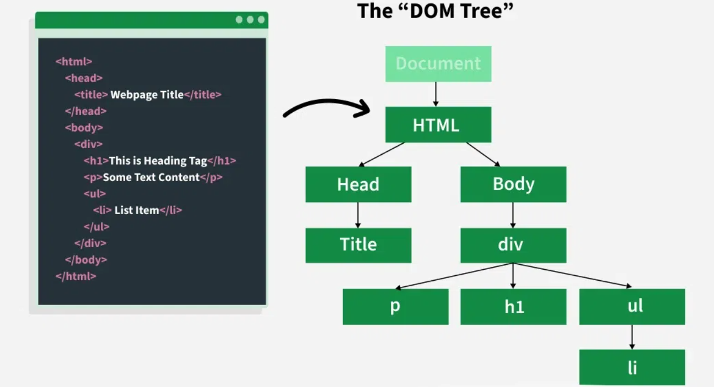
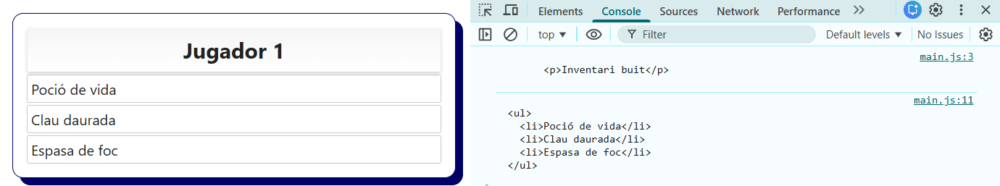

# 03. Manipulació del DOM (Document Object Model)

El **DOM (Document Object Model)** és la representació en forma d'**arbre d'elements** nodes que fa el navegador d'una pàgina pàgina HTML. Cada etiqueta HTML es converteix en un node d'aquest arbre, i és el propi navegador el que proporciona eines per poder interactuar amb els elements HTML a través de JavaScript.

Amb JS podem modificar el contingut de text, l'estructura HTML i els estils CSS dels diferents elements de manera dinàmica (sense haver de recarregar la pàgina). També permet donar resposta als esdeveniments generats per l'usuari (clics i moviments del ratolí, entrades de teclat, etc.).

## Manipulació dinàmica del DOM

Al carregar la pàgina web es genera l'element o objecte `DOCUMENT` que emmagatzema tot el contingut HTML de la pàgina web. Amb Javascript podem accedir als seus mètodes i propietats per interactuar amb els elements de la pàgina.

Sobre els elements HTML es poden realitzar les següents accions:

- Seleccionar elements
- Modificar el elements existents:
  - El contingut (pot ser text o altres elements HTML)
  - Els estils CSS
  - Els atributs i les classes
- Afegir elements nous
- Eliminar elements existents



## Estructura HTML i DOM

Quan el navegador interpreta el següent HTML:

```html
<div id="jugador-stats">
  <h2>Xavi</h2>
  <p class="nivell">Nivell: 17</p>
  <p class="vida">Vida: 100</p>
</div>
```

Crea la següent estructura DOM (arbre):

```
div#jugador-stats
├── h2 (text: "Nom del Jugador")
├── p.nivell (text: "Nivell: 17")
└── p.vida (text: "Vida: 100")
```

Amb JavaScript podem accedir i modificar qualsevol part d'aquest arbre (etiquetes, contingut, classes, ids, etc.).

## 1. Seleccionar elements del DOM

Abans de modificar un element, primer l'hem de **seleccionar** (identificar-lo dins l'arbre).

Actualment hi ha dues maneres de selecionar elements del DOM.

### 1.1 `document.querySelector()`

Seleccionar un únic element HTML que coincideix amb un selector CSS especificat (si hi ha diversos iguals escull el primer)

```html
<h1 id="titol">The Legend of Zelda</h1>
<p class="missatge">Observa bé el teu voltant abans de moure't, hi ha enemics per tot arreu.</p>
<p class="missatge">Puja de nivell abans d'accedir a certes zones del joc.</p>
<a href="./nivell2.html" class="nivell">Accedeix al nivell 2</a>
```

```javascript
// Selecciona el primer element amb el id "titol"
const titol = document.querySelector('#titol');

// Selecciona el primer element amb classe "missatge"
const primerMissatge = document.querySelector('.missatge');

// També es poden seleccionar etiquetes, etc.
const primerAnchor = document.querySelector('a');

// Mostrem per consola els diferents elements seleccionats
console.log(titol);
console.log(primerMissatge);
console.log(primerAnchor);
```


### 1.2 `document.querySelectorAll()`

Selecciona **TOTS** els elements HTML que coincideixen amb un selector CSS especificat i els agrupa en una única **llista o vector** que ens permetrà una gestió individual i més eficient de cada element.

```html
<ul id="jugador1">
  <li class="atac">Hyper Beam</li>
  <li class="atac">Giga Impact</li>
  <li class="atac">Draco Meteor</li>
  <li class="atac">Dragon Ascent</li>
</ul>
```

```javascript
// Selecciona tots els elements de la classe ".atac" del id "#jugador"
const atacsJugador1 = document.querySelectorAll('#jugador1 .atac');
console.log(atacsJugador1);
```


## 2. Modificar contingut d'elements del DOM

### 2.1 `textContent` - Modificar només el text

```html
<h2>Jugador 1</h2>
<div id="jugador1">
  <h3 id="nom">Kratos</h3>
  <p id="vida">Vida: 100</p>
</div>
```

```javascript
// Inicialment la Vida = 100 però es modifica el valor i es mostra vida = 75.
const vida = document.querySelector('#jugador1 #vida');
console.log(vida);
vida.textContent = 'Vida: 75';
```


### 2.2 `innerHTML` - Modificar tot l'HTML (text i etiquetes)

```html
<div id="inventari">
  <p>Inventari buit</p>
</div>
```

```javascript
// Inicialment el DIV inventari es buit i després s'afegeix l'HTML.
const inventari = document.querySelector('#inventari');
console.log(inventari.innerHTML);
inventari.innerHTML = `
  <ul>
    <li>Poció de vida</li>
    <li>Clau daurada</li>
    <li>Espasa de foc</li>
  </ul>
`;
console.log(inventari.innerHTML);
```



**Ves amb Compte:** `innerHTML` pot ser perillós si inserim al DOM directament informació rebuda d'un input d'un usuari. (Ens exposem a patir atacs de XSS). Per a inserir text simple sempre utilitza `textContent`.
