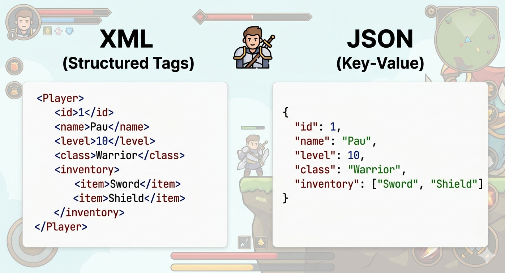

# Tema 01 – Introducció a XML i JSON

Quan dues aplicacions, sistemes o serveis necessiten **intercanviar dades**, han d'acordar un format comú que totes dues entenguin. Igual que les persones necessitem compartir un idioma per comunicar-nos, les aplicacions necessiten establir un **format d'intercanvi de dades**.

**XML** i **JSON** són dos dels formats principals per l'intercanvi de dades. Permeten representar informació estructurada de manera lleugera i llegible i "actuen de pont" entre sistemes/aplicacions diferents

Les aplicacions poden generar i interpretar dades en XML o JSON independentment del llenguatge en què estiguin desenvolupades. Per exemple, un programa escrit en Java pot enviar dades en format JSON que després seran interpretades per una aplicació web desenvolupada en JavaScript o per un servei fet amb Python.



## Què és XML?

**XML (eXtensible Markup Language)** és un llenguatge de marques dissenyat per emmagatzemar, estructurar i transportar dades. Va ser creat pel W3C l'any 1998 com a estàndard per a l'intercanvi de dades entre sistemes. Avui s'utilitza en molts àmbits on es necessita una estructura de dades robusta i validable.

```xml
<?xml version="1.0" encoding="UTF-8"?>
<producte>
  <nom>Teclat mecànic</nom>
  <preu>89.99</preu>
  <disponible>true</disponible>
</producte>
```

### Característiques d'XML:

- **Jeràrquic**: Les dades es representen en una estructura d'arbre amb elements aniuats.
- **Auto-descriptiu**: Les etiquetes expliquen el significat de les dades (pots inventar el nom de l'etiqueta).
- **Estricte**: Requereix una sintaxi concreta (etiquetes tancades, atributs entre cometes, etc.) o el document no serà vàlid.
- **Verbós (pesat)**: Requereix etiquetes d'obertura i tancament per a cada element (<element>...</element>).
- **Tipus de dades**: Tot és text, cal utilitzar atributs o convencions per representar nombres, booleans, etc.
- **Validació**: Es pot validar amb esquemes (XSD, DTD) per assegurar que les dades compleixen una estructura específica.

### On es fa servir XML?

- **Sistemes legacy**: Moltes empreses B2B i aplicacions antigues encara utilitzen XML per a la configuració i l'intercanvi de dades.
- **Documents d'ofimàtica**: Si canvies l'extensió d'un .docx o .xlsx a .zip i l'obres, veuràs que tot el contingut són fitxers XML.
- **Gràfics vectorials (SVG)**: Totes les icones i logos moderns són codi XML.
- **Configuració de projectes**: Eines com Maven (Java) o els manifests d'Android.
- **Administració Pública**: Factura electrònica i tràmits burocràtics oficials.

## Què és JSON?

**JSON (JavaScript Object Notation)** és un format lleuger d'intercanvi de dades, basat en la notació d'objectes de JavaScript. Tot i el seu nom, és independent del llenguatge i s'ha convertit en l'estàndard per a les APIs modernes i el desenvolupament web. JSON va ser creat per Douglas Crockford a principis dels 2000s i es va popularitzar ràpidament gràcies a la seva simplicitat i compatibilitat amb JavaScript.

```json
{
  "producte": {
    "nom": "Teclat mecànic",
    "preu": 89.99,
    "disponible": true
  }
}
```

### Característiques de JSON:

- **Jeràrquic**: Les dades es representen en una estructura d'arbre.
- **Lleuger**: Sintaxi molt compacta i estructura en parelles "clau/valor", sense etiquetes d'obertura i tancament.
- **Tipus de dades nadius**: Suporta números, booleans, null, arrays i objectes de manera nativa.
- **Fàcil i ràpid de parsejar**: Es converteix directament a objectes en molts llenguatges (JavaScript, Python, Java, etc.).
- **Validació**: No requereix validació formal. Es pot validar amb JSON Schema, però no és tan estricte com XML.

### On es fa servir JSON?

- **Desenvolupament web**: JSON és el format per excel·lència per a l'intercanvi de dades entre el client (navegador) i el servidor.
- **APIs REST**: La majoria de serveis web moderns utilitzen JSON per enviar i rebre dades (GitHub, Spotify, OpenWeather, etc.)
- **Bases de dades NoSQL**: Bases de dades modernes com MongoDB emmagatzemen la informació directament en format JSON (o derivats).
- **Bases de dades relacionals**: Sistemes com MariaDB també suporten JSON, però com a tipus de dada dins de taules tradicionals.
- **Configuració de projectes**: Fitxers com el package.json (Node.js) o el settings.json de VS Code.

## Comparativa XML vs JSON

| Característica       | XML                         | JSON                                            |
| -------------------- | --------------------------- | ----------------------------------------------- |
| **Llegibilitat**     | Moderada (moltes etiquetes) | Alta (sintaxi molt neta)                        |
| **Pes del fitxer**   | Més pesant                  | Més lleuger                                     |
| **Tipus de dades**   | Tot és text (tipus via XSD) | Suporta cadenes, números, booleans, array, null |
| **Vectors (arrays)** | Complexos (conveni manual)  | Nadius `[]`                                     |
| **Validació**        | Robusta (XSD, DTD, RelaxNG) | Possible amb (JSON Schema)                      |
| **Ús actual**        | Sistemes legacy, configs    | APIs REST, apps modernes                        |
| **Comentaris**       | Sí (`<!-- -->`)             | No permet comentaris                            |

## Mateixa informació, dos formats

Vegem com es representen les mateixes dades en tots dos formats:

**XML:**

```xml
<?xml version="1.0" encoding="UTF-8"?>
<videojocs>
  <joc id="101">
    <titol>The Legend of Zelda</titol>
    <genere>Aventura</genere>
    <puntuacio>9.5</puntuacio>
    <multijugador>false</multijugador>
    <plataformes>
      <plataforma>Switch</plataforma>
    </plataformes>
  </joc>
  <joc id="102">
    <titol>Elden Ring</titol>
    <genere>RPG</genere>
    <puntuacio>9.8</puntuacio>
    <multijugador>true</multijugador>
    <plataformes>
      <plataforma>PC</plataforma>
      <plataforma>PS5</plataforma>
      <plataforma>Xbox</plataforma>
    </plataformes>
  </joc>
</videojocs>

```

**JSON:**

```json
{
  "videojocs": [
    {
      "id": 101,
      "titol": "The Legend of Zelda",
      "genere": "Aventura",
      "puntuacio": 9.5,
      "multijugador": false,
      "plataformes": ["Switch"]
    },
    {
      "id": 102,
      "titol": "Elden Ring",
      "genere": "RPG",
      "puntuacio": 9.8,
      "multijugador": true,
      "plataformes": ["PC", "PS5", "Xbox"]
    }
  ]
}
```

> **Observa** com JSON és més compacte, suporta tipus de dades nadius (número, booleà) i els arrays `[]` són directes.

## Quin format triar?

```
Has de crear una API o app web moderna?  → JSON ✅
Vols el format més lleuger possible?     → JSON ✅
Treballes amb un sistema legacy?         → XML ✅
Necessites comentaris al fitxer?         → XML ✅
Treballes amb SVG, DOCX, configuració?   → XML ✅
```
