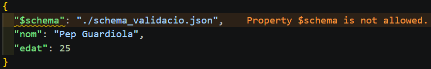
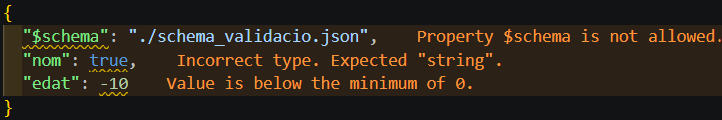

# Tema 05 – Validació de documents JSON amb JSON Schema

JSON és un format molt flexible: qualsevol estructura és vàlida sempre que respecti la sintaxi. Però quan treballem en entorns professionals amb APIs (quan dues aplicacions intercanvien dades), aquesta flexibilitat pot provocar errors si no controlem quines dades rebem.

## Com validar un fitxer JSON?

Per evitar errors, necessitem un "contracte" que asseguri que la informació que s'intercanvien les aplicacions és correcta. Per això necessitem garantir:

- Que els camps obligatoris existeixin
- Que els tipus de dades siguin correctes
- Que els valors estiguin dins d'uns rangs vàlids

**JSON Schema** és l'estàndard que permet definir i validar l'estructura de documents JSON. Podem indicar quines claus i valors han d'existir amb les seves restriccions corresponents.

## Estructura bàsica d'un JSON Schema

```json
{
  "$schema": "https://json-schema.org/draft/2020-12/schema",
  "$id": "https://domini.cat",
  "title": "Producte",
  "description": "Esquema d'un producte de la botiga",
  "type": "object",
  "properties": {
    ...
  },
  "required": ["id", "nom", "preu"],
  "additionalProperties": false
}
```

- `$schema` → Defineix la versió del JSON Schema que fem servir per validar el document
- `$id` → L'identificador únic de l'esquema (una URL identificativa)
- `title` i `description` → Metadades descriptives de l'esquema (per a la documentació)
- `type` → Indica el tipus de dada de l'element arrel (`object`, `array`)
- `properties` → Defineix cada camp (cada clau i tipus de dada dins l'objecte)
- `required` → Llista de camps obligatoris (claus) que han d'aparèixer al JSON
- `additionalProperties` → Indica si només es permeten els camps indicats o també permet camps addicionals

## Tipus de dades bàsics

JSON Schema defineix un conjunt de tipus de dades bàsics que podem utilitzar per validar els valors de les claus (el contingut de cada camp).

| JSON Schema `type` | Exemple JSON          | Descripció                           |
| ------------------ | --------------------- | ------------------------------------ |
| `"string"`         | `"Pep Guardiola"`     | Text                                 |
| `"number"`         | `42`, `3.14`          | Enter o decimal                      |
| `"integer"`        | `42`                  | Sense decimals                       |
| `"boolean"`        | `true`, `false`       | Valors lògics                        |
| `"null"`           | `null`                | Sense valor assignat                 |
| `"array"`          | `[1, 2, 3]`           | Llista d'elements de qualsevol tipus |
| `"object"`         | `{ "clau": "valor" }` | Conjunt de parelles clau-valor       |

## Propietats simples

En JSON Schema, l'equivalent a un element simple de XSD és una propietat dins de l'objecte que té un tipus primitiu (string, number, integer o boolean) i no conté res aniuat.

```json
{
  "nom": "Slimbook FEDORA Black 16\"",
  "preu": 1934.0,
  "estoc": 50,
  "disponible": false
}
```

Per definir aquestes propietats amb JSON Schema, utilitzem la clau `properties` i especifiquem el nom de cada camp i el seu tipus dada:

```json
{
  "type": "object",
  "properties": {
    "nom": { "type": "string" },
    "preu": { "type": "number" },
    "estoc": { "type": "integer" },
    "disponible": { "type": "boolean" }
  }
}
```

## Restriccions numèriques

Les restriccions numèriques permeten limitar els valors dels camps de números establint un rang vàlid de valors.

Per exemple, si volem assegurar que, un preu no sigui negatiu o una nota estigui entre 0 i 10, podem fer servir les següents restriccions:

```json
{
  "nota": 8.5,
  "preu": 1934.54
}
```

```json
{
  "properties": {
    "nota": {
      "type": "number",
      "minimum": 0,
      "maximum": 10
    },
    "preu": {
      "type": "number",
      "minimum": 0,
      "exclusiveMaximum": 10000.0
    }
  }
}
```

## Restriccions de text

Les restriccions de text permeten controlar el contingut de les cadenes de text (string), com la seva longitud o el seu format.

Per exemple, podem controlar que un nom tingui una longitud mínima, que un correu electrònic sigui vàlid, que un codi (un DNI o un telèfon) segueixi un patró concret, etc.

```json
{
  "nom": "Anna",
  "email": "anna@example.com",
  "codi": "AB1234"
}
```

```json
{
  "properties": {
    "nom": {
      "type": "string",
      "minLength": 2,
      "maxLength": 25
    },
    "email": {
      "type": "string",
      "format": "email"
    },
    "codi": {
      "type": "string",
      "pattern": "^[A-Z]{2}[0-9]{4}$"
    }
  }
}
```

## Conjunt de valors permesos (enum)

La propietat `enum` ens permet definir un conjunt tancat de valors possibles per a un camp.

La podem fer servir quan només volem permetre opcions concretes: com categories, estats o tipus.

```json
{
  "genere": "RPG",
  "estat": "actiu"
}
```

```json
{
  "properties": {
    "genere": {
      "type": "string",
      "enum": ["RPG", "Aventura", "Esports", "Estratègia"]
    },
    "estat": {
      "type": "string",
      "enum": ["actiu", "inactiu", "pendent"]
    }
  }
}
```

## Arrays (vectors)

Els arrays permeten definir llistes d'elements dins d'un document JSON. Aquests elements poden ser tipus de dades bàsics o altres ojectes.

Podem controlar el tipus de dades i també les propietats dels elements de la llista, com la seva mida o si els valors es poden repetir.

```json
{
  "etiquetes": ["oferta", "nou", "destacat"],
  "notes": [7.5, 9, 8, 9, 5]
}
```

```json
{
  "properties": {
    "etiquetes": {
      "type": "array",
      "items": {
        "type": "string",
        "minLength": 3
      },
      "minItems": 1,
      "maxItem": 5,
      "uniqueItems": true
    },
    "notes": {
      "type": "array",
      "items": {
        "type": "number",
        "minimum": 0,
        "maximum": 10
      }
    }
  }
}
```

## Objectes niuats

Els objectes niuats són camps que, contenen un altre objecte com a valor.

Això permet estructurar dades més complexes dins d'un mateix document JSON.

```json
{
  "adreca": {
    "carrer": "Carrer de Santpedor 10",
    "codiPostal": "08251",
    "provincia": "Barcelona"
  }
}
```

```json
{
  "adreca": {
    "type": "object",
    "properties": {
      "carrer": { "type": "string" },
      "codiPostal": {
        "type": "string",
        "pattern": "^[0-9]{5}$"
      },
      "provincia": { "type": "string" }
    },
    "required": ["carrer", "codiPostal"]
  }
}
```

## Exemple complet: JSON Schema per a productes

```json
{
  "$schema": "https://json-schema.org/draft/2020-12/schema",
  "$id": "https://exemple.cat/schema/producte.json",
  "title": "Producte",
  "description": "Esquema d'un producte de la botiga TechGear",
  "type": "object",
  "properties": {
    "id": {
      "type": "integer",
      "minimum": 1
    },
    "nom": {
      "type": "string",
      "minLength": 2,
      "maxLength": 100
    },
    "preu": {
      "type": "number",
      "minimum": 0,
      "exclusiveMinimum": true
    },
    "disponible": {
      "type": "boolean"
    },
    "estoc": {
      "type": "integer",
      "minimum": 0
    },
    "etiquetes": {
      "type": "array",
      "items": {
        "type": "string"
      },
      "uniqueItems": true
    },
    "valoracio": {
      "type": "number",
      "minimum": 0,
      "maximum": 5
    }
  },
  "required": ["id", "nom", "preu", "disponible"],
  "additionalProperties": false
}
```

## Validació online i eines

### Validació online

- **[jsonschemavalidator.net](https://www.jsonschemavalidator.net)** → Enganxa el teu schema i el teu JSON i valida al moment
- **[jsonlint.com](https://jsonlint.com)** → Comprova la sintaxi JSON (no l'esquema)

### Validació amb VSCode (mode simple)

1er pas: Crear el document de validació `schema_validacio.json`

```json
{
  "$schema": "https://json-schema.org/draft/2020-12/schema",
  "type": "object",
  "properties": {
    "nom": { "type": "string" },
    "edat": { "type": "integer", "minimum": 0 }
  },
  "required": ["nom", "edat"],
  "additionalProperties": false
}
```

2n pas: Crear el document json `exemple_valid.json` a validar i enllaçar-ho amb el document de validació:

Per enllaçar un JSON amb el validador hem d'afegir un camp on el valor és la ruta al document de validació: `"$schema":"./schema_validacio.json"`

```json
{
  "$schema": "./schema_validacio.json",
  "nom": "Pep Guardiola",
  "edat": 25
}
```

3er pas: Verificar que no apareix cap avís d'error en els camps del json



4t pas: Modificar els valors dels camps del JSON perquè siguin incorrectes:

```json
{
  "$schema": "./schema_validacio.json",
  "nom": true,
  "edat": -10
}
```



## Exercicis

**Exercici 1.** Crea el fitxer `schema_alumne.json` per validar el JSON d'alumnes del tema anterior. Camps obligatoris: `id`, `nom`, `nota`, `aprovat`. La `nota` ha de ser entre 0 i 10, l'`id` ha de ser un enter positiu. Els mòduls han de ser un `array` de strings i cada element ha de tenir mínim 3 caràcters.

**Exercici 2.** Prova el teu schema a [jsonschemavalidator.net](https://www.jsonschemavalidator.net) amb un objecte vàlid i un d'invàlid (per exemple, amb `nota: 15` i un `id: -1`). Captura els errors.

**Exercici 3.** Afegeix a l'esquema una propietat `email` de tipus string amb `format: "email"`. Valida que rebutja el valor `"no-es-un-email"`.
